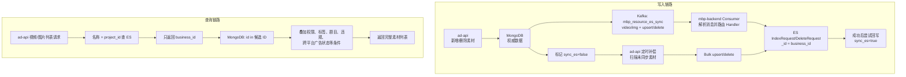
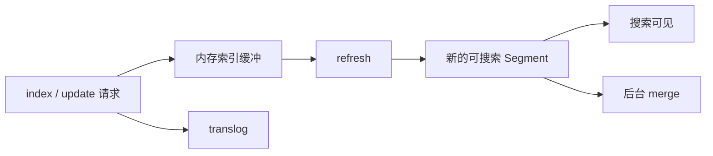
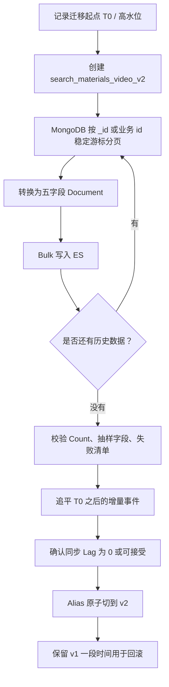
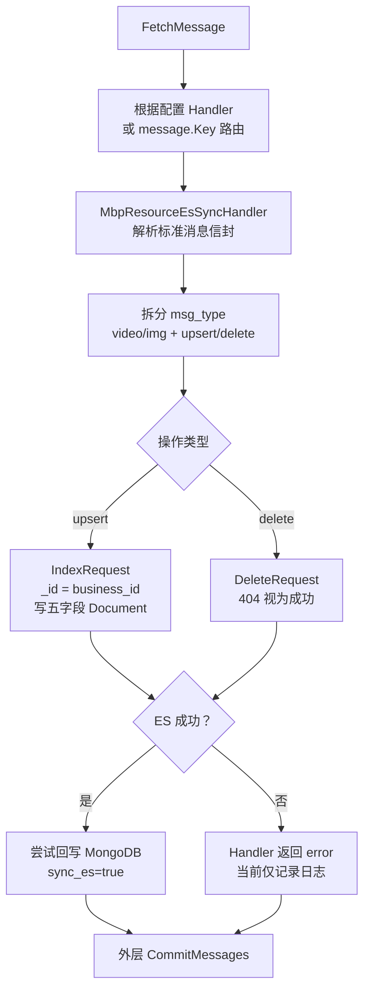
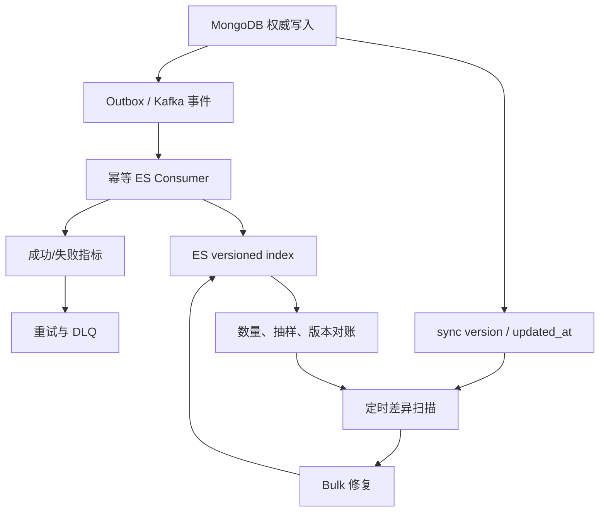
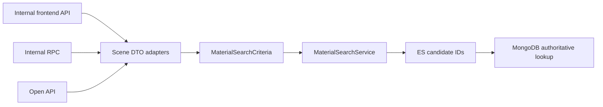

# Elasticsearch 素材搜索实战：从三仓真实链路学会 ES

> 适合 ES 零基础阅读。目标不是成为 ES 运维专家，而是通过 `ad-api`、`mbp-backend`、`lib` 组成的视频、图片素材搜索链路，真正弄懂：项目为什么后期引入 ES、数据怎么放进去、为什么查询快、当前实现有什么问题，以及面试时怎么讲。

---

### 阅读完成后应该会什么？

你应该能够回答：

1. MongoDB 的 `resource_video`、`resource_img` 到 ES 后，是表、索引还是文档？
2. `name` 为什么用 `text`，`project_id` 为什么用整数或 `keyword`？
3. 当前项目为什么先查 ES，再拿 ID 回 MongoDB 查完整素材？
4. 倒排索引为什么比 MongoDB 的前后模糊正则更适合名称检索？
5. 100 万条素材大概需要怎样的 ES 集群？能支持多少 QPS？
6. 100 万历史数据如何导入？新增、更新、删除如何做到秒级同步？
7. MongoDB 与 ES 不一致怎么办？ES 挂了怎么办？
8. 当前快速引入方案解决了什么，还有哪些潜在问题和优化优先级？

### 本文的三种标记

- **【项目事实】**：可以从 `ad-api`、`mbp-backend` 或 `lib` 源码直接确认。
- **【问题分析】**：根据代码行为推导出的风险或代价，不等于线上已经发生事故。
- **【推荐方案】**：结合当前业务给出的生产设计，不代表仓库已经全部实现。
- **【需要核实】**：三个仓库都缺少足够证据，不能把推测当成项目现状。

---

## 一、先看懂项目为什么引入 ES

### 1.1 为什么项目后期才快速引入 ES？

这个项目不是从第一天就使用 ES。早期素材量较少时，MongoDB 同时承担素材存储和列表查询，架构简单，维护成本也低。

后来视频、图片素材逐步增长到百万级，列表查询出现了一个高频组合：

```text
素材名称前后模糊查询
+ 标签 / 剧目
+ 是否违规
+ 是否在 Facebook、TikTok、Snapchat 等平台创建过广告
+ 权限、状态、时间、分页等条件
```

名称的 `.*关键词.*` 前后模糊匹配很难稳定利用普通 B-Tree 索引，往往需要检查大量候选记录；再叠加复杂过滤、Count 和分页，就会持续消耗 MongoDB 的 CPU、内存与磁盘 IO。与此同时，系统其他模块还在对同一个 MongoDB 集群进行查询和写入，资源会相互竞争。

项目当时观察到的直接现象是：

- MongoDB 内存使用经常超过 80%。
- 视频、图片列表接口响应变慢。
- 名称模糊查询与其他业务读写争抢 MongoDB 资源。

这里要注意：**内存超过 80% 本身不等于 MongoDB 一定异常**。MongoDB/WiredTiger 会主动使用内存做缓存，真正需要结合缓存淘汰、Page Fault、磁盘 IO、慢查询、CPU 和接口 P99 判断。结合本项目的慢接口和高频模糊查询，可以合理判断名称搜索是需要优先迁出的重负载之一。

因此项目没有立即进行“大而全”的搜索平台改造，而是采用快速止血方案：

```text
最重的名称搜索交给 ES，快速召回候选素材 ID
其他复杂条件和完整数据仍交给 MongoDB
```

这个选择的价值是改造范围小：现有权限、标签、违规状态和跨平台广告状态逻辑基本不用迁移，就能先减轻 MongoDB 最不擅长的名称模糊搜索压力。

### 1.2 ES 不是简单“挂在 MongoDB 前面的缓存”

可以先这样理解：

```text
MongoDB：保存权威、完整的素材数据
ES：保存为了搜索而重新组织的数据副本
```

它和 Redis 缓存不同：

| 对比 | Redis 缓存 | Elasticsearch |
|---|---|---|
| 主要目标 | 按 Key 快速取值 | 全文检索、组合过滤、排序、聚合 |
| 数据结构 | String、Hash、Set 等 | JSON Document + Mapping + 倒排索引 |
| 典型查询 | `GET material:101` | 名称中包含某些词，并满足项目过滤 |
| 数据角色 | 热数据副本 | 可重建的搜索读模型 |

更准确的定位是：

> MongoDB 是素材事实库，ES 是从事实库派生出来的“搜索读模型”。ES 可以删除后重建，因此不能反过来成为素材数据的唯一来源。

### 1.3 三个代码仓库分别负责什么？

| 仓库 | 在 ES 素材链路中的职责 | 输入 | 输出 |
|---|---|---|---|
| `ad-api` | 素材业务写入、Kafka 生产、ES 名称查询、MongoDB 回表、定时补偿 | HTTP 请求、MongoDB 素材 | Kafka 事件、ES 查询、完整列表响应 |
| `mbp-backend` | Kafka 消费、消息路由、ES upsert/delete、同步状态回写 | `mbp_resource_es_sync` 消息 | ES Document、MongoDB `sync_es=true` |
| `lib` | Trace ID、公共日志和公共领域模型等共享能力 | 两个服务的公共依赖 | 统一工具和公共结构 |

**【项目事实】** `ad-api` 使用 `lib v0.2.45`，`mbp-backend` 使用 `lib v0.2.42`；两个项目 `go.mod` 中指向 `../lib` 的 `replace` 都被注释。因此本地 `lib` 仓库适合帮助理解公共代码，但不能把它当前 HEAD 当成两个服务线上实际编译的版本。

这条素材 ES 链路直接使用了 `lib` 的 [TraceId](/Users/guoyimeng/Documents/Coding/ad/lib/util/trace.go:9) 和 [公共日志上下文](/Users/guoyimeng/Documents/Coding/ad/lib/common/log/context.go:76)。`lib/common/mqx` 虽然提供了另一套通用 MQ 能力，但当前 `mbp_resource_es_sync` 消费链路使用的是 `mbp-backend/mod/kafka/consumer`，不要把两套实现混为一谈。

### 1.4 当前项目到底把哪些数据放进 ES？

**【项目事实】** `ResourceVideo` 和 `ResourceImg` 是带 `bson` 标签的 MongoDB 模型：

- [resourceVideoTypes.go](/Users/guoyimeng/Documents/Coding/ad/ad-api/app/model/resourceVideoTypes.go:31)
- [resourceImgTypes.go](/Users/guoyimeng/Documents/Coding/ad/ad-api/app/model/resourceImgTypes.go:14)

完整的视频素材包含很多字段：

```text
id、name、project_id、tags、duration、width、height、language、
designers、customers、has_fb_ad、status、is_deleted、created_at……
```

但当前 ES 补偿任务构造的 Document 只有五个字段：

```json
{
  "business_id": "101",
  "name": "ReelShort_English_AI_60s.mp4",
  "project_id": 10,
  "name_raw": "ReelShort_English_AI_60s.mp4",
  "update_at": "2026-07-17T10:00:00Z"
}
```

源码见 [resource_es_fallback.go](/Users/guoyimeng/Documents/Coding/ad/ad-api/app/cron/cmd/resource_es_fallback.go:24)。

这不是“少同步了一些字段”，而是一种有意的读模型设计：

```text
ES 只负责：根据名称和项目快速找出素材 ID
MongoDB 负责：权限、标签、状态、时间、分页以及完整数据返回
```

### 1.5 当前项目的完整读写链路



消费端并没有缺失，它位于 `mbp-backend`：

- [消费者循环](/Users/guoyimeng/Documents/Coding/ad/mbp-backend/mod/kafka/consumer/consumer.go:50)
- [素材 ES Handler](/Users/guoyimeng/Documents/Coding/ad/mbp-backend/mod/kafka/handler/impl/mbp_recource_es_sync/mbp_resource_es_sync_handler.go:39)
- [ES upsert/delete Repo](/Users/guoyimeng/Documents/Coding/ad/mbp-backend/mod/kafka/repo/mbp_resource_es_sync_repo.go:33)

### 1.6 为什么快速方案没有把所有筛选字段都放进 ES？

因为每增加一个可索引字段，都有代价：

- 倒排索引或 Doc Values 占磁盘。
- Mapping、Segment 元数据占内存。
- 更新 Document 时需要重新索引字段。
- ES 与 MongoDB 之间需要同步更多数据。
- 两份完整数据更容易出现不一致。

当前最紧急的需求是把名称模糊搜索从 MongoDB 移走，所以五字段精简索引更简单：

```text
ES：召回候选 ID
MongoDB：做最终权威过滤
```

这是一种典型的渐进式改造：先解决主要矛盾，同时保留 MongoDB 的完整业务语义和降级能力。代价是 ES 只完成候选召回，候选集合较大时 MongoDB 回表、Count 和分页仍可能成为瓶颈。

只有当 MongoDB 后半段过滤、Count 或分页也成为瓶颈时，才考虑把 `tags`、`playlet`、违规状态、跨平台广告状态、`status`、`created_at` 等字段继续搬进 ES，让 ES 直接完成更多过滤。这样做之前必须一并设计权限、排序、深分页和字段更新一致性，不能只是在 Mapping 中多加几个字段。

---

## 二、MongoDB 数据如何映射成 ES Document

### 2.1 MongoDB 和 ES 的概念怎么对应？

ES 8 以后已经没有旧式 Type 的概念，可以使用下面的对应关系：

| MongoDB | Elasticsearch | 在素材项目里的例子 |
|---|---|---|
| Database | Cluster 中的一组 Index | 素材搜索系统 |
| Collection | Index | `search_materials_video` |
| 一条 BSON Document | 一条 ES Document | 视频素材 101 的搜索投影 |
| `_id` | ES `_id` | 推荐使用业务素材 ID `101` |
| 字段结构/校验规则 | Mapping | `name` 是 `text`，`project_id` 是 `long` |
| 普通索引 | 倒排索引、BKD、Doc Values 等 | 根据字段类型自动构建 |

因此并不是在 ES 里“创建表”，而是：

```text
创建 Index
  -> 定义 Mapping
  -> 写入 JSON Document
  -> ES 根据 Mapping 为字段建立检索结构
```

### 2.2 当前项目用了哪两个 Index？

**【项目事实】** [search_service.go](/Users/guoyimeng/Documents/Coding/ad/ad-api/app/internal/logic/resource/common/search_service.go:16) 中定义：

```go
var businessIndexMap = map[string]string{
    BusinessTypeVideo: "search_materials_video",
    BusinessTypeImg:   "search_materials_img",
}
```

它们可以理解为两个独立的搜索集合：

```text
resource_video（MongoDB） -> search_materials_video（ES）
resource_img（MongoDB）   -> search_materials_img（ES）
```

视频和图片字段相似，但拆开有几个好处：

- 可以独立重建和切换。
- 可以独立设置 Mapping、分片和权限。
- 视频或图片单侧故障不会直接污染另一侧。
- 业务代码已经按 `video/img` 选择不同 Index。

### 2.3 `_id` 应该怎么选？

**【项目事实】** 实时消费者和补偿任务都使用素材业务 ID 作为 ES `_id`：

```text
MongoDB resource_video.id = 101
ES _id                    = "101"
ES business_id            = "101"
```

写入：

```http
PUT search_materials_video/_doc/101
Content-Type: application/json

{
  "business_id": "101",
  "name": "ReelShort_English_AI_60s.mp4",
  "project_id": 10,
  "name_raw": "ReelShort_English_AI_60s.mp4",
  "update_at": "2026-07-17T10:00:00Z"
}
```

固定 `_id` 非常重要：

- 相同素材重复消费时覆盖同一 Document，不会创建多份。
- 更新时仍写 `_id=101`。
- 删除时直接 `DELETE index/_doc/101`。
- 对账时可以直接按业务 ID 比较 MongoDB 与 ES。

### 2.4 五个字段分别应该选什么类型？

| 字段 | 推荐类型 | 用途 | 为什么 |
|---|---|---|---|
| `business_id` | `keyword` | 返回 ID、精确匹配 | 不分词；虽然内容是数字，但项目代码按字符串读取 |
| `name` | `text` | 全文或短语检索 | 需要经过 Analyzer，生成倒排索引 |
| `name_raw` | `keyword` | 完整名称精确匹配、排序 | 整个名称作为一个值，不分词 |
| `project_id` | `long` | `terms` 精确过滤 | 原始模型是 `int64`，不需要全文分词 |
| `update_at` | `date` | 同步审计、乱序判断、对账 | ES 能按时间解析、比较和排序 |

`text` 和 `keyword` 的核心区别：

```text
text：    "English AI Video" -> english、ai、video
keyword： "English AI Video" -> 整体一个值
```

Elastic 官方建议：人类可读、需要全文检索的内容使用 `text`；结构化、需要精确匹配/排序/聚合的字符串使用 `keyword`。同一个字符串也可以用 multi-field 同时建立两种索引。[Text field](https://www.elastic.co/guide/en/elasticsearch/reference/current/text.html)、[Multi-fields](https://www.elastic.co/docs/reference/elasticsearch/mapping-reference/multi-fields)

### 2.5 一份兼容当前代码的最小 Mapping

**【需要核实】** 仓库中没有找到这两个 Index 的实际创建脚本，因此下面是根据当前查询 DSL 推导出的推荐 Mapping：

```http
PUT search_materials_video_v1
Content-Type: application/json

{
  "settings": {
    "number_of_shards": 1,
    "number_of_replicas": 1
  },
  "mappings": {
    "dynamic": "strict",
    "properties": {
      "business_id": { "type": "keyword" },
      "name":        { "type": "text" },
      "name_raw":    { "type": "keyword", "ignore_above": 512 },
      "project_id":  { "type": "long" },
      "update_at":   { "type": "date" }
    }
  }
}
```

为什么建议 `dynamic: strict`？

```text
发送了拼错字段 projectId
  -> strict 立即报错
  -> 同步任务告警并修复

如果任由动态 Mapping：
  -> 可能悄悄创建错误字段
  -> 长期产生 Mapping 膨胀和查询不一致
```

### 2.6 `match_phrase` 等于 MongoDB 的 `.*关键词.*` 吗？

不一定，这是当前链路必须理解的边界。

MongoDB 查询：

```javascript
{ name: { $regex: ".*glish_AI.*", $options: "i" } }
```

它表达的是任意字符子串包含。

ES 默认 `text + match_phrase` 表达的是：查询文本经过 Analyzer 后，分出来的词项按顺序、相邻出现。最终能否命中，取决于 Index 的 Analyzer。

例如完整名称是：

```text
ReelShort_English_AI_60s.mp4
```

如果默认 Analyzer 没有按业务期望切分下划线、文件后缀或中英文混合内容，搜索体验可能与 MongoDB 正则不同。

### 2.7 如果必须支持任意子串怎么办？

**【推荐方案】** 为 `name` 增加受控的 `ngram` 子字段。下面演示 2～20 字符子串：

```http
PUT search_materials_video_v2
Content-Type: application/json

{
  "settings": {
    "index.max_ngram_diff": 18,
    "analysis": {
      "filter": {
        "material_name_2_20": {
          "type": "ngram",
          "min_gram": 2,
          "max_gram": 20
        }
      },
      "analyzer": {
        "material_name_index": {
          "tokenizer": "keyword",
          "filter": ["lowercase", "material_name_2_20"]
        },
        "material_name_search": {
          "tokenizer": "keyword",
          "filter": ["lowercase"]
        }
      }
    }
  },
  "mappings": {
    "dynamic": "strict",
    "properties": {
      "business_id": { "type": "keyword" },
      "name": {
        "type": "text",
        "fields": {
          "raw": { "type": "keyword", "ignore_above": 512 },
          "contains": {
            "type": "text",
            "analyzer": "material_name_index",
            "search_analyzer": "material_name_search"
          }
        }
      },
      "project_id": { "type": "long" },
      "update_at":  { "type": "date" }
    }
  }
}
```

查询：

```json
{
  "query": {
    "match": {
      "name.contains": "glish_AI"
    }
  }
}
```

但 ngram 不是免费的：

- 一个名称会生成大量子串 Token。
- 倒排索引明显变大。
- 写入、refresh、merge 成本上升。
- `min_gram` 越小，Token 越多，短查询召回结果也越多。

所以应该先确认业务到底需要“按词搜索”“前缀搜索”还是“任意子串搜索”，再选择 standard、edge_ngram 或 ngram。Elastic 官方说明 `ngram` 会生成不同长度的字符片段，并受 `index.max_ngram_diff` 限制。[N-gram token filter](https://www.elastic.co/docs/reference/text-analysis/analysis-ngram-tokenfilter)

### 2.8 Mapping 后续能随便改吗？

新增字段通常可以，但已经存在字段的核心类型不能随意从 `text` 改成 `keyword`。

生产上建议：

```text
search_materials_video_v1
        ↓ 创建新 Mapping
search_materials_video_v2
        ↓ 全量重建并校验
Alias: search_materials_video -> v2
```

应用始终访问 Alias，不直接绑定物理版本索引。Alias 可以实时切换指向，用于无停机重建。[Elastic Alias 文档](https://www.elastic.co/guide/en/elasticsearch/reference/current/aliases.html)

---

## 三、视频与图片列表查询到底怎么走

### 3.1 先看一句话结论

当前项目不是让 ES 完成整个列表查询，而是：

```text
ES 根据名称快速找候选素材 ID
MongoDB 根据这些 ID 做完整查询并返回权威数据
```

这称为“两阶段查询”或“ES 召回 + 主库回表”。

### 3.2 第一步：列表接口整理查询条件

视频入口：

- [getVideoListLogic.go](/Users/guoyimeng/Documents/Coding/ad/ad-api/app/internal/logic/resource/video/getVideoListLogic.go:283)

图片入口：

- [getImgListLogic.go](/Users/guoyimeng/Documents/Coding/ad/ad-api/app/internal/logic/resource/img/getImgListLogic.go:228)

列表请求可能包含：

```text
names、project_ids、tags、language、designers、customers、
created_at、status、duration、resolution、权限范围……
```

其中只有名称和项目 ID 被交给当前 ES 查询。

### 3.3 第二步：`BuildNamesParam` 判断是否走 ES

[search_service.go](/Users/guoyimeng/Documents/Coding/ad/ad-api/app/internal/logic/resource/common/search_service.go:52) 中的核心判断可以概括为：

```text
ES 开关没开，或者没有 names
  -> 不查 ES，继续走 MongoDB 原查询

查 ES 异常
  -> 不影响列表接口，回退 MongoDB

ES 候选 ID 数量达到 5000 上限
  -> 不把超大 ID 集合塞回 MongoDB，回退 MongoDB

ES 命中数量合适
  -> names 清空
  -> ids 替换成 ES 返回的素材 ID
```

配置中：

```yaml
MaterialsSearchByEsSwitch: true
MaterialsSearchByEsMaxSize: 5000
```

5000 是保护阈值，不是 ES 只能查 5000 条。它保护的是后续链路：

```text
ES 返回几十万个 ID
  -> 网络响应很大
  -> Go 内存和 JSON 解码开销增大
  -> MongoDB $in 数组过大
  -> 查询计划和延迟不可控
```

### 3.4 第三步：ES 实际执行什么查询？

[es_search.go](/Users/guoyimeng/Documents/Coding/ad/ad-api/app/internal/logic/resource/common/es_search.go:26) 构造的 DSL 等价于：

```json
{
  "query": {
    "bool": {
      "should": [
        { "match_phrase": { "name": "English AI" } },
        { "match_phrase": { "name": "German Original" } }
      ],
      "minimum_should_match": 1,
      "must": [
        { "terms": { "project_id": [10, 20] } }
      ]
    }
  },
  "size": 5000,
  "track_total_hits": true,
  "_source": ["business_id"]
}
```

含义是：

```text
名称满足任意一个 match_phrase
AND project_id 属于 [10, 20]
只返回 business_id
```

**【推荐改进】** `project_id` 不参与相关性评分，放在 `bool.filter` 比放在 `must` 更准确地表达意图：

```json
{
  "query": {
    "bool": {
      "should": [
        { "match_phrase": { "name": "English AI" } }
      ],
      "minimum_should_match": 1,
      "filter": [
        { "terms": { "project_id": [10, 20] } }
      ]
    }
  }
}
```

### 3.5 第四步：ES 返回 ID，回填 MongoDB 查询条件

视频逻辑最终执行：

```go
param.Names = nil
param.Ids = ids
```

于是 MongoDB 原来的名称正则条件被替换成：

```javascript
{
  id: { $in: [101, 205, 309] },
  is_deleted: 0,
  project_id: { $in: [10, 20] },
  tags: { $in: ["热门素材"] },
  status: 1
}
```

MongoDB 继续负责：

- 用户和角色权限。
- 热门标签、分类标签。
- 剧目、语种、剪辑、编导。
- 视频时长和分辨率。
- 违规状态、上传状态、工单状态。
- 排序、分页、Count。
- 返回最新、完整的素材字段。

### 3.6 为什么 ES 只返回 ID？

好处：

- ES Document 很小，索引成本低。
- MongoDB 始终返回最新权威数据。
- 权限逻辑不需要复制到 ES。
- ES 数据短暂延迟时，不会把陈旧详情直接返回给用户。
- 可以通过开关快速回退 MongoDB。

代价：

- 多了一次 ES -> MongoDB 网络往返。
- 候选 ID 太多时 `$in` 会变重，所以需要 5000 上限。
- MongoDB 的后半段 Count、权限和复杂过滤仍可能成为瓶颈。
- MongoDB 最终按 `_id` 排序，ES 的相关性顺序不会自然保留。

### 3.7 不同场景具体走哪条路径？

| 场景 | 当前行为 | 原因 |
|---|---|---|
| 没有名称条件 | 直接 MongoDB | ES 只优化名称搜索 |
| ES 开关关闭 | MongoDB 名称查询 | 支持灰度和降级 |
| ES 正常且候选少于 5000 | ES 找 ID，再查 MongoDB | 正常加速路径 |
| ES 请求失败 | 回退 MongoDB | 搜索服务故障不阻塞素材列表 |
| ES 候选达到 5000 | 回退 MongoDB | 避免超大 `$in` |
| `search_mode=1` 精确搜索 | 绕过 ES，MongoDB 精确名称 | 当前业务代码如此设计 |
| ES 零命中 | 当前代码继续回退 MongoDB | 直接返回空的优化代码被注释，优先防止 ES 延迟导致漏查 |
| 视频请求 `source=1` | 绕过 ES | 当前工单来源的特殊逻辑 |

这里有一个重要的一致性思想：

> ES 零命中不立即返回空，可以降低“MongoDB 已经有数据但 ES 还没同步”的漏查风险，但会失去零命中时的性能收益。

### 3.8 什么时候应该让列表完全走 ES？

出现以下现象时再考虑：

- MongoDB 回表和 Count 已经是主要延迟。
- `$in` 候选集合经常接近 5000。
- 标签、时间、状态组合过滤也需要高 QPS。
- 需要按相关性排序、搜索后深分页。

那时需要把完整筛选字段加入 ES，并让 ES 返回最终分页 ID；但权限、一致性、排序和字段更新成本都会明显复杂。当前阶段没有必要为了“架构看起来完整”而提前扩张。

---

## 四、为什么 ES 名称查询更快

### 4.1 MongoDB 前后模糊搜索为什么容易慢？

当前 MongoDB 模糊名称条件类似：

```javascript
{ name: { $regex: ".*English.*", $options: "i" } }
```

普通 B-Tree 索引适合：

```text
name = "完整名称"
name 以某个固定前缀开始
name 在一个有序范围中
```

但前面带 `.*` 意味着匹配可以从字符串任意位置开始，通常难以有效利用普通索引定位起点，可能检查大量 Document。

### 4.2 什么是倒排索引？

先有三条素材：

```text
Document 101: ReelShort English AI 60s
Document 205: ReelShort German Original 30s
Document 309: English Original Trailer
```

普通“正排”保存方式：

```text
101 -> ReelShort English AI 60s
205 -> ReelShort German Original 30s
309 -> English Original Trailer
```

倒排索引反过来保存：

```text
词项 english    -> [101, 309]
词项 reelshort  -> [101, 205]
词项 ai         -> [101]
词项 original   -> [205, 309]
词项 german     -> [205]
```

搜索 `English` 时，ES 不需要检查三条完整字符串，而是：

```text
查词典找到 english
  -> 直接取得 Posting List [101, 309]
  -> 再应用 project_id 等过滤
```

查询成本不是简单固定的 `O(1)`，而是取决于：

- 词典查找。
- 命中文档列表的长度。
- 多个词项集合求交/求并。
- 分片数量和跨分片 TopK 合并。
- 是否需要评分、排序、聚合和读取 `_source`。

但相较于扫描大量完整 Document，倒排索引把大量工作提前放在写入阶段完成，因此适合读多写少的搜索场景。

### 4.3 Analyzer 在做什么？

`text` 字段写入时会经过 Analyzer：

```text
原始名称
  -> Character Filter（可选，先清理字符）
  -> Tokenizer（切分 Token）
  -> Token Filter（小写化、同义词、ngram 等）
  -> 写入倒排索引
```

查询字符串也要经过兼容的 Analyzer：

```text
查询 "English AI"
  -> english、ai
  -> 到倒排索引查对应文档
```

写入和查询的 Analyzer 不匹配，会出现“明明名称里有却搜不到”的问题。上线 Mapping 前应使用 `_analyze` API 验证真实素材名称：

```http
POST search_materials_video_v2/_analyze
Content-Type: application/json

{
  "field": "name",
  "text": "ReelShort_English_AI_60s.mp4"
}
```

### 4.4 `match`、`match_phrase`、`term` 怎么选？

| 查询 | 是否分析查询词 | 典型用途 |
|---|---:|---|
| `match` | 是 | 名称包含相关词，顺序不必完全一致 |
| `match_phrase` | 是 | 分词后要求词项按顺序相邻出现 |
| `term` | 否 | `keyword`、数字、状态等精确值 |
| `terms` | 否 | `project_id in [10,20]` |

常见错误：

```text
name 是 text，却用 term 查完整中文或英文名称
  -> 查询词不会分析
  -> 很可能与索引中的 Token 对不上
```

### 4.5 ES 写入后为什么不一定立即搜到？

ES 是 Near Real-Time（近实时）搜索：



Refresh 会把近期索引操作变成可搜索的 Segment。默认情况下，近期被搜索过的普通索引通常每秒周期性 refresh；主动 `_refresh` 成本较高，不应该每写一条就调用。确实需要“写完马上查”的少量流程可使用 `refresh=wait_for` 等待周期 refresh。[Refresh API](https://www.elastic.co/docs/api/doc/elasticsearch/v8/operation/operation-indices-refresh)

因此秒级同步延迟大致是：

```text
MongoDB 提交耗时
+ Kafka 投递和排队
+ 消费者处理与 ES 写入
+ refresh 等待
```

### 4.6 Segment 为什么会影响更新性能

Lucene Segment 基本不可变。更新一条 ES Document 通常不是原地修改：

```text
旧版本标记删除
+ 新版本写入新 Segment
+ 后续 merge 清理旧数据
```

删除也不会立刻让磁盘空间下降，而是等待 Segment merge 回收。

所以持续更新会增加：

- 写放大。
- Segment 数量。
- merge I/O。
- 被标记删除但尚未合并的数据占用。

对 100 万条素材、正常业务频率的名称和项目更新通常可控；如果每秒大量更新同一批 Document，就需要重点观察 refresh、merge、磁盘和写入队列。

### 4.7 到底能有多快？

不能脱离条件回答“ES 固定几毫秒”或“固定多少 QPS”。至少要说明：

```text
Document 数量和大小
查询 DSL
单次命中数量
是否需要评分/排序/聚合
主分片和副本数
节点 CPU、内存、磁盘
并发量与缓存冷热
写入和 merge 是否同时发生
```

这个素材案例的查询很轻：

- 只有五个短字段。
- 查询主要是名称和 `project_id`。
- `_source` 只返回 `business_id`。
- 没有复杂聚合。

因此百万级数据通常不是困难规模，但面试时应该说：

> 我会用生产同形数据做压测，逐级测试 50、100、200、500 QPS，观察 P95/P99、CPU、Heap、GC、磁盘和 rejected，而不是承诺一个脱离硬件的 QPS 数字。

---

## 五、100 万素材需要怎样的 ES 集群

### 5.1 100 万条对 ES 来说大吗？

单看 Document 数量并不大。Elastic 的通用经验是控制单 Shard 大小和文档数，常见建议是每个 Shard 约 10GB～50GB且低于约 2 亿 Document；实际应由数据和压测决定。[Size your shards](https://www.elastic.co/guide/en/elasticsearch/reference/8.19/size-your-shards.html)

当前精简素材索引很可能远小于 10GB，所以不要因为有 100 万条就机械拆成几十个 Shard。过多小 Shard 会增加：

- Cluster State 和 Segment 元数据开销。
- 每次搜索的 Shard 调度开销。
- 文件句柄和 Heap 开销。
- 故障恢复与运维复杂度。

### 5.2 如何估算磁盘？

先用下面公式做第一版预算：

```text
所需磁盘
≈ 原始 JSON 总大小
× 索引膨胀系数
× (1 + 副本数)
÷ 目标磁盘使用率
× 未来增长预留
```

举例，假设视频和图片合计 100 万条：

```text
每条五字段 JSON 平均 350 Byte
原始数据约 1,000,000 × 350B ≈ 350MB

假设 text 倒排、keyword Doc Values、_source 等使主索引约为 2.5 倍
主分片数据约 350MB × 2.5 ≈ 875MB

1 个副本：875MB × 2 ≈ 1.75GB
磁盘只使用 70%：1.75GB ÷ 0.7 ≈ 2.5GB
再预留 2 倍增长：约 5GB
```

这只是演示计算方法，不是实测结论。真实大小应这样测：

1. 抽取 10 万条真实素材。
2. 使用最终 Mapping 建测试 Index。
3. Bulk 写入并等待 merge 稳定。
4. 查看 `_cat/indices`、`_cat/shards` 的 Store Size。
5. 按完整数据量和未来增长外推。

如果启用 `ngram`，膨胀系数可能大幅上升，必须单独实测，不能继续套 2.5 倍。

### 5.3 推荐的 Shard 设置

在当前“五个短字段、百万级 Document”的假设下，可以从下面开始压测：

```json
{
  "number_of_shards": 1,
  "number_of_replicas": 1
}
```

视频、图片各一个 Primary Shard，每个 Primary 各有一个 Replica：

```text
search_materials_video: P0 + R0
search_materials_img:   P0 + R0
```

为什么不是 10 个主分片？

- 当前数据量很小，一个 Shard 足够容纳。
- 单次搜索只需要访问一个主分片组。
- 未来如果真实 Shard 接近几十 GB或单 Shard 吞吐不足，再通过新 Index 重建调整。

Primary Shard 数创建后不能直接减少，因此宁可根据实测规划，不要提前过度分片。

#### 原理图：Primary 与 Replica 怎样分布？


读图时抓住三点：

- 同一个 Primary 与它的 Replica 不会分配在同一节点，否则节点故障时两份数据会同时丢失。
- Primary 故障后，集群可把其中一个同步副本提升为新 Primary，然后重建副本数量。
- Primary Shard 数在创建 Index 时决定；Replica 数可以动态调整，但受节点数和资源限制。

#### 原理图：一次写文档怎样经过分片？


> **7.17 版本校正：**图中的“`one/quorum/all` 写一致性级别、默认等待 quorum”是旧版本表述，不能直接套用到 Elasticsearch 7.17。现代 ES 中，`wait_for_active_shards` 控制写操作开始前至少需要多少活跃分片副本，默认只要 Primary 可用；它不是“只等多数副本 ACK 就返回”的 MongoDB/Kafka 式 write concern。

更准确的写入主线是：

```text
Client
  -> Coordinating Node 根据 routing 定位 Primary Shard
  -> Primary 校验并在本地执行操作
  -> Primary 把操作并行转发给当前 in-sync Replicas
  -> Replica 执行并回应；故障副本先从 in-sync 集合中移除
  -> Primary 结束 replication group 处理后返回
```

默认 `index.translog.durability=request` 时，Translog 按请求持久化是 ACK 前的一部分；但“写入成功”仍不等于“已可被 Search 看到”，搜索可见性由 Refresh 决定。

#### 原理图：Search 为什么是 Scatter-Gather？


这张图表示 Search 的 Query Phase：协调节点向每个相关 Shard 选择一个 Primary 或 Replica 副本发起查询，各 Shard 返回本地 Top N，协调节点再做全局合并。完整搜索还有 Fetch Phase：协调节点根据合并后的全局结果，回到对应 Shard 获取最终 `_source` 等内容。

因此深分页会放大为：

```text
每个 Shard 保留 from + size 个候选
  -> 协调节点收集并全局排序
  -> 丢弃前 from 条
```

用户列表深分页优先使用 PIT + `search_after`；Scroll 更适合批量遍历/导出，不是一般前端翻页的首选。

### 5.4 开发和生产环境怎么配？

以下是当前案例的“起步配置”，不是性能保证：

| 环境 | 节点 | 单节点建议 | Shard/Replica | 适用范围 |
|---|---:|---|---|---|
| 本地学习 | 1 | 2 vCPU、4GB RAM、20GB SSD | 1 Primary、0 Replica | 功能验证，不容灾 |
| 测试环境 | 1～3 | 2～4 vCPU、4～8GB RAM | 按测试目标 | DSL、Mapping、同步联调 |
| 小型生产起点 | 3 | 4 vCPU、8～16GB RAM、100GB SSD/NVMe | 1 Primary、1 Replica | 百万精简 Document、中低 QPS |

生产建议三个节点都可以承担 `master + data + ingest` 角色，客户端配置多个地址或负载均衡。Elastic 对小集群的建议是三个节点均可参与 Master 选举，并至少保留一个 Replica，这样能容忍一个节点故障。[Resilience in small clusters](https://www.elastic.co/docs/deploy-manage/production-guidance/availability-and-resilience/resilience-in-small-clusters)

不要使用两个完全对等的 Master-eligible 节点作为生产高可用方案，因为失去任意一个后无法形成稳定多数派。

#### 原理图：集群节点角色怎样分工？


读图校正：

- 节点角色可以叠加；小集群常让三个节点同时承担 Master-eligible、Data 和 Ingest。
- 任何接收客户端请求的节点都会承担 Coordinating 职责；Coordinating-only 只是可选的专用节点，不是所有大集群必须部署的第五种独立角色。
- Master 主要管理 Cluster State、Index/Mapping 变更和 Shard 分配，不是所有业务读写数据的中转节点。

#### 原理图：Master 选举如何防止脑裂？


多数派是 **Master 选举与 Cluster State 发布**的安全边界：网络分区时，只有满足 voting configuration 多数派的一侧可以选举 Master 并继续做集群状态变更，少数派不会再选出另一个 Master。

要区分两种“多数派”：

```text
Master election quorum
  -> 保护 Cluster State，避免同时出现两个 Master

Document replication
  -> Primary 在 replication group 内把操作发送给 in-sync Replicas
```

两者不能混成“所有 Document 写入都要等集群 Master 多数派或 Replica 多数派 ACK”。7.x 之后 voting configuration 由集群自动管理，不再使用旧的 `discovery.zen.minimum_master_nodes` 人工配置。

### 5.5 Heap 怎么设置？

优先使用 ES 的自动 Heap 配置。必须手动设置时：

```text
Xms = Xmx
Heap 不超过节点可用内存的 50%
给操作系统文件缓存留下足够内存
```

例如 8GB RAM 节点可以从约 4GB Heap 开始验证，而不是把 8GB 全给 JVM。Elastic 明确把 50%作为安全上限，而非目标值；更小 Heap 有时能给文件系统缓存留下更多空间。[JVM settings](https://www.elastic.co/docs/reference/elasticsearch/jvm-settings)

### 5.6 容量规划不能只看磁盘

需要同时测四个维度：

| 维度 | 关注指标 |
|---|---|
| 搜索 | QPS、P50/P95/P99、timeout、`search` rejected |
| 写入 | Bulk docs/s、Bulk MB/s、失败率、refresh、merge time |
| JVM | Heap 使用率、Old GC 次数和停顿 |
| 节点 | CPU、磁盘水位、磁盘 IOPS、网络、Shard 恢复时间 |

建议压测矩阵：

```text
数据：10万 -> 100万 -> 300万
并发：10 -> 50 -> 100 -> 200
查询：单名称、多个名称、热门关键词、冷门关键词、带 project_id
写入：纯查询、查询 + 50/s 增量、全量 Bulk 同时运行
```

判断是否扩容：

- CPU 或 Heap 长时间接近上限。
- P99 超过业务 SLA。
- Search/Write Thread Pool 出现 rejected。
- 单 Shard 过大、恢复过慢。
- 磁盘达到水位或 merge I/O 挤压查询。

---

## 六、历史数据、增量数据和一致性怎么处理

### 6.1 先明确一致性目标

这套架构通常不是强一致，而是：

```text
MongoDB 写入成功
  -> 用户立即按 ID 查主库可以看到
  -> 几百毫秒到数秒后，ES 名称搜索可以看到
```

因此目标应该定义为：

- MongoDB 是唯一事实源。
- ES 达到秒级最终一致。
- 同步失败能够发现、重试、补偿和重建。
- ES 数据陈旧不能导致主库数据被错误修改。

### 6.2 100 万历史数据怎么灌入 ES？

不要直接往线上别名指向的 Index 边试边改，推荐建立版本化新 Index：



MongoDB 分页不要优先使用越来越大的 `skip`：

```javascript
// 推荐：稳定游标
find({ _id: { $gt: lastObjectId } })
  .sort({ _id: 1 })
  .limit(1000)
```

Bulk 建议从以下参数起测，而不是写死：

```text
每批 500～2000 条
或者每批约 5～15MB
并发 Worker 2～4 个
失败项逐条记录和重试
```

Bulk API 将多个 index/update/delete 动作合并到更少网络请求中，适合批量导入；但必须检查响应中每一项的状态，HTTP 请求成功不代表每条 Document 都成功。[Bulk API](https://www.elastic.co/guide/en/elasticsearch/reference/current/docs-bulk.html/)

### 6.3 全量导入期间还有新数据怎么办？

只做下面的流程会漏数据：

```text
开始全量 -> 导入一天 -> 切换
```

因为一天内素材仍在新增、更新、删除。

推荐两种做法：

#### 方案 A：全量高水位 + Kafka 追增量

```text
T0 记录 MongoDB 高水位和 Kafka Offset
  -> 导入 T0 之前的历史数据
  -> 从记录的 Kafka Offset 消费 T0 之后变更
  -> 追平后切 Alias
```

#### 方案 B：全量 + updated_at 二次扫尾

```text
记录 start_time
  -> 完成全量
  -> 再扫描 updated_at >= start_time 的素材并 upsert/delete
  -> 对账后切 Alias
```

方案 A 更实时，但要求 Kafka 事件完整可靠；方案 B 更容易落地，但依赖 `updated_at` 和删除记录可追踪。生产中也可以组合使用。

### 6.4 当前项目的增量同步是怎样的？

现在把三个仓库拼起来看真实流程。

#### 第一步：`ad-api` 生产事件

**【项目事实】** [search_sync.go](/Users/guoyimeng/Documents/Coding/ad/ad-api/app/internal/logic/resource/common/search_sync.go:19) 定义：

```text
业务类型：video / img
操作类型：upsert / delete
Kafka Topic：mbp_resource_es_sync
```

新增视频、图片会发送 upsert；软删除会发送 delete。消息采用统一信封：

```json
{
  "version": "v1",
  "trace_id": "...",
  "source": "ad-api",
  "msg_id": "101",
  "msg_type": "video-upsert",
  "data": {
    "id": 101,
    "name": "ReelShort_English_AI_60s.mp4",
    "project_id": 10,
    "updated_at": "2026-07-17T10:00:00Z"
  }
}
```

信封结构见 [kafka.go](/Users/guoyimeng/Documents/Coding/ad/ad-api/app/model/kafka/kafka.go:81)。Producer 调用 `PushWithKey`，但当前 Key 是固定的 `MbpResourceEsSync`，并不是 `business_id`；实际如何分区还取决于 Pusher 的 Balancer 配置。

业务代码发送事件后，会把 MongoDB 的 `sync_es` 写成 `false`，等待实时消费或补偿闭环。

#### 第二步：`mbp-backend` 消费并写 ES

**【项目事实】** 消费端位于 `mbp-backend`，不是推荐伪代码：



关键源码：

- [普通 Kafka Consumer](/Users/guoyimeng/Documents/Coding/ad/mbp-backend/mod/kafka/consumer/consumer.go:104)
- [消息解析与业务路由](/Users/guoyimeng/Documents/Coding/ad/mbp-backend/mod/kafka/handler/impl/mbp_recource_es_sync/mbp_resource_es_sync_handler.go:63)
- [ES 单文档 upsert/delete](/Users/guoyimeng/Documents/Coding/ad/mbp-backend/mod/kafka/repo/mbp_resource_es_sync_repo.go:33)

upsert 实际使用 `IndexRequest`，固定 ES `_id=business_id`，写入以下五个字段：

```text
business_id、name、project_id、name_raw、update_at
```

这不是 ES `_update` API 的局部更新，而是把当前五字段搜索投影覆盖写到固定 `_id`；重复事件不会新增重复 Document。

#### 第三步：成功后回写 `sync_es`

Handler 只有在 ES upsert/delete 成功后，才尝试把 `resource_video` 或 `resource_img` 的 `sync_es` 更新为 `true`。

但当前代码存在一个删除场景边界：`ResourceVideoRepo` 和 `ResourceImgRepo` 更新条件都包含 `is_deleted=0`。素材已经先被软删除后才发送 delete 事件，所以 ES 删除虽然成功，MongoDB 中这条软删除记录也匹配不到，实时消费者无法把它标记为 `sync_es=true`。后续主要依靠 `ad-api` 的补偿任务再次删除并回写状态。

#### 第四步：Offset 当前是怎样提交的？

这部分对理解可靠性很重要：

`NewConsumers` 会根据 `OrderedByPartition` 选择普通或有序消费者。仓库中的 `resources/debug.yml` 没有为 `mbp_resource_es_sync` 配置 `OrderedByPartition` 和 `Handler`，因此这份配置会创建普通消费者，并通过固定 message Key 路由到 `MbpResourceEsSyncHandler`。线上配置可能来自其他环境或配置中心，是否相同仍需核实。

```text
FetchMessage
  -> 开 goroutine 调用 handleMessage
  -> Handler 成功：记录成功日志
  -> Handler 失败：只记录失败日志并 return
  -> goroutine 随后仍调用 CommitMessages
```

`handleMessage` 没有向外返回 `error`，所以外层不知道业务是否成功。Handler 返回错误、Handler 不存在，甚至 panic 被 recover 后，当前流程仍可能提交该消息的 Offset。

因此当前仓库配置下的素材消费者不是“ES 成功后才提交 Offset”的标准 at-least-once 闭环。项目中另有 `OrderedKafkaConsumer`，具备分区串行、三次重试和 DLQ，但素材 topic 当前配置没有启用它；若复用，还必须显式配置 `Handler: MbpResourceEsSync`，并把偏 Canal 结构的 DLQ 元数据改成真正通用的消息格式。`sync_es=false` 补偿能修复一部分漏同步，但不能替代正确的消费重试、DLQ 和 Offset 策略。

### 6.5 新增、更新、删除对 ES 性能有什么影响？

#### 新增

最友好，持续写入新 Document；批量写比逐条写更高效。

#### 更新

ES 内部通常会产生新版本并把旧版本标记删除。更新频率越高，refresh 和 merge 压力越大。

建议：

- 只在影响搜索投影的字段变化时同步，如 `name`、`project_id`、`updated_at`。
- 同一素材短时间多次更新可以合并或去抖。
- 不要每次更新后强制 `_refresh`。当前实时消费者使用 `refresh=true`，有利于写完立即可搜，但高写入量下会显著增加 refresh、Segment 和 merge 压力；补偿 Bulk 使用 `refresh=false` 更适合批量场景。
- 固定 `_id`，重复 upsert 不新增重复 Document。

#### 删除

删除只需要固定 `_id`。重复删除返回 404 时可以当成业务成功，因为目标状态已经是“不存在”。实时消费者和补偿代码都采用了这种幂等语义。

### 6.6 如何处理重复、丢失和乱序？

| 问题 | 示例 | 处理方式 |
|---|---|---|
| 重复 | upsert 101 消费两次 | 固定 `_id=101`，覆盖同一 Document |
| 丢失 | MongoDB 成功但 Kafka 未送达 | Outbox/CDC，或 `sync_es=false` 扫描补偿 |
| 乱序 | 新名称事件先到，旧名称事件后到 | 携带单调递增业务版本，拒绝旧版本 |
| 删除后旧更新到达 | delete v5 后又收到 update v4 | 比较版本；v4 不得复活 Document |
| ES 暂时不可用 | 消费写入超时 | 有限重试、DLQ、告警、定时补偿 |
| Bulk 部分失败 | 500 条中 3 条失败 | 解析每个 Item，只重试失败项 |

固定 `_id` 只能解决重复，不能单独解决乱序：

```text
事件 v2：name = New Name
事件 v1：name = Old Name

如果 v2 先到、v1 后到，普通 upsert 会被旧值覆盖。
```

更可靠的事件应该带：

```json
{
  "business_id": "101",
  "op": "upsert",
  "version": 18,
  "updated_at": "2026-07-17T10:00:00.123Z",
  "data": { "name": "New Name", "project_id": 10 }
}
```

优先使用单调递增的业务版本；时间戳可能因为时钟、精度或并发更新而碰撞。如果采用 ES External Version，需要严格保证版本生成规则正确；使用不当可能丢失更新。[Reindex/Version API 说明](https://www.elastic.co/docs/api/doc/elasticsearch/operation/operation-reindex)

### 6.7 `sync_es` 能保证一致性吗？

不能，它只是一个补偿线索。

```text
sync_es=false：这条素材可能需要重新同步
sync_es=true：某次同步曾成功
```

一个布尔值无法表达：

- 当前同步的是第几个版本。
- Kafka 是否还有旧事件在路上。
- MongoDB 更新后是否漏改回 false。
- ES Document 是否被人为修改或删除。

更强的设计可以记录：

```text
search_version
es_synced_version
last_sync_at
last_sync_error
```

只有 `es_synced_version >= search_version` 才表示最新搜索投影已经同步。

### 6.8 当前快速实现解决了什么？

它解决的是当时最急迫、最容易拆出的瓶颈：

| 原问题 | 当前处理 | 直接收益 |
|---|---|---|
| MongoDB 承担名称前后模糊扫描 | 名称先查 ES 倒排索引 | 减少 MongoDB 扫描候选的压力 |
| 业务筛选逻辑很多，整体迁移风险高 | ES 只返回 ID，MongoDB 继续完整过滤 | 改造范围小，原权限和业务条件基本不变 |
| 新旧数据持续变化 | Kafka 实时同步 + `sync_es` Bulk 补偿 | 形成基础的最终一致闭环 |
| ES 故障风险 | 查询开关和 MongoDB 回退 | 能快速降级，不阻塞素材事实库 |

所以“ES 只做名称候选召回”并不是不完整，而是一次合理的渐进式止血：先把 MongoDB 最不擅长的负载拆出去，再根据监控决定是否继续迁移其他条件。

它的边界也很清楚：如果名称召回得到数千个 ID，MongoDB 仍需要执行大 `IN`、其他过滤、Count 和分页，后半段依然可能慢；ES 与 MongoDB 双写还引入了同步复杂度。

### 6.9 当前实现有哪些潜在问题？

**【项目事实】** 可以直接确认：

- 新增视频、图片发送 upsert Kafka 事件。
- 删除视频、图片发送 delete Kafka 事件。
- 补偿任务扫描 `sync_es=false` 或字段不存在的数据。
- 补偿按 500 条分页并使用 Bulk upsert/delete。
- `mbp-backend` 消费 `mbp_resource_es_sync`，执行 ES upsert/delete。
- 固定 `_id=business_id`，delete 404 视为幂等成功。
- ES 成功后尝试回写 `sync_es=true`。

综合三仓源码后，风险可以按优先级整理如下：

| 优先级 | 当前行为 | 潜在影响 | 代码依据/状态 |
|---|---|---|---|
| P0 | 仓库配置下的普通 Consumer 在 Handler 失败后仍提交 Offset | ES 写失败的事件不会由 Kafka 自动重投，可能漏数据；线上配置是否相同需核实 | [consumer.go](/Users/guoyimeng/Documents/Coding/ad/mbp-backend/mod/kafka/consumer/consumer.go:140) |
| P0 | 普通 Consumer 对消息开启并发 goroutine | 同一 Partition 的完成顺序可能不同；提交较大 Offset 还可能覆盖较小 Offset 的未完成状态 | [consumer.go](/Users/guoyimeng/Documents/Coding/ad/mbp-backend/mod/kafka/consumer/consumer.go:135) |
| P0 | 普通素材更新逻辑未发现统一 ES upsert/`sync_es=false` | 名称或 `project_id` 更新后，ES 可能保留旧搜索投影 | 三仓内仍未找到完整触发点 |
| P0 | 先发送 Kafka，再写 `sync_es=false` | 极端情况下消费者先写 true，生产端随后覆盖成 false，造成无害但重复的补偿；更严重的是两步之间崩溃时状态语义不完整 | [addVideoLogic.go](/Users/guoyimeng/Documents/Coding/ad/ad-api/app/internal/logic/resource/video/addVideoLogic.go:338) |
| P0 | delete 成功后用 `is_deleted=0` 回写同步状态 | 软删除记录匹配不到，实时路径无法闭环 `sync_es=true` | [resource_video_repo.go](/Users/guoyimeng/Documents/Coding/ad/mbp-backend/mod/kafka/repo/resource_video_repo.go:28) |
| P1 | Kafka Key 固定为 `MbpResourceEsSync`，不是业务 ID | 不能从代码直接证明同一素材按业务 ID 分区；还可能造成分区利用不均 | [search_sync.go](/Users/guoyimeng/Documents/Coding/ad/ad-api/app/internal/logic/resource/common/search_sync.go:24) |
| P1 | 事件没有单调业务版本 | 固定 `_id` 能防重复，但旧 upsert 仍可能覆盖新值或在 delete 后复活文档 | 当前 `ResourceData` 只有时间，没有 version |
| P1 | 每条实时写入使用 `refresh=true` | 写入多时增加 refresh/merge 压力，降低吞吐 | [mbp_resource_es_sync_repo.go](/Users/guoyimeng/Documents/Coding/ad/mbp-backend/mod/kafka/repo/mbp_resource_es_sync_repo.go:37) |
| P1 | `sync_es` 只有 bool | 无法表示“同步了哪个版本”、失败原因和重试次数 | 当前 Mongo 字段设计 |
| P1 | 一个补偿批次遇到单项失败就退出 | 坏数据可能反复挡住同批及后续未同步数据 | [resource_es_fallback.go](/Users/guoyimeng/Documents/Coding/ad/ad-api/app/cron/cmd/resource_es_fallback.go:236) |
| P1 | `ResourceImg` Go 模型没有显式 `SyncEs` | Mongo 可动态保存字段，但编译期模型契约不清晰，容易漏投影或误判默认值 | [resourceImgTypes.go](/Users/guoyimeng/Documents/Coding/ad/ad-api/app/model/resourceImgTypes.go:14) |
| 待核实 | 三仓都没有两个素材 Index 的真实 Mapping/创建脚本 | 无法确认 `match_phrase` 与业务“任意子串包含”是否完全一致 | 需检查部署/运维仓库和线上 `_mapping` |

这些问题不代表当前快速方案没有价值。更准确的评价是：**查询侧已经用较小改造缓解了主要压力；写入一致性侧仍需要工程化加固。**

### 6.10 应该怎样分阶段优化？

#### P0：先解决可能丢数据和明确漏同步的问题

1. 让普通消费者的 `handleMessage` 返回 `error`，只有 Handler 成功才调用 `CommitMessages`；或者为素材 topic 正确启用有序消费者。
2. 失败时做有限重试；超过阈值写入通用 DLQ 并告警，不能只打印日志后提交。现有有序消费者的 DLQ 偏 Canal 字段，需要先通用化。
3. 同一 Partition 串行处理，或使用 `business_id` 作为稳定分区 Key 并保证单分区顺序；不要让同分区 Offset 无序完成。
4. 统一所有影响搜索投影的更新入口：`name`、`project_id` 或删除状态变化时，都先标记待同步并产生 upsert/delete。
5. 修复删除回写：按 ID 更新时允许匹配软删除记录，或单独记录删除同步完成状态。
6. 调整状态与事件顺序，优先采用事务 Outbox；最低限度也应先写 `sync_es=false`，再投递事件，避免成功状态被反向覆盖。

#### P1：把“能补偿”升级为“可证明一致”

1. 为素材增加单调 `search_version`，事件携带 version，ES 拒绝旧版本覆盖新版本。
2. 把 `sync_es` 扩展为 `search_version/es_synced_version/last_sync_at/last_sync_error/retry_count`。
3. 建立 DLQ 重放工具和定时对账：Mongo 有效记录数、ES Document 数、抽样字段、版本差异。
4. 固化 Index Template、Analyzer 和 Alias；把真实 Mapping 纳入代码或部署版本管理。
5. 将实时单条写的 `refresh=true` 改为默认近实时 refresh，或微批 Bulk；由 SLA 决定 refresh interval，而不是每条强刷。
6. 补偿 Bulk 逐项记录失败，只重试失败 ID，避免一条坏数据阻塞整个扫描任务。
7. 在 `ResourceImg` 等模型中显式声明同步字段，避免 Mongo 动态字段与 Go 模型漂移。

#### P2：根据压测决定是否扩大 ES 的职责

如果 ES 名称召回后经常接近 5000 条，MongoDB 回表、Count、过滤仍慢，可以逐步把以下字段放入 ES：

```text
tags、playlet、违规状态、has_fb_ad、has_tt_ad、has_sc_ad、status、created_at
```

然后让 ES 完成名称和这些条件的组合过滤、排序与分页，MongoDB 只按最终几十个 ID 查详情。但这会增加字段同步频率、权限处理和一致性成本，应该以慢查询、候选数量分布和 P99 压测为依据，而不是为了“全部 ES 化”。

面试时可以这样评价：

> 当时先用 ES 接管名称候选召回，是一次低风险、收益快的渐进式改造。它缓解了 MongoDB 的模糊搜索压力，但异步同步的可靠性还需要从 Offset、顺序、版本、DLQ、Mapping 和对账几个方面继续补强。

### 6.11 ES 挂了，列表接口怎么办？

当前代码已经具备基本降级思路：

```text
ES 正常
  -> ES 名称召回 + MongoDB 回表

ES 异常或开关关闭
  -> MongoDB 原名称查询
```

降级时要注意：MongoDB 前后正则可能很慢，因此还需要：

- 限制 names 数量、分页大小和超时。
- 对热点查询做缓存。
- ES 大面积故障时限流，而不是把全部流量瞬间压回 MongoDB。
- 监控 ES 路由比例、回退比例和 MongoDB P99。
- ES 恢复后通过补偿和对账追平数据，再逐步打开开关。

### 6.12 一套完整的最终一致闭环



一句话总结：

> MQ 负责实时，补偿任务负责漏单修复，对账负责发现未知差异，Alias + 全量重建负责最终兜底。

---

## 七、如何把这个项目讲成面试答案

### 7.1 两分钟项目说明

可以这样回答：

> 我们早期只使用 MongoDB 保存和查询视频、图片素材。后来素材增长到百万级，用户频繁按名称做前后模糊查询，并组合标签、剧目、违规状态、是否在 Facebook/TikTok/Snapchat 创建过广告等条件；再叠加系统其他模块的 MongoDB 读写，出现内存经常超过 80% 和列表接口变慢。结合慢查询、IO 和接口延迟，我们决定优先把名称模糊召回从 MongoDB 拆到 Elasticsearch。
>
> 为了快速缓解问题，我们没有一次性迁移整个列表，而是建立视频、图片两个精简索引，只保留 `business_id`、`name`、`name_raw`、`project_id` 和 `update_at`。ES 负责名称和项目候选召回，MongoDB 仍负责权限、标签、剧目、违规和跨平台广告状态等完整过滤。这种两阶段方案改造小、上线快，也保留了 MongoDB 事实源和降级能力。
>
> 三个仓库的分工是：`ad-api` 写 MongoDB、发 Kafka、查 ES 并回表；`mbp-backend` 消费 `mbp_resource_es_sync`，按 `video/img + upsert/delete` 写 ES，再回写 `sync_es=true`；`lib` 提供 Trace ID 和日志等公共能力。查询使用 `match_phrase(name)` 加 `project_id`，ES 只返回 `business_id`，候选少于 5000 时再到 MongoDB 做最终查询。
>
> 写入侧以 MongoDB 为权威源，通过 Kafka 异步 upsert/delete ES，并用 `sync_es=false` 定时扫描和 Bulk 补偿。固定 `_id=business_id` 可以处理重复写，删除 404 按幂等成功。但是代码审计也发现当前消费者在 Handler 失败后仍可能提交 Offset、普通并发消费可能乱序、更新入口没有完全接入、delete 后同步状态回写条件不匹配、单条写 `refresh=true` 成本较高，也没有业务版本阻止旧事件覆盖新数据。
>
> 我的优化顺序是先保证成功后才提交 Offset、补上失败重试和 DLQ、统一更新同步并修复删除回写；然后增加业务版本、Index Template、对账和监控，取消逐条强制 refresh；最后再根据候选数量和 MongoDB P99，决定是否把标签、剧目、违规等更多条件迁入 ES。容量则使用真实 Mapping 和样本压测，结合 P99、CPU、Heap、GC、磁盘和 rejected 决定，而不是只按一百万条拍节点数。

### 7.2 高频追问

#### 追问 1：为什么不用 MongoDB 自己的索引？

精确匹配和固定前缀可以使用 MongoDB 索引，但当前是名称任意位置的模糊查询，前导通配正则通常难以有效利用普通 B-Tree。ES 会在写入时分析文本并建立倒排索引，更适合全文、短语或受控子串搜索。

#### 追问 2：为什么 ES 不直接返回完整素材？

当前只需要优化名称召回。ES 只存五字段能降低索引和同步成本，MongoDB 回表保证权限逻辑及详情数据权威。代价是多一次网络请求和候选 `$in`，所以设置 5000 上限。

#### 追问 3：`text` 和 `keyword` 有什么区别？

`text` 会经过 Analyzer 分词，用于全文检索；`keyword` 把整个值作为一个词项，用于精确过滤、排序和聚合。素材名称通常需要 `text` 搜索和 `keyword` 完整匹配两种视图。

#### 追问 4：为什么 ES 快？

核心是把文本预处理成“词项 -> Document ID 列表”的倒排索引。查询时先定位词项和命中列表，而不是逐条检查完整 Document。代价是写入、磁盘、refresh 和 merge 成本增加。

#### 追问 5：ES 是实时的吗？

是近实时。写入成功后还要等 refresh 生成可搜索 Segment，通常是秒级可见。强制每条 refresh 会伤害吞吐，少量需要立即搜索的流程可以使用 `refresh=wait_for`。

#### 追问 6：100 万条需要多少节点？

文档数本身不足以决定节点数。要结合平均 Document 大小、Mapping、ngram、QPS、写入速度和 SLA。当前五字段精简索引可从三台 4 vCPU、8～16GB RAM、SSD 节点、每 Index 一个 Primary 加一个 Replica开始压测；这是起点，不是承诺。

#### 追问 7：100 万历史数据怎么上线？

创建版本化新 Index，记录高水位，MongoDB 按稳定游标分页，Bulk 写入并记录单项失败；完成后校验 Count 和抽样字段，再追平迁移期间的 Kafka 增量，通过 Alias 原子切换，旧 Index 保留一段时间回滚。

#### 追问 8：如何保证 MongoDB 和 ES 一致？

目标是最终一致：MongoDB 为事实源，Kafka 做秒级同步，固定 `_id` 保证重复幂等，业务版本解决乱序，失败进入重试/DLQ，`sync_es` 或版本差异任务做补偿，定期对账，必要时全量重建。

#### 追问 9：ES 挂了怎么办？

查询侧用开关降级到 MongoDB，但需要限流避免流量击穿；写入侧不阻塞 MongoDB 主流程，Kafka 积压或进入重试/DLQ，恢复后补偿和对账追平。

#### 追问 10：更新和删除会影响性能吗？

会。ES 更新通常产生新版本并把旧版本标记删除，删除空间等 merge 才回收；高频更新会增加 Segment、merge 和 I/O。应批量写入、避免每条强制 refresh、只同步影响搜索的字段并监控 merge。

#### 追问 11：当前快速方案最大的工程问题是什么？

查询设计本身合理，主要问题在异步一致性：Handler 失败仍可能提交 Offset、普通并发消费可能使同分区消息乱序完成、更新入口没有全部产生 upsert、删除后的状态回写匹配不到软删除记录、事件没有业务版本。P0 应先修 Offset、重试/DLQ、顺序和更新/删除闭环。

#### 追问 12：为什么不立即把标签、剧目和违规状态全部放进 ES？

当时首要目标是快速缓解名称模糊查询压力。只做候选召回能复用现有 MongoDB 权限和业务过滤，改造小、可回退。只有监控证明 MongoDB 回表、Count 或分页仍是主要瓶颈，才值得扩大 ES 字段；否则会提前承担更多同步和一致性成本。

### 7.3 你真正需要记住的十二句话

1. ES 在这里是可重建的搜索读模型，MongoDB 是事实源。
2. MongoDB Collection 对应 ES Index，一条素材搜索投影对应一条 ES Document。
3. Mapping 决定字段怎样被索引，类型选错通常需要新建 Index 重建。
4. `text` 用于全文分析，`keyword` 用于精确匹配、排序和聚合。
5. 默认 `match_phrase` 不一定等价于 MongoDB 任意子串正则。
6. 倒排索引保存“词项 -> Document ID 列表”，用写入成本换查询效率。
7. 当前项目是 ES 找 ID、MongoDB 查详情，不是完整列表 ES 化。
8. ES 写入成功到搜索可见之间还有 refresh，所以是近实时。
9. 100 万条本身不大，容量取决于字段、Analyzer、QPS、写入和 SLA。
10. 历史数据用版本化 Index + Bulk + 增量追平 + Alias 切换。
11. 当前消费者失败仍可能提交 Offset，这是比“是否使用 ES”更优先的可靠性问题。
12. 固定 `_id` 解决重复，业务版本解决乱序，补偿和对账解决漏单；查询降级还必须限流保护 MongoDB。

### 7.4 项目源码索引

| 内容 | 源码 |
|---|---|
| 视频 Mongo 模型 | [resourceVideoTypes.go](/Users/guoyimeng/Documents/Coding/ad/ad-api/app/model/resourceVideoTypes.go:31) |
| 图片 Mongo 模型 | [resourceImgTypes.go](/Users/guoyimeng/Documents/Coding/ad/ad-api/app/model/resourceImgTypes.go:14) |
| ES Index 名称、查询开关和回填 ID | [search_service.go](/Users/guoyimeng/Documents/Coding/ad/ad-api/app/internal/logic/resource/common/search_service.go:16) |
| `match_phrase + terms` 查询 | [es_search.go](/Users/guoyimeng/Documents/Coding/ad/ad-api/app/internal/logic/resource/common/es_search.go:26) |
| Kafka 同步生产端 | [search_sync.go](/Users/guoyimeng/Documents/Coding/ad/ad-api/app/internal/logic/resource/common/search_sync.go:19) |
| Kafka 消息信封与固定 Key | [kafka.go](/Users/guoyimeng/Documents/Coding/ad/ad-api/app/model/kafka/kafka.go:50) |
| `sync_es` Bulk 补偿 | [resource_es_fallback.go](/Users/guoyimeng/Documents/Coding/ad/ad-api/app/cron/cmd/resource_es_fallback.go:33) |
| 视频列表接入 ES | [getVideoListLogic.go](/Users/guoyimeng/Documents/Coding/ad/ad-api/app/internal/logic/resource/video/getVideoListLogic.go:283) |
| 图片列表接入 ES | [getImgListLogic.go](/Users/guoyimeng/Documents/Coding/ad/ad-api/app/internal/logic/resource/img/getImgListLogic.go:228) |
| `mbp-backend` Consumer 获取消息、并发和提交 Offset | [consumer.go](/Users/guoyimeng/Documents/Coding/ad/mbp-backend/mod/kafka/consumer/consumer.go:104) |
| 分区有序、重试和 DLQ 的另一套 Consumer | [ordered_consumer.go](/Users/guoyimeng/Documents/Coding/ad/mbp-backend/mod/kafka/consumer/ordered_consumer.go:177) |
| Consumer 与 Handler 注册 | [init.go](/Users/guoyimeng/Documents/Coding/ad/mbp-backend/mod/kafka/boot/init.go:23) |
| 素材消息解析和 ES 操作路由 | [mbp_resource_es_sync_handler.go](/Users/guoyimeng/Documents/Coding/ad/mbp-backend/mod/kafka/handler/impl/mbp_recource_es_sync/mbp_resource_es_sync_handler.go:39) |
| 实时 ES upsert/delete 和 `refresh=true` | [mbp_resource_es_sync_repo.go](/Users/guoyimeng/Documents/Coding/ad/mbp-backend/mod/kafka/repo/mbp_resource_es_sync_repo.go:33) |
| 视频同步状态回写条件 | [resource_video_repo.go](/Users/guoyimeng/Documents/Coding/ad/mbp-backend/mod/kafka/repo/resource_video_repo.go:28) |
| 图片同步状态回写条件 | [resource_img_repo.go](/Users/guoyimeng/Documents/Coding/ad/mbp-backend/mod/kafka/repo/resource_img_repo.go:30) |
| `lib` Trace ID | [trace.go](/Users/guoyimeng/Documents/Coding/ad/lib/util/trace.go:9) |
| `lib` 公共日志上下文 | [context.go](/Users/guoyimeng/Documents/Coding/ad/lib/common/log/context.go:76) |
| `lib` 视频公共模型 | [resourceVideoTypes.go](/Users/guoyimeng/Documents/Coding/ad/lib/model/mongo/resource/resourceVideoTypes.go:12) |
| `lib` 图片公共模型 | [resourceImgTypes.go](/Users/guoyimeng/Documents/Coding/ad/lib/model/mongo/resource/resourceImgTypes.go:12) |

---

## 八、素材名称搜索与接口设计

> **先区分现状与目标：**当前项目用 `match_phrase` 从 ES 召回候选 ID，再回 MongoDB 查询详情，这是快速缓解 MongoDB 名称模糊查询压力的最小实现。但 `match_phrase` 不等于“任意子串包含”。本章描述的 `contains/segment/exact`、新 Mapping 和三类新接口，是建议的目标方案，不是对现网已实现功能的描述。

### 8.1 先把真实的文件名说清楚

这个广告投放系统的视频、图片名称并不是普通自然语言句子，而是由项目、剧目、日期、人员和素材特征拼出来的“半结构化文件名”：

```text
project-playlet-20260718-editor_hot.mp4
project_playlet_20260718_editor.mp4.mp3
project-playlet-editor.mp4_01
project_剧目简称_20260718_热点
```

它们通常有以下特征：

- 用 `_`、`-`、`.` 连接多个片段。
- 项目、剧目、剪辑/编导缩写可能是中文、英文或数字。
- 日期常见为 `YYYYMMDD`，但历史数据可能不完全统一。
- 名称中还可能有“热点”、“切片”、标签、序号等信息。
- 结尾可能是 `.mp4`、`.mp3`、多个媒体扩展名，也可能是 `.mp4_01` 或完全没有扩展名。

因此，名称适合作为一个快速的综合搜索入口，但不应替代结构化字段。如果用户经常按项目、剧目、创建日期、剪辑、标签筛选，它们应该分别存成 `project_id`、`playlet_id`、`created_at`、`designer_id`、`tag_ids` 等字段，而不是每次从 `name` 里猜。

### 8.2 三种搜索模式分别解决什么问题

用户对“模糊搜索”的理解并不统一，所以不应让后端用一条隐含规则猜测。目标方案把语义明确分为三种：

| 模式 | 用户心智 | 例子 | ES 检索视图 | 主要风险 |
|---|---|---|---|---|
| `contains` | 名称的任意位置包含输入值 | `let` 可找到 `playletA` | `*.contains` | 前导通配成本较高，短词命中面过大 |
| `segment` | 匹配由 `_`/`-`/`.` 分隔的完整命名片段 | `editor` 匹配 `project-editor-hot` | `*.segment_cs/ci` | 不是任意子串，连续中文也不会自动分词 |
| `exact` | 整个文件名必须等于输入值 | `a.mp4` 只匹配同名素材 | `*.raw/ci` | 是否忽略扩展名、是否忽略大小写必须明确 |

#### 最终交互决策

在搜索框旁提供“包含 / 片段 / 精确”选择：

1. 用户首次使用时默认 `contains`，符合“输入中间一段也能找到”的直觉。
2. 用户切换模式后，前端本地或偏好服务记住上一次选择。
3. 无论偏好存在哪里，每次请求都显式传送当前有效的 `match_mode`，服务端不猜测。
4. `case_mode` 和 `extension_mode` 放在“高级选项”中，不让默认界面变得过于复杂。

### 8.3 名称在 ES 中应该怎样建模

#### 一个业务字段，多个检索视图

ES multi-field 的意思不是复制多份 Document，而是让同一个原始值按不同方式建立索引。它会增加索引体积和写入成本，但可以把查询语义做得很清晰：

```text
name
├── raw         keyword，整体精确匹配，大小写敏感
├── ci          keyword + lowercase normalizer，整体精确匹配，大小写不敏感
├── segment_cs  text，按分隔符切片，保留大小写
├── segment_ci  text，按分隔符切片，并转小写
└── contains    wildcard，任意字符子串搜索
```

Elastic 官方文档说明，multi-field 与父字段的 Mapping 相互独立，不会修改原始 `_source`；`wildcard` 属于 keyword 类型族，用于 grep 式的字符模式查询。[Multi-fields](https://www.elastic.co/docs/reference/elasticsearch/mapping-reference/multi-fields)、[Keyword type family](https://www.elastic.co/docs/reference/elasticsearch/mapping-reference/keyword)

`segment` 不能只有一个转小写的视图。否则接口虽然允许 `case_mode=sensitive`，ES 中却没有可以保留大小写的索引，协议和 Mapping 就会自相矛盾。

#### 建议 Mapping（Elasticsearch 7.17）

```json
PUT resource_video_v2
{
  "settings": {
    "analysis": {
      "normalizer": {
        "lowercase_normalizer": {
          "type": "custom",
          "filter": ["lowercase"]
        }
      },
      "tokenizer": {
        "filename_segment_tokenizer": {
          "type": "pattern",
          "pattern": "[._-]+"
        }
      },
      "analyzer": {
        "filename_segment_cs": {
          "type": "custom",
          "tokenizer": "filename_segment_tokenizer"
        },
        "filename_segment_ci": {
          "type": "custom",
          "tokenizer": "filename_segment_tokenizer",
          "filter": ["lowercase"]
        }
      }
    }
  },
  "mappings": {
    "dynamic": "strict",
    "properties": {
      "resource_id": { "type": "long" },
      "tenant_id":   { "type": "long" },
      "project_id":  { "type": "long" },
      "business":    { "type": "keyword" },
      "name": {
        "type": "text",
        "analyzer": "filename_segment_ci",
        "fields": {
          "raw":        { "type": "keyword", "ignore_above": 1024 },
          "ci":         { "type": "keyword", "normalizer": "lowercase_normalizer", "ignore_above": 1024 },
          "segment_cs": { "type": "text", "analyzer": "filename_segment_cs" },
          "segment_ci": { "type": "text", "analyzer": "filename_segment_ci" },
          "contains":   { "type": "wildcard" }
        }
      },
      "name_without_media_extension": {
        "type": "text",
        "analyzer": "filename_segment_ci",
        "fields": {
          "raw":        { "type": "keyword", "ignore_above": 1024 },
          "ci":         { "type": "keyword", "normalizer": "lowercase_normalizer", "ignore_above": 1024 },
          "segment_cs": { "type": "text", "analyzer": "filename_segment_cs" },
          "segment_ci": { "type": "text", "analyzer": "filename_segment_ci" },
          "contains":   { "type": "wildcard" }
        }
      },
      "playlet_id":         { "type": "long" },
      "designer_id":        { "type": "long" },
      "tag_ids":            { "type": "long" },
      "violation_status":   { "type": "keyword" },
      "built_platforms":    { "type": "keyword" },
      "created_at":         { "type": "date", "format": "epoch_second" },
      "version":            { "type": "long" }
    }
  }
}
```

图片可以建立对应的 `resource_img_v2`。两个 Index 的 Mapping 可用共享模板生成，但不要因为字段相似就强行把图片和视频塞进同一个 Index；两者后续很可能有不同的素材属性、保留周期和查询压力。

> **性能选型不是靠猜：**`wildcard` 字段适合高基数的机器生成字符串，但不代表所有负载下都优于 ngram。上线前必须用百万级真实名称分布，对比索引体积、回灌速度、刷新成本和查询 P95/P99。

#### 用 `_analyze` 先检查片段边界

```json
POST resource_video_v2/_analyze
{
  "analyzer": "filename_segment_ci",
  "text": "Project-剧目A-20260718_Editor_hot.mp4"
}
```

期望的核心 token：

```text
filename_segment_cs -> Project, 剧目A, 20260718, Editor, hot, mp4
filename_segment_ci -> project, 剧目a, 20260718, editor, hot, mp4
```

`pattern` tokenizer 只认 `_`、`-`、`.` 这些分隔符。如果一段是“我的剧目名称”，它会被当成一个整体 token，不会自动做中文词语切分。这是“命名片段搜索”的明确语义，不是普通中文全文检索。

### 8.4 为什么要生成忽略媒体扩展名的派生值

如果查询时才用脚本临时删扩展名，每次搜索都要重复计算，也难以使用预先建好的索引。更稳定的方式是在搜索投影写入时，同时保存：

```text
name                         = 完整原始名称
name_without_media_extension = 仅删除媒体扩展标识的派生名称
```

规则必须精确，不是把第一个点号之后全部删掉：

```text
foo.mp4          -> foo
foo.mp4.mp3      -> foo
foo.mp4_01       -> foo_01
foo.mp4.mp3_02   -> foo_02
foo              -> foo
```

只删除不区分大小写的 `.mp3`/`.mp4` 标识，且标识后面必须是结尾或 `.`/`_`/`-`。因此 `.mp40` 不能被误删。

#### Go 标准化函数

Go 的 RE2 正则不支持 lookahead，这里用简单扫描反而更容易保证边界正确：

```go
package materialsearch

import "strings"

func StripMediaExtensionMarkers(name string) string {
	var result strings.Builder
	result.Grow(len(name))

	for i := 0; i < len(name); {
		isMediaMarker := i+4 <= len(name) &&
			(strings.EqualFold(name[i:i+4], ".mp3") ||
				strings.EqualFold(name[i:i+4], ".mp4"))

		if isMediaMarker {
			next := i + 4
			atBoundary := next == len(name) ||
				name[next] == '.' || name[next] == '_' || name[next] == '-'
			if atBoundary {
				i = next
				continue
			}
		}

		result.WriteByte(name[i])
		i++
	}

	return result.String()
}
```

这段代码按字节复制不会破坏中文 UTF-8，因为它只删除 ASCII 扩展标识，其余字节原样写回。

```go
package materialsearch

import "testing"

func TestStripMediaExtensionMarkers(t *testing.T) {
	tests := []struct {
		name string
		want string
	}{
		{name: "foo.mp4", want: "foo"},
		{name: "foo.mp4.mp3", want: "foo"},
		{name: "foo.mp4_01", want: "foo_01"},
		{name: "foo.mp4.mp3_02", want: "foo_02"},
		{name: "foo", want: "foo"},
		{name: "foo.mp40", want: "foo.mp40"},
		{name: "剧目A.MP4_01", want: "剧目A_01"},
	}

	for _, tt := range tests {
		t.Run(tt.name, func(t *testing.T) {
			if got := StripMediaExtensionMarkers(tt.name); got != tt.want {
				t.Fatalf("got %q, want %q", got, tt.want)
			}
		})
	}
}
```

历史回灌、Kafka 实时消费、补偿任务和单条重建必须调用同一个标准化函数。如果四条链路各写一份规则，同一条 MongoDB 数据就可能生成不同的 ES Document。

### 8.5 一个请求如何转换成 ES DSL

#### 先定义受控的领域条件

Name 的搜索语义由 5 个属性组成，但它们不应平铺在请求顶层，而应封装为 `NameCondition`。这样将来增加描述、标签显示名等文本搜索时，不会继续往顶层堆参数。

```go
type NameMatchMode string

const (
	NameMatchContains NameMatchMode = "contains"
	NameMatchSegment  NameMatchMode = "segment"
	NameMatchExact    NameMatchMode = "exact"
)

type CaseMode string

const (
	CaseInsensitive CaseMode = "insensitive"
	CaseSensitive   CaseMode = "sensitive"
)

type ExtensionMode string

const (
	IgnoreMediaExtension ExtensionMode = "ignore_media_extension"
	UseFullName          ExtensionMode = "full_name"
)

type ValueOperator string

const (
	ValueAny ValueOperator = "any"
	ValueAll ValueOperator = "all"
)

type NameCondition struct {
	Values        []string      `json:"values"`
	ValueOperator ValueOperator `json:"value_operator"`
	MatchMode     NameMatchMode `json:"match_mode"`
	CaseMode      CaseMode      `json:"case_mode"`
	ExtensionMode ExtensionMode `json:"extension_mode"`
}

type TimeRange struct {
	From int64 `json:"from"`
	To   int64 `json:"to"`
}

type MaterialFilters struct {
	ProjectIDs        []int64  `json:"project_ids"`
	PlayletIDs        []int64  `json:"playlet_ids"`
	ViolationStatuses []string `json:"violation_statuses"`
	BuiltPlatforms    []string `json:"built_platforms"`
	DesignerIDs       []int64  `json:"designer_ids"`
	TagIDs            []int64  `json:"tag_ids"`
	CreatedAt         TimeRange `json:"created_at"`
}

type MaterialSearchCriteria struct {
	Name    *NameCondition `json:"name"`
	Filters MaterialFilters `json:"filters"`
}
```

这是共享的“领域语义”，不代表所有 HTTP/RPC 都必须复用这个 Go DTO。更不要对外开放任意 `field/operator/value` DSL：调用方一旦可以指定字段和操作符，就可能绑定内部 Mapping、绕过查询限制，甚至构造高成本查询。

`value_operator` 表示多个 `values` 之间的关系：`any` 是任意一个命中，`all` 是所有值都必须命中；它不是允许调用方传入任意 ES 操作符。

#### 字段路由表

Query Builder 不应在各个 Handler 中堆分支，而应根据有限枚举集中选择字段：

| `match_mode` | `case_mode` | `extension_mode` | ES field |
|---|---|---|---|
| `contains` | `insensitive` / `sensitive` | `ignore_media_extension` | `name_without_media_extension.contains` |
| `contains` | `insensitive` / `sensitive` | `full_name` | `name.contains` |
| `segment` | `insensitive` | `ignore_media_extension` | `name_without_media_extension.segment_ci` |
| `segment` | `sensitive` | `ignore_media_extension` | `name_without_media_extension.segment_cs` |
| `segment` | `insensitive` | `full_name` | `name.segment_ci` |
| `segment` | `sensitive` | `full_name` | `name.segment_cs` |
| `exact` | `insensitive` | `ignore_media_extension` | `name_without_media_extension.ci` |
| `exact` | `sensitive` | `ignore_media_extension` | `name_without_media_extension.raw` |
| `exact` | `insensitive` | `full_name` | `name.ci` |
| `exact` | `sensitive` | `full_name` | `name.raw` |

`contains` 不需要两个字段，因为 Elasticsearch 7.17 的 `wildcard` query 可以通过 `case_insensitive` 控制是否忽略大小写，该参数从 7.10 开始提供。`segment` 必须分成 `cs/ci`，因为 Analyzer 在写入时已经决定是否小写化。[Wildcard query](https://www.elastic.co/docs/reference/query-languages/query-dsl/query-dsl-wildcard-query)

#### `contains`：任意子串

请求示例：

```json
{
  "values": ["PlayLet"],
  "value_operator": "any",
  "match_mode": "contains",
  "case_mode": "insensitive",
  "extension_mode": "ignore_media_extension"
}
```

生成：

```json
{
  "wildcard": {
    "name_without_media_extension.contains": {
      "value": "*PlayLet*",
      "case_insensitive": true
    }
  }
}
```

服务端必须把用户输入中的 `*`、`?`、`\` 转义成字面量，然后再包装为 `*value*`。不能让用户自己控制 wildcard 模式，否则查询范围和成本将不受服务端约束。

当 `values` 有多个值时，每个值生成一个受控的 `wildcard` query；`value_operator=all` 放入 `bool.must`，`any` 放入 `bool.should` 并设置 `minimum_should_match: 1`。

#### `segment`：完整命名片段

如果用户输入两个值，并要求两者都命中：

```json
{
  "bool": {
    "must": [
      {
        "match": {
          "name_without_media_extension.segment_ci": {
            "query": "PlayLet",
            "operator": "and"
          }
        }
      },
      {
        "match": {
          "name_without_media_extension.segment_ci": {
            "query": "20260718",
            "operator": "and"
          }
        }
      }
    ]
  }
}
```

- `value_operator=all`：多个 value 放入 `bool.must`。
- `value_operator=any`：多个 value 放入 `bool.should`，并设置 `minimum_should_match: 1`。
- 每个 value 内部使用 `operator: and`：如果输入值本身被 `_`/`-`/`.` 切成多个 token，必须全部存在。

`value_operator=any` 的外层结构是：

```json
{
  "bool": {
    "should": [
      { "match": { "name.segment_cs": { "query": "Editor", "operator": "and" } } },
      { "match": { "name.segment_cs": { "query": "Director", "operator": "and" } } }
    ],
    "minimum_should_match": 1
  }
}
```

#### `exact`：完整名称精确匹配

大小写敏感：

```json
{
  "term": {
    "name.raw": "Project-PlayLet-Editor.mp4"
  }
}
```

大小写不敏感：

```json
{
  "term": {
    "name_without_media_extension.ci": "project-playlet-editor"
  }
}
```

`term` query 不会像 `match` 一样分词，因此查 `*.ci` 时，服务端也要用与 `lowercase_normalizer` 一致的规则把请求值转为小写。

#### 结构化条件放在 `bool.filter`

Name 负责文本召回，项目、剧目、违规状态、已投平台、日期和数据权限负责精确筛选：

```json
{
  "query": {
    "bool": {
      "must": [
        {
          "wildcard": {
            "name_without_media_extension.contains": {
              "value": "*playlet*",
              "case_insensitive": true
            }
          }
        }
      ],
      "filter": [
        { "terms": { "project_id": [101, 102] } },
        { "terms": { "violation_status": ["normal"] } },
        { "range": { "created_at": { "gte": 1784304000, "lte": 1784390399 } } },
        { "term": { "tenant_id": 9001 } }
      ]
    }
  }
}
```

Filter context 不参与相关性评分，适合精确筛选，也有机会被 ES 复用缓存。其中 `tenant_id` 这类权限范围必须由服务端根据身份追加，不能相信客户端传入的值。

### 8.6 内部前端、内部 RPC 和开放 API 怎样拆分

结论是：**三类调用方使用不同协议，但共享同一个搜索领域内核。**



需要共享的是：

- `NameCondition` 和 `MaterialSearchCriteria` 的领域语义。
- 文件名标准化函数、字段路由和 ES Query Builder。
- `MaterialSearchService`、MongoDB 权威回表及通用权限组件。

不强行共享的是：

- HTTP/RPC 协议和传输 DTO。
- 身份认证、数据权限、QPS/配额和超时。
- 页码还是 Cursor、是否返回总数、返回完整 DTO 还是 ID/受控投影。

#### 内部前端列表接口

```text
POST /api/v2/materials/videos/search
POST /api/v2/materials/images/search
```

请求示例：

```json
{
  "text_search": {
    "name": {
      "values": ["playlet", "20260718"],
      "value_operator": "all",
      "match_mode": "contains",
      "case_mode": "insensitive",
      "extension_mode": "ignore_media_extension"
    }
  },
  "filters": {
    "project_ids": [101],
    "playlet_ids": [301],
    "violation_statuses": ["normal"],
    "built_platforms": ["meta"],
    "designer_ids": [501],
    "tag_ids": [701, 702],
    "created_at": {
      "from": 1784304000,
      "to": 1784390399
    }
  },
  "sort": [
    { "field": "created_at", "direction": "desc" }
  ],
  "page": {
    "number": 1,
    "size": 20
  }
}
```

页面需要展示页码、总数和素材详情，所以该接口可以返回完整页面 DTO。它使用当前登录用户身份，服务端根据组织、租户和项目权限追加 filter，不从请求中接收“我能看哪些数据”。

#### 内部 RPC / API

```text
SearchMaterialIds
BatchGetMaterials
```

`SearchMaterialIds` 适合定时任务、批处理和其他内部服务，默认返回 ID 和 Cursor；`BatchGetMaterials` 再根据显式字段投影批量获取详情。这样可以避免所有内部调用都被迫计算页面总数、传输页面上的完整大 DTO。

RPC 使用服务身份和显式 scope，例如 `material:search:project`。不同服务可以有不同的最大 limit、超时和 QPS，调用来源必须进入监控标签。

#### 开放 API

```text
POST /openapi/v1/materials/search
```

开放 API 的业务语义可以与 `MaterialSearchCriteria` 对齐，但需要独立版本化和安全边界：

- 使用 API Key 或 OAuth2，由凭证推导 tenant scope。
- 默认使用 Cursor，不提供无限制的深页码。
- 只开放查询字段、返回字段和排序字段白名单。
- 对租户设独立 QPS、每日配额、最大 limit、超时和审计日志。
- 响应不暴露 ES Index、查询 DSL、MongoDB 降级、内部候选数量和同步状态。

#### 默认值、校验和错误边界

| 项目 | 建议规则 |
|---|---|
| `values` | 去除空字符串后必须非空，数量设上限 |
| `contains` | 默认至少 2～3 个字符，纯数字短词可更严格 |
| 枚举 | 未知 `match_mode/case_mode/extension_mode/value_operator` 直接返回参数错误 |
| 权限 | 只由服务端根据已认证身份追加 |
| 排序 | 只允许白名单；`text` 字段不直接排序 |
| 故障 | 参数错误、权限拒绝、限流、超时和 ES 不可用使用不同错误码 |

### 8.7 如何保护集群并观测搜索性能

`contains` 使用方便，但不能把查询成本无限开放：

1. 前端使用 300～500ms 防抖或 Enter 提交，不要每输入一个字符就立即发请求。
2. 限制 `contains` 的最小长度、`values` 数量、page size 和最大候选 ID 数。
3. 项目、剧目、日期、租户等条件尽量进入 `bool.filter`，在子串匹配前缩小数据范围。
4. 查询设 timeout，排序字段用白名单；RPC 和开放 API 默认 Cursor，不允许无限制深分页。
5. ES 故障后如果降级到 MongoDB，必须附带更严格的限流和查询限制，否则会把 ES 故障放大成 MongoDB 雪崩。

#### 三类场景分开观测

| 维度 | 需要记录的指标 |
|---|---|
| 调用场景 | 内部前端 / RPC 调用方 / OpenAPI tenant |
| 流量 | QPS、并发数、限流比例 |
| 耗时 | 接口 P50/P95/P99、ES `took`、MongoDB 回表耗时 |
| 结果 | 候选 ID 数、最终回表数、零命中比例 |
| 稳定性 | 超时比例、ES 错误比例、MongoDB 降级比例 |
| 搜索语义 | `match_mode`、查询词长度、是否带项目/日期 filter |

如果所有调用都只有一条“素材搜索 P99”，就无法知道是用户短词 `contains`、某个定时任务扫大量 ID，还是开放客户超配额所导致。

#### `wildcard` 还是 ngram，怎样压测才有意义？

用百万级脱敏后的真实文件名分布分别建立两个候选 Index，不要只生成长度相同的随机字符串。对比：

- 索引大小、Bulk 回灌速度、refresh 与 Segment merge 成本。
- 热缓存与冷缓存下的查询 P50/P95/P99、CPU、heap 和 page cache。
- 2 个字符、3～5 个字符、长字符串，以及是否附带项目/日期 filter 的不同查询组。
- 相同召回结果下的资源成本，而不是只看某一次平均耗时。

只有压测证明 `wildcard` 无法满足 SLA，且 ngram 增加的磁盘、写入和 merge 成本可接受时，才值得切换。

### 8.8 面试时怎样讲这套设计

#### 90 秒项目答案

> 我们的广告投放系统有视频和图片素材列表。数据到百万级后，用户经常按名称模糊查询，并组合项目、剧目、违规状态和已投平台筛选。MongoDB 同时承担其他模块读写，出现内存超 80% 和列表响应变慢，所以先快速引入 ES，用 `match_phrase` 召回候选 ID，再回 MongoDB 做权限、业务过滤和详情查询。这个版本改造小、可降级，但不能准确表达任意子串搜索。
>
> 针对素材名称由项目、剧目、日期、人员等片段组成的特点，我会把搜索语义分为 `contains`、`segment`、`exact`，同时显式支持大小写和是否忽略媒体扩展名。ES 中为 `name` 和预计算的 `name_without_media_extension` 建立 `raw/ci/segment_cs/segment_ci/contains` 检索视图。前端、内部 RPC 和开放 API 有不同的权限、QPS、分页和响应需求，所以使用独立 DTO，但共享 `MaterialSearchCriteria`、Query Builder 和搜索服务。
>
> MongoDB 仍是权威数据源，ES 是可重建的读模型，用固定 `_id`、业务版本、重试/DLQ、补偿和对账完成最终一致。上线前会用百万级真实名称对比 `wildcard` 与 ngram，并分场景观测 QPS、P95/P99、ES took、候选 ID 数和 MongoDB 回表耗时。

#### 高频追问

**1. 为什么不只用 `match_phrase`？**

`match_phrase` 匹配分词后的连续 token，不保证是字符串任意位置包含。它适合快速版，但不能代替明确的 `contains/segment/exact` 语义。

**2. 为什么 `exact` 不用 `match`？**

`match` 会分析输入，而完整名称等值匹配需要使用 `keyword` 索引上的 `term`。

**3. 为什么 `segment` 要分 `cs/ci`？**

Analyzer 在建索引时已决定是否 lowercase。只有小写化视图就无法真正执行大小写敏感的片段匹配。

**4. 为什么 `contains` 默认，却要限制最小长度？**

它最符合用户对模糊搜索的直觉，但一两个字符可能命中大量高基数名称，导致 CPU、I/O 和候选回表量不受控。

**5. 为什么扩展名要预计算，不在查询时现算？**

预计算可以直接使用建好的索引，查询逻辑稳定；查询时脚本会重复消耗 CPU，也难以利用索引。

**6. 为什么三类接口不共用一个 HTTP DTO？**

前端要页码、总数和完整展示 DTO，RPC 常要 ID/Cursor，开放 API 还需要稳定版本、租户配额和白名单。强行共用协议会把三种变化周期耦合在一起。

**7. 为什么不开放 `field/operator/value` DSL？**

它会把客户端绑定到 ES Mapping，扩大权限绕过、高成本查询和升级不兼容的风险。有限的业务枚举更可控。

**8. 为什么 ES 返回 ID 后还要回表 MongoDB？**

当前快速版可以复用 MongoDB 中成熟的权限、业务过滤和详情组装，也保持 MongoDB 为权威数据源。代价是候选集过大、Count 或深分页仍可能慢，需要根据监控决定是否进一步把更多筛选下推到 ES。

---

## 结尾：这份文档的学习边界

到这里已经足以应对“会用 + 核心原理 + 项目面试”：

- 会创建 Index 和 Mapping。
- 会选择 `text/keyword/long/date`。
- 会写 `match_phrase/term/terms/bool/filter`。
- 能解释 Analyzer、倒排索引、Segment 和 refresh。
- 能说明 Shard、Replica、三节点和容量估算。
- 能设计全量迁移、增量同步、幂等、乱序、补偿和 Alias 切换。
- 能把文件名搜索拆成 `contains/segment/exact`，并选择对应的 Mapping 和 DSL。
- 能设计内部前端、内部 RPC 和开放 API 的边界，复用领域内核而不强行复用传输 DTO。

暂时不用深入：复杂相关性打分、聚合优化、PIT、向量检索、跨集群复制和 Lucene 底层数据结构。等当前案例真正掌握后，再按业务需要扩展。
