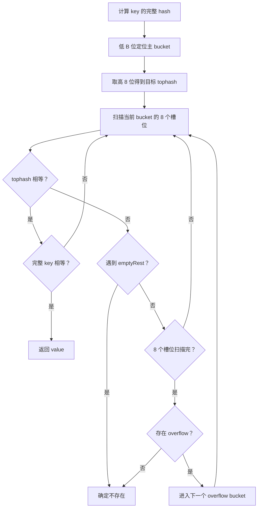
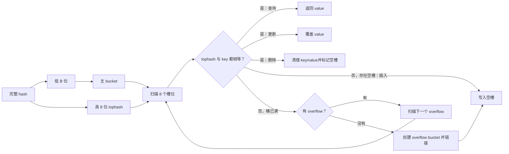

# 技术｜Go语言核心与工程化面试题

> 面向 9 年+ Golang Web 后端业务岗。
> 回答方式统一采用“结论先行 -> 分层展开 -> 面试追问”，重点体现 Go 基础深度、工程判断和业务落地能力。

## 一、Go 语言核心与工程化 面试思想方法论篇：先建立结构化回答框架

> 本模块回答“怎么学、怎么答、怎么临场组织”。先建立资深后端视角，再进入能力、原理、实战和项目表达。

### 方法 0：复习地图

```text
Go 当前能力 -> 核心原理 -> 工程实战 -> 项目表达 -> 面试方法论
```

### 方法 1：资深后端如何回答 Go 语言核心与工程化问题？

**结论先行：**
Go 面试不能停留在语法层，要回答“语言设计取舍、运行时行为、工程风险、性能影响和线上治理”。

**分层展开：**

**语言层**
- slice、map、interface、defer、panic/recover、error。
- 值传递、指针、逃逸分析、零值可用。

**工程层**
- context 贯穿请求生命周期。
- error 显式处理和错误分类。
- Go module、依赖升级、接口隔离、单测基准测试。

**性能层**
- 减少无意义分配。
- 关注逃逸、反射、序列化、锁竞争。
- 用 pprof 和 benchmark 证明优化收益。

**业务层**
- 代码结构服务于业务边界。
- 接口设计要支持演进。
- 不为了炫技引入复杂抽象。

**面试追问：Go 的优势是什么？**
Go 的优势是简单、并发模型清晰、部署方便、运行时能力强、生态适合云原生和微服务。它牺牲了一部分表达复杂度，换来工程协作和长期维护效率。

### 方法 2：Go 语言核心与工程化 题目通用决策框架

```text
题目问语言机制？
    先说用途 -> 底层结构 -> 边界坑点 -> 工程建议

题目问并发稳定性？
    控制并发 -> 传递取消 -> 处理错误 -> 防泄漏 -> 可观测

题目问项目实践？
    场景 -> 约束 -> 方案 -> 监控 -> 复盘
```

## 二、Go 语言核心与工程化 当前能力全景：核心语法、工程能力与边界

> 本模块回答“能做什么、怎么正确使用”。先掌握能力边界，再进入底层原理。

### 1. slice 和数组有什么区别？

**结论先行：**
数组是固定长度的值类型，slice 是对底层数组的动态视图，包含指针、长度和容量三个字段。

**分层展开：**

**数组**
- 长度是类型的一部分，例如 `[3]int` 和 `[4]int` 是不同类型。
- 赋值和传参会拷贝整个数组。
- 适合固定长度、低层实现和性能敏感小数组。

**slice**
- 本身是一个描述符：data 指针、len、cap。
- 传参会拷贝 slice header，但底层数组共享。
- append 可能复用原数组，也可能扩容后分配新数组。

**工程风险**
- 子切片可能引用大数组，导致大对象无法释放。
- append 后是否影响原 slice 取决于容量是否足够。
- 并发读写同一个底层数组会有数据竞争。

**面试追问：如何避免子切片导致内存泄漏？**
如果只需要保留小片段，可以 copy 到新 slice，让原大数组可被 GC 回收。

#### 2.1 slice 共享底层数组有哪些容易踩的坑？

**结论先行：**
slice header 是值传递，但多个 slice 可能共享同一底层数组。修改已有元素通常彼此可见；`append` 是否相互影响，取决于容量是否足够。

```go
func modify(s []int) {
	s[0] = 99 // 修改共享的底层数组
	s = append(s, 4) // 只改变函数内 slice header
}
```

**append 覆盖原数组：**

```go
a := []int{1, 2, 3, 4}
b := a[:2]       // len=2，cap=4
b = append(b, 9) // 复用底层数组，覆盖 a[2]

fmt.Println(a) // [1 2 9 4]
```

需要阻止子 slice 的 append 污染原数组时，可以使用完整切片表达式：

```go
a := []int{1, 2, 3, 4}
b := a[:2:2]     // low=0, high=2, max=2，因此 len=2，cap=2
b = append(b, 9) // 容量不足，分配新数组

fmt.Println(a) // [1 2 3 4]
```

**内存滞留：**

```go
data := make([]byte, 100<<20)
small := data[:10] // small 仍引用整个 100MB 底层数组
```

这更准确地说是内存滞留，不是无法回收的永久泄漏。处理方式：

```go
small := append([]byte(nil), data[:10]...)
// 或
small := make([]byte, 10)
copy(small, data[:10])
```

**面试追问：为什么 append 必须接收返回值？**
`append` 可能产生新的底层数组和新的 slice header。必须写成 `s = append(s, x)`，否则调用方可能丢失扩容后的结果。

### 2. map 并发读写会怎样？怎么解决？

**结论先行：**
普通 map 并发读写不安全，可能 panic 或数据竞争；要用锁、`sync.Map`、分片 map 或消息串行化来解决。

**分层展开：**

**问题原因**
- map 写入可能触发扩容和 bucket 迁移。
- 并发读写会破坏内部结构一致性。
- race condition 不一定每次复现。

**解决方案**
- `sync.RWMutex + map`：通用、可控。
- `sync.Map`：适合读多写少、key 稳定的场景。
- 分片 map：降低锁粒度，适合高并发读写。
- 单 goroutine 管理状态：通过 channel 串行化变更。

**选型建议**
- 业务缓存优先 `RWMutex + map`。
- 插件注册表、只增少删场景可用 `sync.Map`。
- 极高并发热点 key 要考虑分片。

**面试追问：sync.Map 为什么不适合所有场景？**
`sync.Map` 为特定场景优化，接口弱类型，删除和频繁更新场景不一定比加锁 map 更好。资深工程里要用压测数据选型。

### 3. interface 的底层是什么？

**结论先行：**
interface 本质上保存类型信息和数据指针；空接口和非空接口结构略有不同，但核心都是“动态类型 + 动态值”。

**分层展开：**

**空接口**
- 可以承载任意类型。
- 内部包含类型描述和数据指针。

**非空接口**
- 还需要记录方法集相关信息。
- 类型只有实现接口方法集才可赋值。

**常见风险**
- `var err error = (*MyError)(nil)` 时，interface 不等于 nil。
- 类型断言失败会 panic，推荐使用 `v, ok := x.(T)`。
- 频繁 interface 转换和反射可能带来额外成本。

**面试追问：为什么 interface 可能不等于 nil？**
因为 interface 只有在动态类型和动态值都为 nil 时才等于 nil。如果动态类型存在，只是动态值为 nil，则 interface 本身不为 nil。

#### 6.1 哪些类型可以比较？interface 比较为什么可能 panic？

**可比较性总表：**

| 类型 | 是否可比较 | 条件或含义 |
|---|---|---|
| bool、整数、浮点数、复数、string | 可以 | 浮点计算结果要注意精度和 NaN |
| pointer | 可以 | 比较地址或是否都为 nil |
| channel | 可以 | 比较是否为同一个 channel 或都为 nil |
| array | 条件可以 | 元素类型必须可比较 |
| struct | 条件可以 | 所有字段必须可比较 |
| interface | 条件可以 | 两侧动态值必须可比较 |
| slice、map、function | 不可以 | 只能与 nil 比较 |

Go 1.21+ 可使用标准库 `slices.Equal` 和 `maps.Equal` 比较满足约束的内容；它们不是通过 `==` 直接比较 slice 或 map。

**interface 相等的条件：**

```text
动态类型相同 && 动态值相等
```

```go
var a any = int32(10)
var b any = int64(10)
fmt.Println(a == b) // false，动态类型不同
```

若动态类型不可比较，比较操作可以通过编译，但运行时会 panic：

```go
var a any = []int{1, 2}
var b any = []int{1, 2}
fmt.Println(a == b) // panic: comparing uncomparable type []int
```

**typed nil：**

```go
type MyError struct{}

func (*MyError) Error() string { return "failed" }

var concrete *MyError
var err error = concrete

fmt.Println(concrete == nil) // true
fmt.Println(err == nil)      // false
```

此时 `err` 的动态类型是 `*MyError`，动态值才是 nil，因此接口整体不为 nil。

**面试追问：struct 为什么有时不能作为 map key？**
struct 只有在全部字段都可比较时才可比较。含 slice、map 或 function 字段的 struct 不能作为 map key。

### 4. Go 的值传递怎么理解？

**结论先行：**
Go 所有参数传递都是值传递，只是传递的值可能是指针、slice header、map header、channel 等引用语义的描述符。

**分层展开：**

**普通值**
- int、struct、array 传参会拷贝值。
- 修改副本不影响原值。

**引用语义对象**
- slice 传的是 slice header 的副本。
- map、chan 传的是运行时结构的引用描述。
- 指针传的是地址值的副本。

**工程建议**
- 大 struct 传指针，避免拷贝成本。
- 小 struct 值传递更简单安全。
- 可变对象传指针时要注意并发和逃逸。

**面试追问：slice 传参后 append 会影响外面吗？**
修改已有元素通常会影响，因为共享底层数组。append 是否影响外面取决于是否扩容。

### 5. Go error 如何设计？

**结论先行：**
Go 的 error 设计应该区分“系统错误、业务错误、可重试错误、不可重试错误”，并保留上下文，方便上层决策和排障。

**分层展开：**

**错误分类**
- 参数错误。
- 业务规则错误。
- 下游依赖错误。
- 超时和取消。
- 数据一致性错误。

**错误包装**
- 使用 `%w` 包装底层 error。
- 用 `errors.Is/As` 判断错误类型。
- 保留业务上下文，但不要泄露敏感信息。

**工程实践**
- API 层统一转换错误码。
- 日志记录链路信息和关键参数。
- 不要重复打日志，避免噪声。

**面试追问：什么时候返回 error，什么时候 panic？**
可预期、可恢复、需要调用方处理的问题返回 error；程序无法继续、安全性被破坏或初始化不可恢复时可以 panic。

### 6. context 解决什么问题？

**结论先行：**
context 用来在调用链中传递取消信号、超时时间和请求级元数据，是 Go 服务端治理超时、取消和资源释放的核心机制。

**分层展开：**

**核心能力**
- `WithCancel` 主动取消。
- `WithTimeout/WithDeadline` 控制超时。
- `WithValue` 传递请求级元数据。

**典型场景**
- HTTP 请求结束后取消下游调用。
- RPC 超时控制。
- 数据库查询取消。
- 异步任务级联停止。

**工程规范**
- context 作为函数第一个参数。
- 不要把 context 存在 struct 中长期持有。
- `WithValue` 只放请求级元信息，如 trace id，不放业务参数。

**面试追问：为什么要把 context 传给数据库和 RPC？**
这样上游超时或客户端断开后，下游操作可以及时取消，避免无意义占用连接、线程和 goroutine。

### 7. 反射适合什么场景？有什么风险？

**结论先行：**
反射适合框架、序列化、ORM、通用工具，但不适合普通业务热路径，因为它牺牲类型安全、可读性和性能。

**分层展开：**

**适合场景**
- JSON/ORM 字段映射。
- 依赖注入。
- 配置解析。
- 通用校验器。

**风险**
- 编译期无法检查类型。
- 运行时 panic 风险高。
- 性能和分配成本更高。
- 代码可读性下降。

**工程建议**
- 业务代码优先显式类型。
- 热路径避免反射。
- 框架层使用反射要有缓存和 benchmark。

**面试追问：如何优化反射性能？**
缓存类型元数据、减少重复字段解析、避免在循环热路径反复反射，必要时用代码生成替代。

### 8. Go 泛型解决什么问题？

**结论先行：**
泛型解决类型安全的通用代码复用问题，适合集合、算法、工具库，但不应滥用于业务抽象。

**分层展开：**

**价值**
- 减少重复代码。
- 保持类型安全。
- 避免大量 `interface{}` 和类型断言。

**适合场景**
- 通用集合。
- 分页结果。
- 缓存 wrapper。
- 算法工具函数。

**风险**
- 复杂约束降低可读性。
- 业务泛型抽象过度会让代码难懂。
- 和 interface 的边界要清晰。

**面试追问：泛型和 interface 怎么选？**
需要编译期类型安全和通用数据结构时用泛型；需要行为抽象和多态时用 interface。

### 9. unsafe 能不能用？

**结论先行：**
unsafe 可以用，但应限制在极少数性能敏感、边界清晰、测试充分的底层代码中，普通业务代码不建议使用。

**分层展开：**

**使用场景**
- 零拷贝转换。
- 高性能序列化。
- 系统底层库。

**风险**
- 绕过类型安全。
- 破坏 GC 正确性。
- Go 版本升级后行为可能变化。
- 隐藏 bug 很难排查。

**工程规范**
- 封装在小范围函数内。
- 写清楚前置条件。
- 单测、race、benchmark 都要覆盖。
- 优先使用标准库安全方案。

**面试追问：字符串和 byte slice 能否零拷贝转换？**
可以用 unsafe 做，但必须保证生命周期和不可变语义，业务代码通常不值得冒这个风险。

## 三、核心能力原理分析：为什么这样设计、代价是什么

> 本模块回答“为什么能做到、哪里会失效”。复杂原理要结合案例和线上问题理解。

### 10. slice 扩容规则是什么？

**结论先行：**
slice append 超过容量时会扩容，旧版本通常小容量翻倍、大容量按较小比例增长，新版本规则更平滑；工程上不要死记倍数，要理解扩容会导致重新分配和拷贝。

**分层展开：**

**触发条件**
- `append` 后长度超过容量。
- 运行时分配更大的底层数组。
- 将旧元素拷贝到新数组。

**性能影响**
- 扩容会产生内存分配。
- 元素拷贝会带来 CPU 成本。
- 指向旧数组的其他 slice 不会自动指向新数组。

**优化建议**
- 能预估容量时使用 `make([]T, 0, n)`。
- 大批量拼接避免频繁 append。
- 热路径关注分配次数和 pprof 结果。

**面试追问：append 后原 slice 一定不变吗？**
不一定。如果容量足够，append 会复用底层数组，其他共享底层数组的 slice 可能看到变化。如果容量不足，会分配新数组。

#### 3.1 slice 扩容如何结合工程场景回答？

**热路径风险：**
扩容不是每次 append 都发生，因此请求耗时可能呈现抖动。触发扩容的一次操作需要完成新数组分配、旧元素拷贝，并增加后续 GC 压力。

**列表组装：**

```go
func buildOrderDTOs(orders []Order) []OrderDTO {
	result := make([]OrderDTO, 0, len(orders))
	for _, order := range orders {
		result = append(result, OrderDTO{
			ID:     order.ID,
			Amount: order.Amount,
		})
	}
	return result
}
```

**批量消费：**

```go
func collectUserIDs(messages []Message) []int64 {
	ids := make([]int64, 0, len(messages))
	for _, message := range messages {
		ids = append(ids, message.UserID)
	}
	return ids
}
```

**工程判断：**
- 已知最终数量时，优先 `make([]T, 0, n)`。
- 最终长度固定且每个位置都会赋值时，可以 `make([]T, n)` 后按下标写入。
- 不要为了消除所有扩容而盲目预分配巨大容量，否则会用内存换取并不存在的性能收益。
- 用 benchmark、allocs/op 和 pprof 验证热点，不依赖主观判断。

**面试追问：slice 是并发安全的吗？**
多个 goroutine 只读同一 slice 可以；只要存在并发写元素或 append，就可能发生 data race。即使两个 slice header 不同，只要共享底层数组，仍可能竞争。

### 11. map 的底层原理是什么？

**结论先行：**
Go map 本质上是哈希表。Go 1.23 及以前采用 `hmap + bucket + overflow` 和渐进迁移；Go 1.24 起改为 Swiss Table，采用 table、group、control word 和开放寻址。

**分层展开：**

**经典实现（Go 1.23 及以前）**
- key 通过 hash 定位 bucket。
- bucket 内存储若干 key/value 和 tophash。
- 冲突过多时使用 overflow bucket。

**经典扩容机制**
- 元素过多或 overflow bucket 过多会触发扩容。
- Go map 采用渐进式迁移，避免一次性搬迁所有数据。
- 扩容过程中读写要同时兼容新旧 bucket。

**当前实现（Go 1.24+）**
- hash 拆为 H1 和 H2，H1 用于定位和探测，H2 用于槽位初筛。
- 每个 group 包含 8 个 slot 和一个 control word。
- 冲突时使用开放寻址的 probe sequence，不再创建 overflow bucket 链。

**工程风险**
- map 不是并发安全的。
- 遍历顺序不稳定，不能依赖顺序。
- key 必须可比较，slice/map/function 不能直接做 key。

**面试追问：为什么 map 遍历是随机的？**
Go 运行时有意打乱遍历顺序，避免开发者依赖未定义行为，也有助于暴露隐藏 bug。

#### 4.1 map 经典 bucket 实现图解（Go 1.23 及以前）

> **版本提示：**下面是面试最常考的 `hmap + bmap + overflow bucket` 模型，对应 Go 1.23 及以前的经典实现。Go 1.24 起内置 map 已改为 Swiss Table，文末会说明差异。面试时应先确认面试官问的是经典实现还是当前实现。

##### 一、先看全局：一个 map 到底长什么样

```text
map 变量
   │
   ▼
+---------------------------+
| hmap                      |
| count      元素数量       |
| B          bucket 数量指数|
| hash0      随机哈希种子   |
| buckets ───────────────────────┐
| oldbuckets 扩容前的桶数组 |    │
| nevacuate  已迁移进度     |    │
+---------------------------+    │
                                 ▼
              buckets 数组，共 2^B 个主 bucket
        +-----------+-----------+-----------+-----------+
        | bucket 0  | bucket 1  | bucket 2  |    ...    |
        +-----┬-----+-----------+-----┬-----+-----------+
              │                       │
              ▼                       ▼
        overflow 0-1             overflow 2-1
              │
              ▼
        overflow 0-2
```

`B` 不是 bucket 数量，而是 bucket 数量的以 2 为底的指数：

```text
B = 0  -> 2^0 = 1 个主 bucket
B = 1  -> 2^1 = 2 个主 bucket
B = 3  -> 2^3 = 8 个主 bucket
```

##### 二、一个 bmap（bucket）的真实逻辑布局

每个 bucket 最多存放 8 组 key/value。源码中的 `bmap` 表面只声明了 `tophash`，编译器会在其后安排 keys、values 和 overflow 指针。

```text
一个 bucket（bmap）

低地址
┌───────────────────────────────────────────────────────────────┐
│ tophash[8] │ t0 │ t1 │ t2 │ t3 │ t4 │ t5 │ t6 │ t7 │
├───────────────────────────────────────────────────────────────┤
│ keys[8]    │ k0 │ k1 │ k2 │ k3 │ k4 │ k5 │ k6 │ k7 │
├───────────────────────────────────────────────────────────────┤
│ values[8]  │ v0 │ v1 │ v2 │ v3 │ v4 │ v5 │ v6 │ v7 │
├───────────────────────────────────────────────────────────────┤
│ overflow *bmap                                                │
└───────────────────────────────────────────────────────────────┘
高地址

同一个槽位的对应关系：
tophash[i] <-> key[i] <-> value[i]
```

key 和 value 没有按 `k0,v0,k1,v1...` 交替存储，而是先放完 8 个 key，再放 8 个 value。这样可以减少某些类型组合产生的内存对齐填充。

##### 三、低位 hash 和 tophash 各自负责什么

假设：

```text
B = 3，因此一共有 2^3 = 8 个主 bucket

某个 key 经过 hash 后得到：

hash = 1010 1011  .... ....  .... ....  .... .101
       └──┬───┘                              └─┬─┘
        高 8 位                              低 B 位
         0xAB                                 101
```

```text
低 B 位：101₂ = 5
作用：定位主 bucket 5

高 8 位：0xAB
作用：得到 tophash，放入 bucket 槽位中
```

公式可以记成：

```text
bucketIndex = hash & ((1 << B) - 1)  // 取低 B 位
tophash     = hash >> (机器字长 - 8) // 取高 8 位
```

经典实现中，普通元素的 `tophash` 最小值是 5。若计算出的高 8 位小于 5，运行时会给它加 5，因为 `0~4` 被保留为特殊状态：

```text
0 = emptyRest       当前槽及其后面都没有元素，可结束查询
1 = emptyOne        当前槽为空，但后面可能还有元素
2 = evacuatedX      扩容时已迁移到新数组前半部分
3 = evacuatedY      扩容时已迁移到新数组后半部分
4 = evacuatedEmpty  空槽已完成迁移
5~255               正常元素的 tophash
```

**为什么既用低位又用高位？**

- 低 `B` 位快速定位到某个主 bucket。
- 高 8 位在 bucket 内做廉价初筛。
- 只有 `tophash` 相等时，才继续比较完整 key。
- 不同 key 的 `tophash` 仍可能相同，所以它不是唯一标识。

##### 四、一次查询是怎么完成的

假设查询 `m["pear"]`：

```text
hash("pear", hash0)
        │
        ├── 低 B 位 = 010 ──> 定位 bucket 2
        │
        └── 高 8 位 = 0x9A ─> 目标 tophash
```

bucket 2 当前内容：

```text
下标         0      1      2      3      4      5      6      7
tophash    0x31   0x9A   0x9A   0x56     0      0      0      0
key        "cat"  "plum" "pear" "dog"     -      -      -      -
value        7      12     20      9       -      -      -      -
                     │      │
                     │      └── tophash 相等，key 也相等，返回 20
                     └───────── tophash 相等，但 key 不等，继续找
```

查询流程：



核心不是“看到同样的 `tophash` 就命中”，而是：

```text
tophash 相等 && 完整 key 相等 -> 真正命中
```

##### 五、哈希冲突时 overflow bucket 如何创建

有两类常见冲突：

1. 不同 key 的低 `B` 位相同，被分到同一个主 bucket。
2. 它们甚至可能拥有相同 `tophash`，最终仍靠完整 key 比较区分。

假设下面 9 个 key 的低 `B` 位都为 `011`，因此都进入 bucket 3：

```text
插入前 8 个 key：

bucket 3
┌──────────────────────────────────────────────────────┐
│ top │ A1 │ B2 │ C3 │ D4 │ E5 │ F6 │ A1 │ B2 │
├──────────────────────────────────────────────────────┤
│ key │ k1 │ k2 │ k3 │ k4 │ k5 │ k6 │ k7 │ k8 │
├──────────────────────────────────────────────────────┤
│ val │ v1 │ v2 │ v3 │ v4 │ v5 │ v6 │ v7 │ v8 │
├──────────────────────────────────────────────────────┤
│ overflow = nil                                       │
└──────────────────────────────────────────────────────┘
```

插入第 9 个 key `k9` 时，主 bucket 没有空槽：

```text
bucket 3（主桶已满）
┌──────────────────────────────────────────────────────┐
│ k1 │ k2 │ k3 │ k4 │ k5 │ k6 │ k7 │ k8 │ overflow ─────┐
└──────────────────────────────────────────────────────┘  │
                                                          ▼
overflow bucket 3-1
┌──────────────────────────────────────────────────────┐
│ top │ C8 │  0 │  0 │  0 │  0 │  0 │  0 │  0 │
├──────────────────────────────────────────────────────┤
│ key │ k9 │  - │  - │  - │  - │  - │  - │  - │
├──────────────────────────────────────────────────────┤
│ val │ v9 │  - │  - │  - │  - │  - │  - │  - │
├──────────────────────────────────────────────────────┤
│ overflow = nil                                       │
└──────────────────────────────────────────────────────┘
```

overflow bucket 的创建过程可以概括为：

```text
1. 定位主 bucket。
2. 沿 overflow 指针扫描整条链，同时寻找可复用空槽。
3. 若找到空槽，直接写入。
4. 若整条链都满了，运行时申请一个新的 bmap。
5. 将链尾 bucket.overflow 指向新 bmap。
6. 在新 overflow bucket 的第一个槽位写入元素。
7. 更新 overflow bucket 计数。
```

overflow 链可能继续增长：

```text
主 bucket
    │ overflow
    ▼
overflow 1
    │ overflow
    ▼
overflow 2
    │
    ▼
   nil
```

这是一条单向链。查询、更新和删除都从主 bucket 开始，再按顺序扫描 overflow 链。

##### 六、存在 overflow 时如何查询

查找 `k17`，且它位于第二个 overflow bucket：

```text
计算 hash
   │
   ▼
主 bucket：扫描 8 个槽位，未命中
   │ overflow != nil
   ▼
overflow 1：扫描 8 个槽位，未命中
   │ overflow != nil
   ▼
overflow 2：tophash 命中
   │
   ├── 完整 key 不等 -> 继续扫描
   └── 完整 key 相等 -> 返回 value
```

overflow 链越长，查询时需要访问的内存越多，缓存局部性越差。因此 overflow bucket 过多即使元素总数不大，也可能触发一次**等量扩容**，重新整理桶布局。

##### 七、删除元素时发生了什么

执行：

```go
delete(m, "pear")
```

运行时先按查询流程找到对应槽位，然后：

```text
1. 清理 key。
2. 清理 value。
3. 将槽位的 tophash 标记为空。
4. hmap.count 减 1。
```

删除前：

```text
下标         0       1       2       3       4
tophash    0x31    0x9A    0x55    0x71      0
key        "cat"   "pear"  "dog"   "book"     -
```

删除中间的 `"pear"` 后：

```text
下标         0       1       2       3       4
tophash    0x31      1     0x55    0x71      0
key        "cat"     -     "dog"   "book"     -
                    ↑
                 emptyOne
```

这里必须是 `emptyOne`，不能直接用 `emptyRest`。因为后面还有元素，查询另一个 key 时不能在下标 1 提前结束。

删除链尾元素时，运行时会向前检查连续的空槽，尽可能把末尾的 `emptyOne` 收缩成 `emptyRest`：

```text
删除前： [A1] [B2] [C3] [ 0] [ 0]
删除 C3：[A1] [B2] [ 0] [ 0] [ 0]
                        ↑
                 emptyRest，可提前结束查询
```

**删除 overflow 中的元素会立即释放 overflow bucket 吗？**

通常不会因为删掉一个元素就立刻摘除并释放该 overflow bucket。槽位会被清空，但桶结构主要在后续扩容或整理时回收。这样可以避免频繁申请、释放和修改链结构。

##### 八、插入、查询、删除放在一张图里



##### 九、扩容时 bucket 如何变化

经典实现中有两种扩容：

```text
翻倍扩容：负载因子过高
2^B 个 bucket -> 2^(B+1) 个 bucket

等量扩容：overflow bucket 过多，但有效元素并不多
2^B 个 bucket -> 仍为 2^B 个 bucket，目的是整理数据
```

扩容不是一次搬完，而是渐进迁移：

```text
hmap
├── buckets    -> 新 bucket 数组
├── oldbuckets -> 旧 bucket 数组
└── nevacuate  -> 下一个待迁移旧 bucket

每次写操作顺带迁移一部分旧 bucket：

old bucket i
     ├── hash 新增位为 0 -> 新数组 bucket i（X）
     └── hash 新增位为 1 -> 新数组 bucket i + 2^B（Y）
```

这就是 `evacuatedX` 和 `evacuatedY` 状态的来源。扩容期间访问 map，需要判断目标旧 bucket 是否已迁移，再决定从旧数组还是新数组查找。

##### 十、面试口述版

> Go 1.23 及以前的经典 map 底层是哈希表，`hmap` 指向 `2^B` 个主 bucket。一个 bucket 最多保存 8 组 key/value，并为每个槽位保存一个 `tophash`。完整 hash 的低 `B` 位用于选择主 bucket，高 8 位作为 `tophash` 在桶内快速过滤，最终仍需比较完整 key。主 bucket 满后会通过 overflow 指针连接新的 bucket；查询和删除都沿这条链扫描。删除会清空 key/value，并根据后续是否还有元素标记为 `emptyOne` 或 `emptyRest`。负载过高或 overflow 过多会触发翻倍扩容或等量扩容，并通过渐进迁移降低单次延迟。

#### 4.2 Go 1.24+：为什么不能再把 overflow bucket 当作当前实现

Go 1.24 起，内置 map 改为基于 Swiss Table 的实现。当前版本的核心概念变为：

```text
Map
└── Directory
    ├── Table 0（最多约 1024 个 entry）
    │   ├── Group 0：control word + 8 个 slot
    │   ├── Group 1：control word + 8 个 slot
    │   └── ...
    ├── Table 1
    └── ...
```

hash 被拆分为：

```text
H1：高 57 位，用于选择 table 和探测 group
H2：低 7 位，写入 control byte，用于并行筛选 8 个 slot
```

```text
一个 Swiss Group

┌───────────────────────────────────────────────────────────┐
│ control word：c0 c1 c2 c3 c4 c5 c6 c7                    │
├───────────────────────────────────────────────────────────┤
│ slot 0 │ slot 1 │ slot 2 │ slot 3 │ ... │ slot 7         │
│ k0/v0  │ k1/v1  │ k2/v2  │ k3/v3  │ ... │ k7/v7          │
└───────────────────────────────────────────────────────────┘

control byte：
0hhhhhhh = 槽位已使用，hhhhhhh 保存 H2
10000000 = empty
11111110 = deleted
```

Swiss Table 不再通过 overflow bucket 链处理冲突，而是使用开放寻址和 probe sequence 寻找后续 group。control word 可以一次并行比较 8 个 H2，减少逐槽检查和指针跳转。

**新版面试回答建议：**

> 如果问经典 Go map，我会回答 `hmap/bmap/tophash/overflow`；但从 Go 1.24 开始，运行时已经切换到 Swiss Table，使用 group、control word、H1/H2 和开放寻址探测，不再使用经典 overflow bucket 链。两套实现都应了解，但需要先明确版本。

参考：

- [Go 1.24 Release Notes：新 map 实现](https://go.dev/doc/go1.24)
- [Go Blog：Faster Go maps with Swiss Tables](https://go.dev/blog/swisstable)
- [Go 当前 map 源码](https://go.dev/src/internal/runtime/maps/map.go)

#### 4.3 map 常见语义与工程陷阱

**nil map：**

```go
var m map[string]int
fmt.Println(m["missing"]) // 0，读取安全
delete(m, "missing")      // 安全
m["a"] = 1               // panic: assignment to entry in nil map
```

nil map 可以读取、遍历、取长度和删除，但写入前必须初始化。

**零值与 comma-ok：**

```go
value, ok := m["key"]
```

单值读取无法区分“key 不存在”和“key 存在但 value 恰好是零值”，需要通过 `ok` 判断。

**结构体 value 不可直接改字段：**

```go
type User struct {
	Age int
}

m := map[string]User{"tom": {Age: 18}}

user := m["tom"]
user.Age = 20
m["tom"] = user
```

`m["tom"]` 的结果不可寻址，不能写 `m["tom"].Age = 20`。也可以存 `*User`，但要承担共享可变对象、nil 指针和并发安全问题。

**稳定输出：**
map 遍历顺序没有保证。需要稳定输出时，应先收集 key 并排序，再按排序后的 key 访问 map。

**遍历时删除：**
Go 语言允许在 `range map` 时删除尚未遍历到的元素，被删除元素不会再被产出。但工程中仍应避免复杂的边遍历边修改逻辑；并发遍历和写入依然不安全。

**面试追问：interface{} 可以作为 map key 吗？**
语法上可以，但实际放入的动态值必须可比较。以 slice、map 或 function 作为动态 key 时，会在运行时 panic。

### 12. defer 的执行顺序和成本是什么？

**结论先行：**
defer 按后进先出执行，函数返回前运行；现代 Go 已优化 defer 成本，但在极端热循环中仍要谨慎。

**分层展开：**

**执行规则**
- 多个 defer LIFO 执行。
- defer 参数在注册时求值。
- defer 可以修改具名返回值。

**典型用途**
- 释放锁。
- 关闭文件或连接。
- recover panic。
- 统计耗时。

**性能注意**
- 普通业务代码可以放心使用。
- 极高频循环里大量 defer 仍可能有成本。
- 不要在循环中无脑 defer 关闭资源，可能拖到函数结束才释放。

**面试追问：defer 参数什么时候求值？**
defer 语句执行时立即求值，不是 defer 函数真正执行时才求值。

### 13. panic/recover 应该怎么用？

**结论先行：**
panic/recover 不是常规错误处理机制，应该用于不可恢复异常、框架边界兜底和保护 goroutine，不应替代 error。

**分层展开：**

**适合场景**
- HTTP/RPC 中间件兜底，避免单个请求打挂进程。
- goroutine 顶层保护，记录异常日志。
- 初始化阶段遇到不可恢复配置错误。

**不适合场景**
- 普通业务分支。
- 可预期的参数错误。
- 下游返回失败。

**工程规范**
- recover 必须在 defer 中调用。
- recover 后要记录堆栈和请求上下文。
- 框架层兜底，业务层显式返回 error。

**面试追问：子 goroutine 的 panic 能被父 goroutine recover 吗？**
不能。recover 只能捕获同一个 goroutine 栈上的 panic，所以每个关键 goroutine 都要有自己的兜底。

### Go 内存模型与 happens-before

**结论先行：**
Go 内存模型定义了不同 goroutine 之间读写共享变量时，哪些操作能保证可见性和顺序。只要存在数据竞争，程序结果就不能靠经验判断。

**必须掌握的 happens-before 场景：**

- goroutine 创建前的写，对新 goroutine 启动后可见。
- channel 发送 happens-before 对应接收完成。
- close channel happens-before 接收方观察到关闭。
- mutex unlock happens-before 后续 lock 成功。
- `sync.Once` 的函数执行完成 happens-before 后续所有 `Do` 返回。
- atomic 操作提供原子性和特定顺序保证。

**错误示例：**

```go
var done bool

go func() {
	done = true
}()

for !done {
}
```

这段代码有数据竞争。即使本地看起来能跑，也不能保证另一个 goroutine 一定看到 `done = true`。

**正确方式：**

```go
done := make(chan struct{})

go func() {
	close(done)
}()

<-done
```

或者使用 `sync.Mutex`、`sync/atomic`。

**面试追问：race detector 能发现所有并发问题吗？**
不能。`go test -race` 能发现实际执行路径上的数据竞争，但不能证明程序没有并发问题。它发现不了未覆盖路径，也不能替代并发设计。工程上要结合单测、压测、代码审查和 pprof/trace。

## 四、Go 语言核心与工程化 实战设计：会用、用好、知道边界

> 本模块回答“怎么落到工程设计里”。重点是分层、接口、测试、超时、并发和性能。

### 14. Go 项目如何分层？

**结论先行：**
Go 项目分层应围绕业务边界和依赖方向设计，常见是 handler/controller、service/usecase、repository/dao、domain/model、infra/pkg。

**分层展开：**

**接口层**
- HTTP/RPC 入参校验。
- 鉴权、限流、错误码转换。
- 不放复杂业务逻辑。

**业务层**
- 编排业务流程。
- 处理事务、一致性、幂等。
- 调用多个领域服务或仓储。

**数据层**
- 封装 DB、Redis、MQ。
- 不泄露底层实现细节。
- 控制 SQL 和缓存 key。

**基础设施层**
- 日志、指标、配置、客户端。
- 和业务逻辑解耦。

**面试追问：Go 要不要严格 DDD？**
不建议为了 DDD 而 DDD。复杂业务可以借鉴领域建模和依赖倒置，简单 CRUD 保持直接清晰更重要。

### 15. Go 接口应该定义在哪一侧？

**结论先行：**
Go 接口通常应该定义在使用方，而不是实现方，这样更符合依赖倒置和最小接口原则。

**分层展开：**

**原因**
- 使用方最清楚需要哪些方法。
- 避免实现方定义大而全接口。
- 降低 mock 和测试成本。

**实践**
- 接口尽量小。
- 不提前抽象。
- 当存在多个实现或需要测试替身时再抽象。

**反例**
- 一个 service 定义几十个方法的大接口。
- 所有 struct 都配套 interface。
- 为了 mock 牺牲业务可读性。

**面试追问：Go 里需要显式声明实现接口吗？**
不需要。Go 是隐式实现接口，只要方法集匹配即可。必要时可用 `var _ Interface = (*Impl)(nil)` 做编译期检查。

### 16. Go 单元测试怎么写才有价值？

**结论先行：**
有价值的单测应该覆盖业务规则、边界条件、错误路径和并发风险，而不是只追求覆盖率数字。

**分层展开：**

**测试对象**
- 纯业务函数。
- service 编排逻辑。
- 错误分类和幂等逻辑。
- 复杂算法和状态机。

**测试方式**
- 表格驱动测试。
- mock 外部依赖。
- 使用 `t.Parallel()` 时注意共享状态。
- 集成测试覆盖 DB/Redis/MQ 关键路径。

**质量标准**
- 测试名称表达业务场景。
- 输入输出清晰。
- 失败信息可定位。
- CI 中稳定运行。

**面试追问：什么时候写 benchmark？**
当优化性能、比较方案、验证序列化/锁/内存分配时写 benchmark，而不是凭感觉优化。

### 17. Go module 依赖治理怎么做？

**结论先行：**
依赖治理核心是版本可控、升级可回滚、安全可审计、间接依赖不过度膨胀。

**分层展开：**

**版本管理**
- 使用 Go module 固定版本。
- 重要依赖升级要看 changelog。
- 避免随意使用 replace 长期指向本地路径。

**安全治理**
- 定期扫描漏洞。
- 控制不维护依赖。
- 私有模块配置好代理和权限。

**工程实践**
- 依赖升级走测试和灰度。
- 公共库保持兼容。
- 不为小功能引入重依赖。

**面试追问：go.sum 有什么用？**
`go.sum` 记录模块版本的校验和，用来保证依赖内容可验证，防止同版本模块被篡改。

### 18. 资深 Go 项目里如何做性能优化？

## 五、线上治理与故障排查：发现问题、定位问题、解决问题

> 本模块回答“线上出问题怎么办”。重点是 pprof、泄漏、CPU、内存、优雅停机和 race。

### 19. context 泄漏是什么？

**结论先行：**
context 泄漏通常是创建了带 cancel 的 context 但没有调用 cancel，导致 timer、子 context 或 goroutine 不能及时释放。

**分层展开：**

**常见原因**
- `context.WithTimeout` 后忘记 `defer cancel()`。
- goroutine 等待 `ctx.Done()` 但没有退出路径。
- 下游不接受 context，取消信号无法传递。

**影响**
- timer 泄漏。
- goroutine 泄漏。
- 请求结束后资源仍被占用。

**治理**
- 创建可取消 context 后立即安排 cancel。
- goroutine select 监听 `ctx.Done()`。
- 压测和 pprof 观察 goroutine 数量。

**面试追问：context 超时后业务一定停止了吗？**
不一定。context 只是传递取消信号，下游代码必须主动监听和尊重这个信号。

### HTTP/RPC 超时、连接池与工程并发边界

**为什么必须掌握：**
字节后端面试很容易从 `context` 追问到完整调用链：入口请求、内部 RPC、外部 SDK、DB、Redis、MQ，每一层超时怎么配置，取消信号怎么传递，连接池怎么避免把下游打爆。

**1. HTTP Client 超时体系**

常见超时不是只有一个 `Timeout`：

- `DialContext` timeout：建立 TCP 连接超时。
- `TLSHandshakeTimeout`：TLS 握手超时。
- `ResponseHeaderTimeout`：等待响应头超时。
- `Client.Timeout`：整个请求生命周期超时。
- `context.WithTimeout`：业务链路超时和取消信号。

**面试表达：**
我不会只设置一个大而全的超时，而是会按调用链拆分预算。例如入口 800ms，内部 RPC 300ms，DB 100ms，外部 Facebook SDK 500ms，并且所有下游调用都接收同一个 request context，避免上游已经取消、下游还在占连接和 goroutine。

**2. 连接池核心参数**

- 最大连接数：限制并发打到下游的强度。
- 空闲连接数：减少频繁建连。
- 连接最大生命周期：避免长期连接遇到 NAT、LB 或服务端状态异常。
- 等待超时：避免请求无限等待连接。

**面试追问：连接池满了是加连接数吗？**
不一定。先看是慢请求、下游抖动、连接泄漏还是突发流量。盲目加连接会把下游压垮。正确路径是看池等待时间、活跃连接数、错误率、P99、下游容量，再决定限流、降级、扩容或优化慢请求。

**3. bounded concurrency 有界并发**

不能因为 goroutine 便宜就无限开。常见治理方式：

- worker pool：固定 worker 数消费任务。
- channel semaphore：用带缓冲 channel 控制并发数。
- errgroup + SetLimit：批量任务并发控制和错误传播。
- rate limiter：按 QPS 或令牌桶限制外部调用。
- singleflight：同 key 请求合并，防止缓存击穿。

Go 本地令牌桶常用 `golang.org/x/time/rate`：

```go
limiter := rate.NewLimiter(rate.Limit(60), 120) // 平均每秒 60 次，最大突发 120 次

if !limiter.Allow() {
	return ErrRateLimited
}
```

如果需要“排队等待 token”，用 `Wait(ctx)`；如果要“立即判断是否放行”，用 `Allow()`。多实例共享额度时不要只靠本地 limiter，应使用 Redis 全局限流或网关限流。

**保护 DB / 下游 RPC 的本地限流模板**

在高并发场景里，Go 服务本地通常会同时做两件事：
- 用令牌桶限制“单位时间进入下游的请求数”。
- 用 semaphore 限制“同时执行中的请求数”。

```go
var (
	ErrRateLimited = errors.New("rate limited")
	ErrBusy        = errors.New("downstream busy")

	// 平均每秒最多 200 次 DB 回源，允许短时突发 500 次。
	dbLimiter = rate.NewLimiter(rate.Limit(200), 500)

	// 同时最多 50 个 goroutine 查 DB，防止缓存击穿时把连接池和数据库打满。
	dbSem = make(chan struct{}, 50)
)

func queryDBWithGuard(ctx context.Context, fn func(context.Context) error) error {
	// Allow 是立即判断，适合保护数据库：超过就快速失败或降级，不让请求无限排队。
	if !dbLimiter.Allow() {
		return ErrRateLimited
	}

	select {
	case dbSem <- struct{}{}:
		defer func() { <-dbSem }()
		return fn(ctx)
	case <-ctx.Done():
		return ctx.Err()
	default:
		return ErrBusy
	}
}
```

如果保护的是外部 RPC 或第三方 API，并且允许短暂排队，可以用 `Wait(ctx)`：

```go
var rpcLimiter = rate.NewLimiter(rate.Limit(60), 120) // 平均 60 QPS，最大突发 120

func callRPCWithGuard(ctx context.Context, fn func(context.Context) error) error {
	if err := rpcLimiter.Wait(ctx); err != nil {
		return err
	}
	return fn(ctx)
}
```

工程判断：
- DB 回源、缓存击穿、慢 SQL 保护：更倾向 `Allow()` 快速失败 + semaphore 控并发 + singleflight 合并热点 key。
- 外部 API、媒体平台接口、低优先级任务：可以 `Wait(ctx)` 短暂排队，但必须给 context 设置超时。
- 多实例共享额度：本地 limiter 只能保护当前进程，账号/API/租户级全局限流要放到 Redis、网关或限流服务。

```go
g, ctx := errgroup.WithContext(ctx)
g.SetLimit(20)

for _, item := range items {
	item := item
	g.Go(func() error {
		return callDownstream(ctx, item)
	})
}

if err := g.Wait(); err != nil {
	return err
}
```

**项目表达：**
外部平台接口、素材批量同步、广告账户拉取这类任务，核心不是“开很多 goroutine”，而是“控制并发 + 超时 + 重试退避 + 限流 + 可观测”。这能体现你不是只会写代码，而是知道怎么保护系统和下游。

## 六、项目实战表达：把 Go 语言核心与工程化讲成项目能力

> 本模块用于项目深挖，把语言和运行时能力落到业务复杂度、稳定性和工程收益上。

### 20. 你在项目里如何做 Go 服务分层？

**推荐回答：**

我一般会按“接口层、业务编排层、领域能力层、数据访问层、基础设施层”拆分。以广告投放平台为例：

- API/Handler：负责参数解析、鉴权、返回结构，不写复杂业务。
- Logic/Service：负责广告任务创建、素材同步、工单分配等业务编排。
- Domain：沉淀任务状态流转、限流、分配规则、模板匹配等核心能力。
- Repository/Model：封装 MySQL、MongoDB、Redis、ES 访问。
- Infra：封装 Kafka、媒体 SDK、日志、trace、监控。

**核心原则：**
接口层薄，业务逻辑可测试；外部依赖通过接口隔离，方便 mock；复杂规则不要散落在 handler 里。

### 21. Go 项目里如何处理外部 SDK 不稳定？

**项目场景：**
枫叶互动广告平台大量依赖 Facebook/TikTok/Snapchat Marketing API，知乎项目也遇到过三方 SDK map 并发不安全问题。

**治理方式：**
- SDK 外面包一层 adapter，业务不直接依赖三方结构。
- 统一处理超时、重试、错误码、限流和日志。
- 对平台错误码做分类：可重试、不可重试、需人工处理。
- 对并发不安全的 SDK 做隔离或加锁。
- 关键请求记录 trace_id、request_id、平台返回，便于排查。

**面试亮点：**
外部 SDK 不能当成可信内部模块，要在边界层做保护。

### 22. 如何设计 Go error？

**推荐方式：**
- 基础设施错误保留原始 error，方便排查。
- 业务错误带业务码和用户可理解信息。
- 外部平台错误保留平台 code、message、request_id。
- 跨层返回时使用 wrap，避免丢失上下文。

**广告创建例子：**

```text
create ad failed:
  platform=facebook
  account_id=xxx
  task_id=xxx
  platform_code=rate_limit
  trace_id=xxx
```

**注意：**
不要所有地方都 `return err`，否则排查时不知道是哪一步失败。也不要把敏感信息直接打到日志里。

### 23. 如何回答“你做过哪些 Go 性能优化”？

**可以结合三个项目讲：**

- 知乎动态模板：通过缓存和模板匹配逻辑优化降低接口延迟，关注 QPS、TP99、成功率。
- 360 事件消费：主链路和 App 推送解耦，批量写入和多 topic 隔离提升吞吐。
- 枫叶互动广告平台：广告创建异步化，worker pool 控制并发，Redis 限流保护外部 API，ES 承接复杂检索。

**Go 层面可以展开：**
- pprof 定位 CPU/内存热点。
- 控制 goroutine 数量，避免泄漏。
- 减少大对象频繁分配。
- JSON 序列化热点优化。
- 连接池参数调优。
- context 超时控制。

**总结句：**
Go 性能优化不是只调 GC 参数，更多是从链路拆分、并发控制、缓存、批量处理和可观测性入手。

**结论先行：**
性能优化要先量化瓶颈，再针对 CPU、内存、锁、IO、序列化和下游调用做局部优化，不能凭直觉改代码。

**分层展开：**

**定位工具**
- benchmark。
- pprof CPU/heap/block/mutex。
- trace。
- 日志和指标。

**常见方向**
- 减少分配和逃逸。
- 降低锁竞争。
- 批量处理和连接池复用。
- 优化序列化。
- 控制 goroutine 数量。

**工程原则**
- 先优化高频路径。
- 每次只改一个变量。
- 用数据证明收益。
- 避免牺牲可读性换极小收益。

**面试追问：你怎么证明优化有效？**
用压测、benchmark、pprof 对比优化前后的 QPS、P99、CPU、内存分配、GC 次数和错误率。
