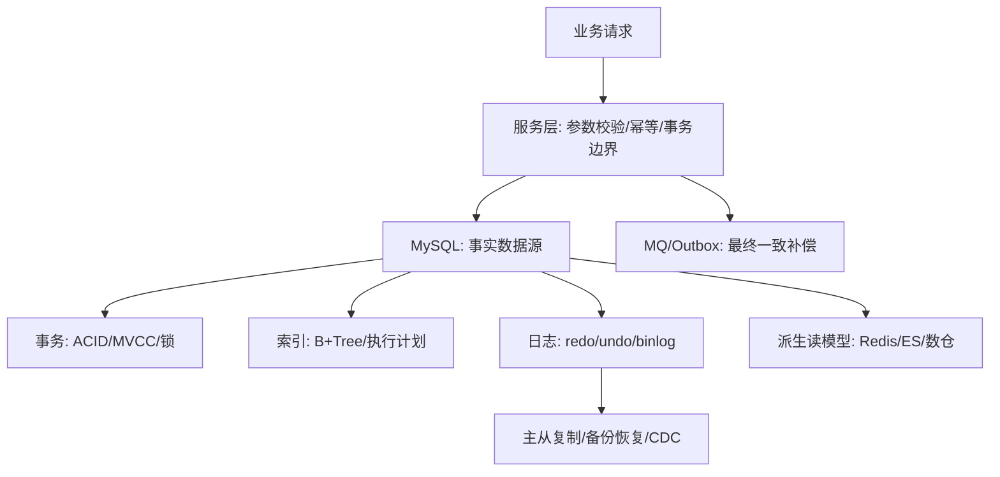

# 技术｜MySQL数据库面试题

> 面向 9 年+ Golang Web 后端业务岗。
> 回答重点：数据建模、索引、事务、锁、SQL 优化、主从复制、分库分表、线上治理和项目表达。

## 一、MySQL 面试思想方法论篇：先建立结构化回答框架

> 本模块回答“怎么学、怎么答、怎么临场组织”。MySQL 面试不要散点背诵，要围绕数据正确性、查询性能、并发控制、容量扩展和故障恢复建立金字塔。

### 方法 0：复习地图

```text
面试方法论 -> 当前能力全景 -> 核心原理 -> 实战设计 -> 线上治理 -> 项目表达
```

### 方法 1：资深后端 MySQL 金字塔学习框架

> 顶层先回答“为什么选 MySQL、如何保证正确性、如何扛住增长”；底层再落到索引、事务、锁、日志和执行计划。

```text
                    业务价值层
        数据正确性 / 查询效率 / 容量扩展 / 故障恢复
                         │
                    架构设计层
      主从复制 / 读写分离 / 分库分表 / 冷热归档 / 迁移切流
                         │
                    工程治理层
       表结构设计 / 索引设计 / 慢 SQL / 连接池 / 监控告警
                         │
                    并发一致层
        事务 ACID / MVCC / 行锁 / gap lock / 死锁重试
                         │
                    存储原理层
          B+Tree / Buffer Pool / redo / undo / binlog
```

**资深后端必须掌握的 8 个问题域：**

| 问题域 | 必须会什么 | 面试高频追问 | 项目表达落点 |
| --- | --- | --- | --- |
| 表结构设计 | 字段类型、主键、唯一键、范式/反范式、冷热字段拆分 | 为什么不用 UUID 做主键？金额怎么存？JSON 字段能不能用？ | 投放工单、广告任务、配额流水、审计日志 |
| 索引设计 | B+Tree、聚簇/二级索引、联合索引、覆盖索引、索引失效 | 联合索引顺序怎么定？为什么回表慢？ | 列表查询、状态筛选、报表查询、深分页 |
| SQL 执行 | 解析、优化器、执行计划、回表、排序、临时表 | EXPLAIN 怎么看？Using filesort 一定坏吗？ | 慢 SQL 排查和上线 SQL 审核 |
| 事务一致性 | ACID、隔离级别、MVCC、undo/redo、两阶段提交 | RR 怎么避免幻读？binlog/redo 为什么两阶段提交？ | 工单分配、库存扣减、状态流转 |
| 锁与并发 | 行锁、gap lock、next-key lock、死锁、锁等待 | 为什么没走索引会锁很多行？死锁怎么治理？ | 并发更新、任务抢占、热点行治理 |
| 高可用复制 | binlog、relay log、主从延迟、半同步、读写分离 | 写完读不到怎么办？主从延迟怎么处理？ | 读扩展、报表读库、关键链路读主 |
| 容量扩展 | 分库分表、分片键、全局 ID、迁移扩容、归档 | 什么时候分表？分表后怎么查？ | 广告日志、事件流水、历史报表 |
| 线上治理 | 慢 SQL、连接池、Online DDL、备份恢复、监控告警 | 连接池满了怎么办？大表加字段怎么做？ | 事故排查、性能优化、灰度变更 |

**金字塔表达模板：**

```text
结论：我会先保证数据正确性，再优化性能和扩展性。
第一层：数据模型是否合理，主键、唯一键、字段类型和事务边界是否清晰。
第二层：核心查询是否有合适索引，执行计划扫描量、回表、排序是否可控。
第三层：并发写是否通过事务、条件更新、锁、幂等和重试保证正确。
第四层：容量增长后通过读写分离、冷热拆分、分库分表、归档和迁移治理。
第五层：线上通过慢日志、连接池指标、锁等待、主从延迟、DDL 风险和告警闭环。
```

**一张总图：MySQL 在后端系统中的位置**



### 方法 2：资深后端如何回答 MySQL 问题？

**结论先行：**
MySQL 面试要围绕“数据正确性、查询性能、并发控制、容量扩展、故障恢复”展开，而不是只背 SQL。

**分层展开：**

**基础层**
- InnoDB、B+Tree、聚簇索引、二级索引。
- 事务、MVCC、锁、隔离级别。

**性能层**
- SQL 执行计划。
- 索引设计。
- 慢 SQL 治理。
- 分页、排序、回表、覆盖索引。

**架构层**
- 主从复制、读写分离。
- 分库分表。
- 冷热数据拆分。
- 数据迁移和扩容。

**工程层**
- 连接池、超时、重试、幂等。
- 数据一致性。
- 监控告警和故障预案。

**面试追问：数据库问题最重要的意识是什么？**
数据正确性优先于性能优化。性能可以扩容和优化，数据错了往往只能靠补偿、修复和审计。

### 方法 3：MySQL 题目通用决策框架

**结论先行：**
遇到 MySQL 题，先判断它属于哪类问题：建模、查询、并发、扩展、恢复、治理。不要一上来只回答“加索引”。

```text
题目问表设计？
    实体关系 -> 字段类型 -> 主键/唯一键 -> 查询入口 -> 生命周期

题目问查询慢？
    慢日志 -> EXPLAIN -> 扫描行数 -> 回表/排序/临时表 -> 索引/SQL/架构优化

题目问并发写？
    事务边界 -> 条件更新 -> 锁范围 -> 幂等 -> 死锁重试 -> 补偿

题目问容量增长？
    读写分离 -> 冷热拆分 -> 分库分表 -> 全局 ID -> 迁移校验

题目问线上事故？
    先止血 -> 定位瓶颈 -> 修复 -> 复盘制度化
```

### 方法 4：MySQL 速记清单与回答模板
> 本模块用于临考前快速复盘，帮助把零散知识压缩成可输出的回答。

#### 模板 1：原理类题

```text
结论先行：先说这个机制解决什么问题。
核心结构：再说依赖哪些结构，例如 B+Tree、ReadView、undo/redo、锁。
执行过程：按步骤讲一遍链路。
适用边界：说明它解决不了什么。
工程案例：最后落到慢 SQL、库存扣减、状态流转、主从延迟等场景。
```

#### 模板 2：场景设计题

```text
业务目标 -> 数据模型 -> 事务边界 -> 索引设计 -> 并发控制 -> 容量扩展 -> 监控补偿
```

#### 模板 3：线上排障题

```text
先止血：限流、降级、暂停任务、切读主、摘除异常从库。
再定位：慢日志、EXPLAIN、锁等待、连接池、主从延迟、CPU/IO。
再修复：索引、SQL 改写、事务缩短、批量拆分、DDL 灰度。
再复盘：SQL 审核、压测、监控、告警、容量规划。
```

#### 高频速记清单

| 方向 | 必背关键词 |
| --- | --- |
| 表设计 | 主键短稳递增、唯一约束兜底、金额整数、冷热字段拆分 |
| 索引 | B+Tree、聚簇索引、二级索引、回表、覆盖索引、最左前缀 |
| SQL | EXPLAIN、rows、filtered、Using index、filesort、temporary |
| 事务 | ACID、undo、redo、MVCC、ReadView、隔离级别 |
| 锁 | record lock、gap lock、next-key lock、死锁、锁等待 |
| 日志 | redo 崩溃恢复、undo 回滚/MVCC、binlog 复制/恢复、两阶段提交 |
| 架构 | 主从复制、读写分离、主从延迟、分库分表、全局 ID |
| 治理 | 慢 SQL、连接池、Online DDL、备份恢复、监控告警 |

## 二、MySQL 当前能力全景：数据建模、索引、SQL、复制、扩展与连接池
> 本模块回答“MySQL 能做什么、怎么正确使用”。重点是中介总览：先知道能力边界，再进入底层原理。

### 1. 数据建模与表结构设计怎么做？

**结论先行：**
表结构设计要从业务实体、查询模式、并发写入、一致性边界和数据生命周期出发。资深后端不会只看“字段够不够”，还会考虑主键、唯一约束、索引、状态机、审计、冷热拆分和未来扩展。

**设计步骤：**

```text
业务对象 -> 事务边界 -> 查询入口 -> 字段类型 -> 约束索引 -> 生命周期 -> 扩展治理
```

**这五个维度具体指什么？**

表结构设计不是先想字段，而是先回答五个问题：

```text
数据是什么 -> 怎么被查 -> 怎么被写 -> 哪些必须一起正确 -> 这批数据会活多久
```

| 维度 | 核心问题 | 主要影响 | 例子 |
| --- | --- | --- | --- |
| 业务实体 | 这张表描述哪个业务对象？对象之间是什么关系？ | 字段、主键、外键/逻辑关联、主表/明细表 | 广告账户、Campaign、AdGroup、素材、投放报表 |
| 查询模式 | 线上最常怎么查？按什么过滤、排序、分页、聚合？ | 联合索引、覆盖索引、冗余字段、汇总表 | 按 `account_id + status` 查计划列表，并按 `updated_at` 倒序 |
| 并发写入 | 多个请求会不会同时改同一行？写入 QPS 多高？有没有热点行？ | 行锁、乐观锁、条件更新、流水表、MQ 聚合、分片 | 并发修改预算、状态；高频更新点击数、消耗 |
| 一致性边界 | 哪些数据必须在一个事务里一起成功？哪些允许最终一致？ | 事务范围、唯一约束、幂等表、补偿任务、Outbox/MQ | 预算变更和操作日志要一致；报表统计可延迟 |
| 数据生命周期 | 数据什么时候产生？多久高频访问？何时变冷、归档、删除？ | 分区、分表、冷热拆分、归档、TTL、历史表 | 近 7 天报表热查，1 年前报表归档 |

它们会交叉，但关注点不同：
- 业务实体决定“表长什么样”。
- 查询模式决定“索引怎么建”。
- 并发写入决定“怎么避免锁冲突和热点行”。
- 一致性边界决定“事务、约束和补偿怎么设计”。
- 数据生命周期决定“分区、归档和清理怎么做”。

**完整例子：广告计划 Campaign 表**

```text
业务实体：
  Campaign 是广告投放的计划层级，属于某个广告账户，有名称、状态、预算、起止时间。

查询模式：
  投手经常按 account_id + status 查列表，并按 updated_at 倒序分页。

并发写入：
  预算、状态可能被多人或自动规则同时修改，需要避免并发覆盖。

一致性边界：
  修改预算时要同时写预算变更日志；状态流转要保证不能从已删除状态回到运行中。

数据生命周期：
  运行中计划高频访问；结束/删除很久的计划可以归档或减少索引维护。
```

表结构可以这样推导：

```sql
create table campaign (
  id bigint primary key,
  account_id bigint not null,
  name varchar(128) not null,
  status tinyint not null,
  budget_cent bigint not null,
  version int not null default 0,
  start_time datetime,
  end_time datetime,
  created_at datetime not null,
  updated_at datetime not null,
  key idx_account_status_updated(account_id, status, updated_at)
);
```

设计解释：
- `id` 来自业务实体，作为短、稳、趋势递增的聚簇主键。
- `idx_account_status_updated` 来自查询模式，支撑账户下按状态筛选和更新时间排序。
- `version` 来自并发写入，用于乐观锁或并发覆盖检测。
- 预算变更日志表来自一致性边界，预算修改和日志写入应放在同一事务。
- 历史归档策略来自数据生命周期，避免历史计划长期拖累热表。

**1. 先找业务实体和聚合根**
- 订单系统：订单主表、订单明细、支付单、履约单、状态流转。
- 广告投放：广告任务、广告账户、campaign/adgroup/ad、素材、创建日志。
- 工单分配：工单主表、组统计、轮次状态、历史配对、分配日志。

**2. 字段类型要保守**
- 金额用整数分，不用 float/double。
- 状态用 tinyint/smallint 或 varchar 枚举，但要统一规范。
- 时间字段统一 `created_at`、`updated_at`，必要时加 `deleted_at`。
- 大文本、JSON、扩展字段不要污染高频列表查询，可拆详情表。
- 字符集、排序规则统一，避免关联时隐式转换。

**3. 主键设计**
- InnoDB 主键就是聚簇索引，叶子节点存整行。
- 主键尽量短、稳定、趋势递增。
- 不建议 UUID 直接做主键：长、随机、二级索引膨胀、页分裂更多。
- 分库分表场景可用雪花 ID 或号段 ID。

**4. 约束比代码判断更可靠**
- 幂等号、业务流水号、外部平台 ID 要用唯一索引兜底。
- 状态流转用条件更新兜底，例如 `where id=? and status='INIT'`。
- 软删除表的唯一约束要考虑 `deleted_at` 或业务唯一键设计。

**5. 宽表和拆表取舍**

| 方案 | 优点 | 缺点 | 适合场景 |
| --- | --- | --- | --- |
| 单表 | 查询简单，事务边界清晰 | 宽字段影响缓存命中，DDL 成本高 | 中小规模、字段稳定 |
| 主表 + 详情表 | 高频字段轻，列表查询快 | 查询详情多一次 join/查询 | 大文本、JSON、低频字段 |
| 主表 + 流水表 | 当前状态和历史轨迹分离 | 写入链路多一步 | 状态机、审计、补偿 |
| 冷热拆分 | 热表小，性能稳定 | 归档和查询复杂 | 历史数据很大 |

**示例：广告创建任务表**

```sql
create table ad_create_task (
  id bigint primary key,
  request_id varchar(64) not null,
  account_id varchar(64) not null,
  platform varchar(32) not null,
  status tinyint not null,
  retry_count int not null default 0,
  created_at datetime not null,
  updated_at datetime not null,
  unique key uk_request_id(request_id),
  key idx_account_status_time(account_id, status, created_at)
);
```

**为什么这样设计：**
- `id` 做聚簇主键，稳定且短。
- `request_id` 唯一索引防重复提交。
- `account_id + status + created_at` 支撑运营列表和定时任务扫描。
- 状态流转通过条件更新保证并发安全。

**面试追问：JSON 字段能不能用？**
可以用，但要克制。JSON 适合低频扩展属性、配置快照、第三方原始 payload；不适合作为高频过滤、排序、关联字段。核心查询条件应拆成普通列并建索引。

### 2. 为什么 MySQL InnoDB 用 B+Tree 做索引？

**结论先行：**
InnoDB 使用 B+Tree 是因为它适合磁盘 IO 场景，树高低、范围查询友好、节点可存多个 key，综合性能稳定。

**分层展开：**

**磁盘友好**
- B+Tree 每个节点可存多个 key。
- 树高通常较低。
- 一次页读取能加载多个索引项。

**范围查询友好**
- 叶子节点按 key 有序。
- 叶子节点之间有链表。
- 范围扫描比哈希索引更自然。

**稳定性**
- 查询、插入、删除复杂度稳定。
- 适合 OLTP 常见等值和范围查询。

**面试追问：为什么不用红黑树？**
红黑树每个节点通常只存一个 key，树高更高，磁盘随机 IO 更多，不适合数据库页存储模型。

### 3. 聚簇索引和二级索引有什么区别？

**结论先行：**
聚簇索引的叶子节点存整行数据，二级索引的叶子节点存主键值；通过二级索引查非覆盖字段通常需要回表。

**分层展开：**

**为什么 InnoDB 主键索引又叫聚簇索引？**

因为 InnoDB 的主键索引叶子节点存的不是“数据地址”，而是整行数据本身。也就是说，索引和数据行聚在同一棵 B+Tree 上，所以叫聚簇索引。

```text
InnoDB 主键索引 B+Tree

          [id=10 | id=20 | id=30]
                 /      \
                /        \
        [id=1, id=5]   [id=20, id=30]

叶子节点：
[id=1  -> 整行数据]
[id=5  -> 整行数据]
[id=20 -> 整行数据]
[id=30 -> 整行数据]
```

所以可以记住一句话：

```text
主键索引的叶子节点 = 数据页
```

通过主键查询时：

```sql
select * from user where id = 100;
```

执行路径是：

```text
沿主键 B+Tree 查到 id=100 的叶子节点 -> 直接拿到整行数据
```

二级索引不一样：

```text
二级索引 idx_name

叶子节点：
[name='Tom'   -> 主键 id=100]
[name='Jerry' -> 主键 id=200]
```

如果执行：

```sql
select * from user where name = 'Tom';
```

执行路径是：

```text
先查 idx_name 找到 id=100
再用 id=100 回到主键索引查整行数据
```

第二步就是回表。

**聚簇索引**
- InnoDB 表数据按主键组织。
- 主键索引叶子节点就是完整行。
- 一张表只能有一个聚簇索引。

**二级索引**
- 叶子节点保存索引列和主键。
- 查到主键后再回聚簇索引查整行。
- 覆盖索引可以避免回表。

**工程建议**
- 主键尽量短、稳定、递增。
- 二级索引不要过多。
- 高价值查询尽量设计覆盖索引。

**面试加分点**
- 一张 InnoDB 表只能有一个聚簇索引，因为数据行只能按照一种顺序组织。
- 如果表有主键，InnoDB 用主键作为聚簇索引。
- 如果没有主键，InnoDB 会选择第一个非空唯一索引。
- 如果连非空唯一索引也没有，InnoDB 会生成隐藏的 `row_id` 作为聚簇索引。

**面试追问：为什么不建议用很长字符串做主键？**
主键会出现在所有二级索引叶子节点中，太长会放大索引空间、降低缓存命中率和查询性能。

### 4. 什么是最左前缀原则？

**结论先行：**
联合索引按字段顺序组织，查询必须从最左列开始连续匹配，才能充分利用索引。

**分层展开：**

**基本规则**
- 索引 `(a,b,c)` 可用于 `a`、`a,b`、`a,b,c`。
- 如果缺少 `a`，通常无法有效使用该联合索引。
- 范围查询后的列通常不能继续用于有序定位。

**设计原则**
- 区分度高、过滤能力强的字段靠前。
- 等值条件字段通常放在范围字段前。
- 结合排序和覆盖索引设计。

**常见误区**
- 不是字段出现在 where 就一定用索引。
- 函数、隐式转换、前导模糊匹配可能导致索引失效。

**面试追问：联合索引顺序怎么定？**
要结合查询模式、过滤性、排序需求和覆盖需求。没有脱离业务 SQL 的固定答案。

### 5. 什么情况下索引会失效？

**结论先行：**
索引失效通常是因为查询条件破坏了索引有序性、类型不匹配、选择性太差或优化器认为全表扫描更划算。

**分层展开：**

**常见原因**
- 对索引列使用函数或表达式。
- 隐式类型转换。
- `like '%abc'` 前导模糊。
- 联合索引不满足最左前缀。
- `or` 条件部分字段无索引。
- 选择性太低。

**排查方式**
- `EXPLAIN` 看 type、key、rows、Extra。
- 对比实际扫描行数。
- 分析索引基数和数据分布。

**治理建议**
- 改写 SQL。
- 增加合适联合索引。
- 避免隐式转换。
- 大表避免函数包列，改为冗余字段或计算列。

**面试追问：用了索引一定快吗？**
不一定。低选择性索引、大量回表、排序临时表、随机 IO 都可能让索引查询很慢。

### 5.1 `IN`、`NOT IN`、`AND`、`OR` 都能使用索引吗？

**结论先行：**

这些运算符都可能使用索引，但没有“出现某个运算符就一定走索引”的规则。最终要结合索引结构、条件选择性、数据分布和 `EXPLAIN` 判断。

**`IN` 通常可以使用索引**

```sql
select *
from ad_task
where status in (1, 2, 3);
```

有 `index(status)` 时，MySQL 通常会把它看成多个等值查找或多个范围查找，常见执行类型是 `range`。

对于联合索引：

```sql
index(account_id, status, created_at)
```

下面的条件通常可以使用 `account_id + status`：

```sql
where account_id = ?
  and status in (1, 2, 3)
```

但 `IN` 可能产生多个索引范围。例如：

```sql
where account_id = ?
  and status in (1, 2, 3)
  and created_at >= ?
order by created_at desc
```

可以理解为：

```text
(account_id=?, status=1, created_at>=?)
(account_id=?, status=2, created_at>=?)
(account_id=?, status=3, created_at>=?)
```

这些分支分别有序，但合并后不一定满足 `created_at` 的全局倒序，因此仍可能出现 `Using filesort`。如果 `status` 只有这三个值且查询包含全部状态，`status` 的过滤价值也很低，常需要评估 `(account_id, created_at)` 是否更贴合查询目标。

**`NOT IN` 可能使用索引，但通常不如 `IN`**

```sql
where status not in (1, 2)
```

它可以被理解为多个范围：

```text
status < 1 or status > 2
```

但 `NOT IN` 往往匹配大量数据，选择性较差，优化器可能认为全表扫描成本更低。因此不能简单说 `NOT IN` 一定不走索引，必须看实际执行计划。

还要注意 `NULL` 语义：

```sql
status not in (1, 2)
```

不会把 `status is null` 的记录当作满足条件的数据。如果业务要求包含 `NULL`，需要显式写出：

```sql
where status not in (1, 2)
   or status is null
```

**`AND` 最适合通过联合索引优化**

```sql
where account_id = ?
  and status = ?
  and created_at >= ?
```

索引：

```sql
index(account_id, status, created_at)
```

可以沿着下面的路径查找：

```text
account_id 等值
    -> status 等值
        -> created_at 范围
```

但 `AND` 中的每个字段不一定都能完整使用索引。例如索引仍为 `(account_id, status, created_at)`，查询改成：

```sql
where account_id = ?
  and created_at >= ?
```

由于跳过了中间列 `status`，通常只能充分利用 `account_id`；`created_at` 可能通过索引下推或回表后过滤，不能把 `AND` 理解成“每个字段都会独立命中一个索引”。

**`OR` 有可能使用索引，但更容易退化**

同一个字段的条件：

```sql
where status = 1 or status = 2
```

通常可以改写为：

```sql
where status in (1, 2)
```

不同字段的条件：

```sql
where account_id = ?
   or campaign_id = ?
```

如果两个字段各自都有索引，MySQL 可能使用 `index_merge`，分别扫描两个索引后再合并结果：

```text
扫描 idx_account_id
扫描 idx_campaign_id
合并索引结果
回表读取数据
```

但 `index_merge` 不一定比联合索引或查询改写更快。如果 `OR` 的某一侧无法有效使用索引，例如：

```sql
where account_id = ?
   or name like '%abc'
```

为了保证结果完整，MySQL 可能直接选择全表扫描。

**`OR` 拆成 `UNION ALL` 后能否使用多个索引？**

可以。`UNION ALL` 的每个子查询会独立优化，因此不同分支可以使用不同索引：

```sql
select *
from user
where user_id = ?

union all

select *
from user
where phone = ?;
```

可能的执行路径是：

```text
第一个分支 -> idx_user_id
第二个分支 -> uk_phone
```

但 `UNION ALL` 不会自动去重。如果一条记录同时满足两个分支，结果会返回两次。可以改用 `UNION` 去重，但会引入额外的去重成本；或者在第二个分支增加排除条件。

如果最终还要全局排序和分页：

```sql
select ... where account_id = ?
union all
select ... where campaign_id = ?
order by created_at desc
limit 20;
```

两个分支即使都走索引，合并后仍可能需要全局排序。是否改写，要通过 `EXPLAIN` 和实际耗时验证，不能机械认为 `UNION ALL` 一定更快。

**一个 SQL 一次最多只能命中一个索引吗？**

不准确。应该区分“同一张表的一次访问”和“整条 SQL”：

| 场景 | 是否可能使用多个索引 | 说明 |
| --- | --- | --- |
| 单表普通查询 | 通常一个主要访问索引 | 多个条件通常通过一个联合索引解决 |
| 多表 `JOIN` | 可以 | 每张表可以使用自己的索引 |
| `UNION ALL` | 可以 | 每个分支可以使用不同索引 |
| `OR` / `AND` | 可能 | 可能出现 `index_merge`，如 `Using union`、`Using intersect` |
| 子查询、派生表 | 可以 | 不同查询阶段可以选择不同索引 |

例如：

```sql
select *
from orders o
join users u on o.user_id = u.id
where o.account_id = ?
  and u.status = 1;
```

可能是：

```text
orders 表 -> idx_account_id
users 表  -> idx_status 或 PRIMARY
```

而下面的普通单表查询：

```sql
where account_id = ?
  and status = ?
  and created_at >= ?
```

通常更希望使用一个合理的联合索引：

```sql
index(account_id, status, created_at)
```

而不是分别依赖三个单列索引。最终以 `EXPLAIN` 中的 `type`、`key`、`rows`、`Extra`，以及真实压测和线上耗时为准。

### 6. EXPLAIN 执行计划必须怎么看？

**结论先行：**
EXPLAIN 不是背字段，而是判断 SQL 是否走对索引、扫描量是否可控、是否发生大量回表、额外排序和临时表。资深后端看 EXPLAIN 的顺序是：先看访问类型 `type`，再看命中的索引 `key/key_len`，再看扫描量 `rows/filtered`，最后看 `Extra` 里的回表、排序、临时表和索引下推。

**核心字段：**

- `type`：访问类型，常见从好到差是 `const`、`eq_ref`、`ref`、`range`、`index`、`ALL`。
- `possible_keys`：优化器认为可能使用的索引。
- `key`：最终使用的索引。
- `key_len`：实际使用索引长度，可辅助判断联合索引用到几列。
- `rows`：预估扫描行数。
- `filtered`：过滤后剩余比例。
- `Extra`：额外执行信息，最能暴露风险。

**type 不同取值怎么理解**

| type | 含义 | 常见 SQL 场景 | 性能判断 |
| --- | --- | --- | --- |
| `system` | 表只有一行，是 `const` 的特殊情况 | 系统表或极小表 | 极少见，性能最好 |
| `const` | 通过主键或唯一索引等值查询，最多命中一行 | `where id = ?`、`where uk_order_no = ?` | 很好，通常是单行定位 |
| `eq_ref` | join 中，被驱动表通过主键/唯一索引等值匹配，每次最多一行 | 订单表 join 用户表 `on user.id = order.user_id` | 很好，join 中最理想之一 |
| `ref` | 使用非唯一索引等值查询，可能匹配多行 | `where account_id = ?`、`where status = ?` | 通常不错，但要看 rows |
| `range` | 使用索引范围扫描 | `where created_at >= ?`、`between`、`in` | 可接受，但范围越大越慢 |
| `index` | 扫描整棵索引树 | 覆盖索引全扫描、无 where 但只读索引列 | 比全表小，但仍可能很重 |
| `ALL` | 全表扫描 | 无索引、索引失效、优化器认为全表更划算 | 大表危险，小表不一定有问题 |

**容易误解的点**
- `type=ref` 不一定快，如果 `rows` 很大，仍然可能扫描大量数据。
- `type=index` 不是“用了好索引”，它可能是在扫整个索引。
- `type=ALL` 不一定永远错，小表或返回大比例数据时全表扫描可能合理。
- 判断好坏不能只看 `type`，还要看 `rows`、`filtered`、`Extra` 和实际业务 QPS。

**Extra 高频判断：**

- `Using index`：覆盖索引，不需要回表，通常较好。
- `Using where`：server 层仍需过滤。
- `Using filesort`：需要额外排序，不一定落盘，但大数据量危险。
- `Using temporary`：使用临时表，常见于 group by/order by，需重点关注。
- `Using index condition`：索引下推 ICP，先在存储引擎层过滤部分条件。

**经典案例 1：主键/唯一键查询，`type=const`**

SQL：

```sql
explain
select id, order_no, status
from orders
where order_no = 'NO202607130001';
```

索引：

```sql
unique key uk_order_no(order_no)
```

典型 EXPLAIN：

| type | key | rows | Extra |
| --- | --- | --- | --- |
| const | uk_order_no | 1 |  |

分析：
- `order_no` 是唯一索引，等值查询最多返回一行。
- `type=const` 表示优化器可以把这条记录当成常量处理。
- 这种查询通常没有优化空间，重点是保证字段类型一致、索引存在。

优化建议：
- 业务幂等号、订单号、支付流水号适合唯一索引。
- 不要对唯一索引列做函数或隐式转换，否则可能从 `const` 退化。

**经典案例 2：普通二级索引等值查询，`type=ref`，但 rows 很大**

SQL：

```sql
explain
select id, account_id, status, created_at
from ad_task
where status = 1;
```

索引：

```sql
key idx_status(status)
```

典型 EXPLAIN：

| type | key | rows | filtered | Extra |
| --- | --- | --- | --- | --- |
| ref | idx_status | 500000 | 100.00 | Using where |

分析：
- `type=ref` 说明用了普通二级索引等值查询。
- 但 `status` 区分度低，`rows` 预估 50 万，扫描量仍然很大。
- 如果还要回表读取多个字段，随机 IO 成本会很高。

优化建议：
- 不要单独迷信低区分度字段索引。
- 结合业务查询增加联合索引，例如：

```sql
key idx_account_status_time(account_id, status, created_at)
```

- 如果是后台扫描任务，增加时间范围、分页游标或分批处理。

**经典案例 3：联合索引只用到一部分，`key_len` 暴露问题**

SQL：

```sql
explain
select id, status, created_at
from ad_task
where account_id = ?
  and created_at >= ?
order by created_at desc
limit 20;
```

已有索引：

```sql
key idx_account_status_time(account_id, status, created_at)
```

典型 EXPLAIN：

| type | key | key_len | rows | Extra |
| --- | --- | --- | --- | --- |
| ref | idx_account_status_time | account_id长度 | 10000 | Using where; Using filesort |

分析：
- 联合索引是 `(account_id, status, created_at)`。
- SQL 缺少 `status` 条件，所以 `created_at` 不能充分接上索引顺序。
- `key_len` 只能看到使用到了 `account_id` 这一段。
- `order by created_at` 可能无法直接利用索引顺序，出现 `Using filesort`。

优化建议：
- 如果这个查询高频，可以新增更贴合的索引：

```sql
key idx_account_time(account_id, created_at)
```

- 如果业务允许，补充 `status` 条件，让原联合索引完整发挥作用。
- 一个联合索引服务一类核心查询，不要幻想一个索引覆盖所有查询。

**变体：`status in (1, 2, 3)` 是否等于补齐了中间列？**

如果业务里 `status` 只有 `1、2、3` 三种取值，SQL 改成：

```sql
explain
select id, status, created_at
from ad_task
where account_id = ?
  and status in (1, 2, 3)
  and created_at >= ?
order by created_at desc
limit 20;
```

索引仍然是：

```sql
key idx_account_status_time(account_id, status, created_at)
```

典型 EXPLAIN 可能变成：

| type | key | key_len | rows | Extra |
| --- | --- | --- | --- | --- |
| range | idx_account_status_time | account_id + status + created_at 长度 | 取决于数据量 | Using where; Using index; Using filesort |

分析：
- `status in (1,2,3)` 在业务上等于“所有状态”，但 MySQL 仍会把它当作多个范围条件。
- 访问路径类似拆成三段：

```text
(account_id=?, status=1, created_at>=?)
(account_id=?, status=2, created_at>=?)
(account_id=?, status=3, created_at>=?)
```

- 因此 `key_len` 可能显示用到了 `account_id + status + created_at`。
- 但索引顺序是 `(account_id, status, created_at)`，结果天然是先按 `status` 分组，再在每个 `status` 里按 `created_at` 有序。
- 如果业务要的是所有状态混在一起后按 `created_at desc` 取最新 20 条，MySQL 通常仍需要 `Using filesort` 做全局排序。

记忆点：

```text
IN 补齐中间列，不等于能消除排序。
多值 IN 会让结果分成多段有序，但整体不一定按 order by 字段全局有序。
```

如果这个查询是高频核心查询，更匹配的索引仍然是：

```sql
key idx_account_time(account_id, created_at)
```

因为它可以直接服务：

```text
account_id = ? 后，按 created_at desc 扫描最新数据
```

**经典案例 4：范围查询后排序，可能出现 `Using filesort`**

SQL：

```sql
explain
select id, account_id, status, created_at
from ad_task
where account_id = ?
  and status in (1, 2, 3)
  and created_at >= '2026-07-01'
order by updated_at desc
limit 20;
```

已有索引：

```sql
key idx_account_status_created(account_id, status, created_at)
```

典型 EXPLAIN：

| type | key | rows | Extra |
| --- | --- | --- | --- |
| range | idx_account_status_created | 30000 | Using index condition; Using filesort |

分析：
- where 能用到部分联合索引，`type=range`。
- 但排序字段是 `updated_at`，不在当前索引顺序里。
- MySQL 需要把符合条件的数据再额外排序，所以出现 `Using filesort`。

优化建议：
- 如果排序固定是 `updated_at desc`，考虑新建符合查询和排序的联合索引：

```sql
key idx_account_status_updated(account_id, status, updated_at)
```

- 如果范围条件返回数据很多，优先减少候选集，再考虑排序索引。
- `Using filesort` 不一定错，但大 rows + filesort 是风险组合。

**经典案例 5：隐式转换或函数包列导致索引失效，`type=ALL`**

SQL：

```sql
explain
select id, phone
from user
where phone = 13800138000;
```

字段和索引：

```sql
phone varchar(20)
key idx_phone(phone)
```

典型 EXPLAIN：

| type | key | rows | Extra |
| --- | --- | --- | --- |
| ALL | NULL | 1000000 | Using where |

分析：
- `phone` 是字符串，但 SQL 传入数字。
- MySQL 可能发生隐式类型转换，导致无法按字符串索引有序查找。
- 类似地，`where date(created_at) = '2026-07-13'` 这种函数包列也可能导致索引失效。

优化建议：

```sql
where phone = '13800138000'
```

或把函数条件改写成范围：

```sql
where created_at >= '2026-07-13 00:00:00'
  and created_at <  '2026-07-14 00:00:00'
```

**经典案例 6：覆盖索引优化，`Extra=Using index`**

SQL：

```sql
explain
select id, status, created_at
from ad_task
where account_id = ?
  and status = ?
order by created_at desc
limit 20;
```

索引：

```sql
key idx_account_status_time(account_id, status, created_at, id)
```

典型 EXPLAIN：

| type | key | rows | Extra |
| --- | --- | --- | --- |
| ref | idx_account_status_time | 200 | Using where; Using index |

分析：
- where 和 order by 都能利用联合索引。
- 查询返回字段都在索引里，`Using index` 表示覆盖索引。
- 不需要回表读取完整行，列表页性能更稳定。

优化建议：
- 高频列表查询可设计覆盖索引，但不要无限把字段塞进索引。
- 覆盖索引适合返回字段少、查询频率高、延迟敏感的场景。

**经典案例 7：深分页，type 看起来不差但仍然慢**

SQL：

```sql
explain
select id, title, created_at
from article
where account_id = ?
order by created_at desc
limit 100000, 20;
```

典型 EXPLAIN：

| type | key | rows | Extra |
| --- | --- | --- | --- |
| ref | idx_account_time | 100020 | Using where |

分析：
- `type=ref` 并不差。
- 但 `limit 100000, 20` 需要扫描并丢弃前 100000 行。
- 如果查询字段不覆盖索引，还可能产生大量回表。

优化建议：
- 改成游标分页/seek pagination：

```sql
select id, title, created_at
from article
where account_id = ?
  and created_at < ?
order by created_at desc
limit 20;
```

- 索引设计：

```sql
key idx_account_time(account_id, created_at, id)
```

**EXPLAIN 分析模板**

```text
1. 看 type：是 const/ref/range，还是 index/ALL？
2. 看 key：是否命中预期索引？
3. 看 key_len：联合索引用到了几列？
4. 看 rows + filtered：扫描量是否可控？
5. 看 Extra：是否有 Using filesort、Using temporary、大量回表？
6. 结合业务：SQL 频率、表数据量、返回比例、写入成本和是否需要新索引。
```

**面试表达：**
我看执行计划会先看 `type` 和 `key` 判断是否命中预期索引，再看 `key_len` 判断联合索引用到几列，再看 `rows` 和 `filtered` 判断扫描代价，最后看 `Extra` 是否有 filesort、temporary、回表和索引下推。优化不是看到 `ALL` 就机械加索引，也不是看到 `ref` 就认为没问题，而是结合数据分布、查询频率、返回行数和写入成本一起判断。

### 7. 联合索引高级设计怎么答？

**核心原则：**

- 等值条件优先，范围条件靠后。
- 高频过滤字段优先于低频字段。
- 排序字段尽量接在等值条件之后，减少 filesort。
- 需要返回的少量字段可放入联合索引形成覆盖索引。
- 一个索引尽量服务一类核心查询，不要幻想一个超长索引覆盖所有场景。

**典型例子：**

查询：

```sql
select id, status, created_at
from ad_task
where account_id = ?
  and status = ?
  and created_at >= ?
order by created_at desc
limit 20;
```

可考虑索引：

```sql
idx_account_status_time(account_id, status, created_at)
```

原因：

- `account_id`、`status` 是等值过滤。
- `created_at` 是范围和排序字段。
- 返回字段少时可以补充覆盖索引字段，减少回表。

**面试追问：低区分度字段能不能建索引？**
单独建通常价值不高，例如 status 只有几个值。但它放在联合索引中，配合租户、账户、时间等字段，仍可能很有价值。

### 8. 一条 SQL 从客户端到 InnoDB 怎么执行？

**结论先行：**
SQL 执行不是“发给数据库就结束”，它会经过连接层、解析器、优化器、执行器、存储引擎，最后落到 Buffer Pool、索引页和日志系统。

```mermaid
sequenceDiagram
    participant App as Go 服务
    participant Conn as MySQL 连接层
    participant Parser as 解析器
    participant Opt as 优化器
    participant Exec as 执行器
    participant InnoDB as InnoDB
    participant BP as Buffer Pool
    participant Log as redo/undo/binlog

    App->>Conn: SQL + 参数
    Conn->>Parser: 词法/语法解析
    Parser->>Opt: 生成候选执行计划
    Opt->>Exec: 选择索引和 join 顺序
    Exec->>InnoDB: 按执行计划读取/修改
    InnoDB->>BP: 访问数据页/索引页
    InnoDB->>Log: 写 undo/redo
    Exec->>Log: 提交阶段写 binlog
    Exec-->>App: 返回结果
```

**查询链路重点：**
- 优化器根据统计信息、索引、条件选择执行计划。
- `EXPLAIN` 看到的是优化器选择的计划，不是业务“以为”的计划。
- 回表、排序、临时表、扫描行数决定查询是否稳定。

**更新链路重点：**
- 先写 undo，支持回滚和 MVCC。
- 修改 Buffer Pool 中的数据页。
- 写 redo，保证崩溃恢复。
- 提交时协调 redo 和 binlog，保证复制和恢复一致。

**面试追问：为什么同一条 SQL 有时突然变慢？**
可能是执行计划变化、统计信息不准、数据分布倾斜、Buffer Pool 未命中、锁等待、主从延迟、连接池排队、磁盘 IO 抖动或临时表变大。资深排查不能只盯索引。

### 9. MySQL 主从复制原理是什么？

**结论先行：**
主库写入 binlog，从库 IO 线程拉取 binlog 写 relay log，SQL 线程重放 relay log，实现数据复制。

**分层展开：**

**流程**
- 主库事务提交写 binlog。
- 从库 IO 线程读取 binlog。
- 从库写 relay log。
- SQL 线程执行 relay log。

**复制模式**
- 异步复制：性能好但可能丢数据。
- 半同步复制：至少一个从库确认后返回，降低丢失风险。
- 组复制：更强一致和高可用能力。

**常见问题**
- 主从延迟。
- 复制中断。
- 数据不一致。
- 大事务导致延迟。

**面试追问：如何降低主从延迟？**
避免大事务，优化从库 SQL 执行，开启并行复制，合理拆库拆表，读请求对一致性敏感时读主库。

### 10. 读写分离有什么坑？

**结论先行：**
读写分离能扩展读能力，但会引入主从延迟导致的读写不一致，需要按业务一致性选择读主、延迟判断或会话级一致性。

**分层展开：**

**典型问题**
- 写完马上读从库读不到。
- 从库延迟导致状态回退。
- 复杂查询压垮从库。

**解决方案**
- 写后短时间读主。
- 根据 GTID 或位点判断从库追平。
- 核心链路读主。
- 从库按业务隔离。

**工程建议**
- 不要把所有读都丢给从库。
- 监控复制延迟。
- 客户端路由要可配置。

**面试追问：读写分离能提高写能力吗？**
不能。写仍然主要受主库限制。写扩展通常需要分库分表、业务拆分或架构调整。

### 11. 什么时候需要分库分表？

**结论先行：**
分库分表是为了解决单库单表容量、写入吞吐、索引膨胀和维护成本问题，不应过早引入。

**分层展开：**

**触发因素**
- 单表数据量过大，索引高度和维护成本上升。
- 写 QPS 接近单库瓶颈。
- 历史数据和热数据混在一起。
- DDL、备份、恢复变慢。

**拆分方式**
- 垂直拆分：按业务域拆库。
- 水平拆分：按用户 ID、订单 ID、时间等分片。
- 冷热拆分：热表保近期数据，历史归档。

**代价**
- 跨分片查询困难。
- 分布式事务复杂。
- 全局唯一 ID。
- 扩容迁移成本高。

**面试追问：分表键怎么选？**
选择高频查询条件、分布均匀、稳定不变、能减少跨分片访问的字段，例如用户维度业务常用 user_id。

### 12. 分库分表后如何生成全局 ID？

**结论先行：**
常见方案有雪花算法、号段模式、数据库自增步长、UUID，业务上通常优先雪花或号段。

**分层展开：**

**雪花算法**
- 时间戳 + 机器 ID + 序列号。
- 趋势递增，性能高。
- 依赖时钟，需处理回拨。

**号段模式**
- 从数据库批量申请 ID 段。
- 本地内存发号。
- 性能高且可控。

**UUID**
- 生成简单。
- 无序且较长。
- 不适合作为 InnoDB 主键热点写。

**面试追问：雪花算法时钟回拨怎么办？**
可短暂等待、切换备用 worker、记录逻辑时钟，严重回拨时拒绝发号并告警。

### 13. 如何做数据迁移和扩容？

**结论先行：**
数据迁移要保证不停机、可校验、可回滚，常用双写、增量同步、数据校验、灰度切流。

**分层展开：**

**迁移流程**
- 全量导历史数据。
- 增量同步新变更。
- 双写新旧链路。
- 校验数据一致性。
- 灰度读新库。
- 完成切流并保留回滚窗口。

**风险点**
- 双写失败。
- 增量乱序。
- 数据校验成本高。
- 切流后回滚复杂。

**治理**
- 操作幂等。
- 记录迁移状态。
- 分批执行。
- 核心指标监控。

**面试追问：双写如何保证一致？**
双写很难天然强一致，需要本地事务 + outbox、MQ 补偿、定期校验和人工兜底。核心数据切换要谨慎。

### 14. 数据库连接池怎么配置？

**结论先行：**
连接池不是越大越好，核心是让应用并发和数据库承载能力匹配，避免连接泄漏、排队过长和慢 SQL 把连接池打满。

**分层展开：**

**关键参数**
- 最大打开连接数：限制同时打到 MySQL 的连接上限。
- 最大空闲连接数：减少频繁建连。
- 连接最大生命周期：避免长连接被网关、LB 或 MySQL 侧异常关闭。
- 连接空闲时间：回收长时间不用的连接。
- 获取连接等待时间：避免请求无限阻塞。

**排查指标**
- 连接池活跃连接数。
- 等待连接的请求数和等待时间。
- 慢 SQL 数量。
- 事务执行时间。
- MySQL 当前连接数和线程状态。

**面试追问：连接池满了应该加连接吗？**
不一定。先看是否有慢 SQL、长事务、下游阻塞、连接泄漏或突发流量。盲目加连接可能让 MySQL 并发更高、锁竞争更严重，最终把数据库压垮。

## 三、核心能力原理分析：InnoDB、事务、MVCC、锁、日志与复制一致性

> 本模块回答“为什么 MySQL 能保证事务、并发和恢复”。复杂原理要结合图例、执行链路和生产问题理解。

### 15. InnoDB 存储结构与 Buffer Pool 怎么理解？

**结论先行：**
InnoDB 不是每次都直接读写磁盘记录，而是以页为单位管理数据，通过 Buffer Pool 缓存数据页和索引页；更新时先改内存页并写 redo log，再由后台线程把脏页刷盘。这是 MySQL 性能和崩溃恢复的基础。

**分层展开：**

**1. 存储层级**

```text
表空间 tablespace
  └── 段 segment
       └── 区 extent
            └── 页 page，默认 16KB
                 └── 行 record
```

需要掌握的概念：
- 数据页：存放真实行记录。
- 索引页：存放 B+Tree 节点。
- Buffer Pool：InnoDB 的核心内存缓存。
- 脏页：内存中被修改但还没刷到磁盘的页。
- Free List：空闲页链表。
- Flush List：需要刷盘的脏页链表。
- LRU List：缓存淘汰链表，避免内存无限增长。

**2. 为什么修改数据不是立即改磁盘**

```text
读取数据页到 Buffer Pool
        │
        ▼
修改内存中的数据页
        │
        ▼
数据页变成脏页
        │
        ▼
先写 redo log
        │
        ▼
事务提交
        │
        ▼
后台线程择机把脏页刷盘
```

核心思想是 WAL，也就是 Write-Ahead Logging：先顺序写日志保证可恢复，再异步写随机数据页。这样既提升性能，又能在宕机后通过 redo log 恢复已提交事务。

**3. Buffer Pool 面试必须会讲什么**
- Buffer Pool 命中率越高，越少访问磁盘。
- 大查询和全表扫描可能把热点页挤出去，造成缓存污染。
- 脏页太多时刷盘压力上升，可能导致延迟抖动。
- Buffer Pool 不是越大越好，不能占满机器内存，还要给连接、线程、OS page cache、备份和监控留空间。
- redo log 写满或 checkpoint 推进慢时，会触发更激烈的刷脏页。

**面试追问：为什么数据库偶发抖动不一定是 SQL 变慢？**
可能是 Buffer Pool 命中率下降、脏页集中刷盘、redo checkpoint 压力、磁盘 IO 抖动、备份任务或大查询缓存污染导致。资深排查要把内存页、日志和磁盘 IO 一起看。

### 16. MySQL 事务 ACID 怎么理解？

**结论先行：**
ACID 分别是原子性、一致性、隔离性、持久性，InnoDB 通过 undo log、redo log、锁和 MVCC 等机制实现。

**分层展开：**

**原子性**
- 事务内操作要么都成功，要么都回滚。
- 主要依赖 undo log。

**一致性**
- 事务前后数据满足约束和业务规则。
- 需要数据库机制和业务逻辑共同保证。

**隔离性**
- 并发事务互不干扰。
- 通过锁和 MVCC 实现。

**持久性**
- 提交后的数据即使宕机也能恢复。
- 主要依赖 redo log。

**面试追问：一致性完全由数据库保证吗？**
不是。数据库保证约束层面的一致性，业务一致性还需要代码、事务边界、幂等和补偿机制。

**和 Redis、MongoDB 的区别**

| 组件 | 事务定位 | 更适合解决的问题 | 不适合解决的问题 |
| --- | --- | --- | --- |
| MySQL/InnoDB | 完整本地 ACID 事务 | 多表多行强一致写入、状态流转、唯一约束、资金/库存/订单 | 跨服务长流程强事务、缓存一致性直接绑定 |
| Redis | 命令队列连续执行 | Redis 内部简单原子组合、计数、缓存状态切换 | 数据库级回滚、复杂业务一致性、跨系统事务 |
| MongoDB | 单文档原子 + 多文档事务补充 | 文档聚合根内原子更新、少量跨文档一致变更 | 高频大范围跨集合事务、复杂关系约束 |

**MySQL 事务底层分别靠什么保证**
- 原子性：靠 undo log，失败时按旧版本回滚。
- 持久性：靠 redo log，提交后宕机可重放恢复。
- 隔离性：靠 MVCC + 锁，快照读减少读写冲突，当前读通过行锁/间隙锁控制并发。
- 一致性：靠主键/唯一键/外键/检查约束、事务边界、业务规则共同保证。
- 复制一致性：靠 redo log 和 binlog 的两阶段提交，避免本机提交状态和复制日志不一致。

**工程里如何使用 MySQL 事务**

```sql
START TRANSACTION;

UPDATE account
SET balance = balance - 100
WHERE user_id = 1001 AND balance >= 100;

INSERT INTO account_flow(flow_no, user_id, amount, type)
VALUES ('flow_001', 1001, -100, 'deduct');

COMMIT;
```

- 事务边界要短，不要在事务里调用外部 HTTP/RPC。
- 关键更新用条件更新兜底，例如 `WHERE status = 'INIT'`、`WHERE stock >= n`。
- 幂等用唯一索引兜底，例如订单号、流水号、请求号。
- 失败要能重试，死锁和锁等待超时不能直接当业务成功。
- 写 DB + 发 MQ 不在一个本地事务里，常用 Outbox/本地消息表补偿。

**面试追问：MySQL 事务能不能解决所有一致性问题？**
不能。MySQL 事务只能保证同一个数据库本地事务内的一致性。跨 Redis 缓存、MQ、第三方 API、多个微服务时，仍然要靠幂等、Outbox、事务消息、补偿任务、对账和状态机。

### 17. MVCC 是什么？

**结论先行：**
MVCC 是多版本并发控制，通过 undo log 和 ReadView 让读写并发时读请求看到一致版本，减少锁冲突。

**分层展开：**

**核心机制**
- 每行记录有隐藏事务 ID 和回滚指针。
- undo log 保存历史版本。
- ReadView 判断哪个版本对当前事务可见。

**解决问题**
- 快照读不阻塞写。
- 写不阻塞快照读。
- 提升并发性能。

**隔离级别差异**
- RC 每次快照读生成新 ReadView。
- RR 事务内第一次快照读生成 ReadView，后续复用。

**面试追问：MVCC 能解决幻读吗？**
快照读在 RR 下通过一致性视图避免幻读感知；当前读需要 next-key lock 防止幻读。

**图例：一行数据的版本链**

```text
聚簇索引记录 id=1001
┌────────────────────────────────────────────┐
│ name='A3', trx_id=30, roll_pointer ─────┐  │  当前最新版本
└──────────────────────────────────────────│─┘
                                           │ undo
┌──────────────────────────────────────────▼─┐
│ name='A2', trx_id=20, roll_pointer ─────┐  │  历史版本
└──────────────────────────────────────────│─┘
                                           │ undo
┌──────────────────────────────────────────▼─┐
│ name='A1', trx_id=10, roll_pointer=null    │  更早版本
└────────────────────────────────────────────┘
```

**ReadView 怎么判断可见：**
- 当前事务能看到哪些已提交事务版本。
- 如果最新版本不可见，就沿着 undo 版本链往前找。
- RC：每次快照读生成新 ReadView，所以能读到别人新提交的数据。
- RR：事务第一次快照读生成 ReadView，后续复用，所以同一事务内多次读结果一致。

**案例：为什么 RR 下两次普通 select 结果一样？**

```text
T1 开启事务并第一次 select，生成 ReadView。
T2 更新同一行并提交。
T1 再次普通 select，仍复用旧 ReadView，所以看不到 T2 的新版本。
T1 如果执行 select ... for update，这是当前读，会读最新版本并加锁。
```

**面试表达：**
MVCC 解决的是快照读的一致性和读写并发问题，不是让所有读都不加锁。普通 `select` 多数是快照读，`update/delete/select for update` 是当前读，需要通过锁保证并发正确。

### 18. 可重复读和读已提交有什么区别？

**结论先行：**
读已提交每次读都能看到其他事务已提交的新数据；可重复读保证同一事务内多次快照读结果一致。

**分层展开：**

**读已提交 RC**
- 每次 select 创建新的 ReadView。
- 可以避免脏读。
- 可能出现不可重复读。

**可重复读 RR**
- 事务内复用 ReadView。
- 避免不可重复读。
- InnoDB 结合 next-key lock 处理当前读幻读。

**工程选择**
- MySQL 默认 RR。
- 需要更接近实时读取已提交数据可用 RC。
- 核心业务要明确读是快照读还是当前读。

**面试追问：普通 select 和 select for update 一样吗？**
不一样。普通 select 是快照读，`select for update` 是当前读，会加锁并读取最新已提交版本。

### 19. InnoDB 有哪些锁？

**结论先行：**
InnoDB 锁包括行锁、间隙锁、next-key lock、意向锁、自增锁等，核心目的是在并发下保证隔离性和一致性。

**分层展开：**

**行锁**
- 锁住索引记录。
- 命中索引时粒度较小。

**间隙锁**
- 锁住索引记录之间的间隙。
- 防止其他事务插入导致幻读。

**next-key lock**
- 行锁 + 间隙锁。
- RR 下当前读常见。

**意向锁**
- 表级锁。
- 表示事务接下来要加行锁。
- 用于协调表锁和行锁。

**面试追问：行锁一定只锁一行吗？**
不一定。如果查询没走索引，可能扫描大量记录并加锁，甚至接近锁表效果。

**图例：next-key lock 锁住什么**

假设索引 `idx_age` 中已有记录：

```text
age index:
(-∞, 10]  (10, 20]  (20, 30]  (30, +∞)
       10        20        30
```

执行：

```sql
select * from user where age between 10 and 20 for update;
```

在 RR 隔离级别下，InnoDB 可能不仅锁住 `10`、`20` 这些记录，还会锁住相关间隙，防止其他事务插入 `age=15` 造成当前读幻读。

```text
锁记录：age=10、age=20
锁间隙：(10,20)
效果：其他事务不能插入 age=15
```

**当前读和快照读的区别：**

| 类型 | 典型 SQL | 是否读最新版本 | 是否加锁 | 用途 |
| --- | --- | --- | --- | --- |
| 快照读 | `select * from t where id=1` | 按 ReadView 判断 | 通常不加锁 | 普通查询 |
| 当前读 | `select ... for update` | 是 | 加锁 | 先查后改 |
| 当前读 | `update/delete` | 是 | 加锁 | 修改数据 |

**工程提醒：**
库存扣减、任务抢占、状态流转不能只靠先 `select` 再 `update`。要么用 `select for update` 放进事务，要么更推荐条件更新：

```sql
update task
set status = 'RUNNING'
where id = ? and status = 'INIT';
```

根据 affected rows 判断是否抢占成功。

### 20. 死锁怎么产生？怎么处理？

**结论先行：**
死锁是多个事务互相持有对方需要的锁，形成循环等待。处理方式是统一加锁顺序、缩短事务、命中索引和失败重试。

**分层展开：**

**产生原因**
- 多事务更新资源顺序不一致。
- 范围更新锁住间隙。
- SQL 未命中索引导致锁范围扩大。
- 长事务持锁时间过长。

**处理机制**
- InnoDB 可以检测死锁。
- 回滚其中一个事务。
- 应用层需要识别错误并重试。

**治理方案**
- 固定资源访问顺序。
- 事务尽量短。
- 更新条件走索引。
- 拆分大事务。

**面试追问：死锁能完全避免吗？**
复杂系统里很难完全避免，关键是降低概率，并让业务具备安全重试和幂等能力。

### 21. redo log、undo log、binlog 分别做什么？

**结论先行：**
redo log 保证崩溃恢复，undo log 支持回滚和 MVCC，binlog 用于复制、归档和数据恢复。

**分层展开：**

**redo log**
- InnoDB 引擎层日志。
- 记录物理页修改。
- 保证持久性。

**undo log**
- 保存修改前版本。
- 支持事务回滚。
- 支持 MVCC 历史版本读取。

**binlog**
- MySQL Server 层日志。
- 记录逻辑变更。
- 用于主从复制和恢复。

**面试追问：为什么需要两阶段提交？**
为了保证 redo log 和 binlog 一致，避免事务提交后一个日志有、另一个没有，导致崩溃恢复或主从复制不一致。

### 22. record lock、gap lock、next-key lock 和 insert intention lock 怎么讲？

**结论先行：**
InnoDB 行锁是加在索引上的。RR 隔离级别下，为了防止当前读幻读，范围查询可能加 next-key lock，也就是记录锁 + 间隙锁。

**四类锁的直观理解：**

- record lock：锁住一条索引记录。
- gap lock：锁住两条索引记录之间的间隙，不锁已有记录本身。
- next-key lock：record lock + gap lock，锁住记录以及它前面的间隙。
- insert intention lock：插入意向锁，多个事务插入不同位置时可并发，但会和 gap lock 冲突。

**典型场景：**

```sql
select * from user where age between 10 and 20 for update;
```

如果 `age` 上有索引，RR 下不只是锁住已有的 age=10 到 20 的记录，还可能锁住相关间隙，防止其他事务插入新的 age=15 记录造成幻读。

**高危点：**

- 条件没走索引，锁范围可能扩大。
- 范围更新比等值主键更新更容易锁住间隙。
- 长事务持锁时间长，容易放大阻塞。
- RC 下 gap lock 使用更少，但并不代表没有锁冲突。

**面试追问：为什么一个 update 没命中索引会锁很多行？**
因为 InnoDB 需要扫描记录判断哪些行满足条件，扫描过程中会对相关记录加锁。条件没有索引时，扫描范围变大，锁范围也会随之扩大。

### 23. redo/binlog 两阶段提交和崩溃恢复怎么答？

**核心链路：**

```text
执行事务
  -> 写 undo log
  -> 修改 buffer pool 中的数据页
  -> redo log 写 prepare
  -> 写 binlog
  -> redo log 写 commit
  -> 返回提交成功
```

**为什么需要两阶段提交：**

- redo log 是 InnoDB 的崩溃恢复依据。
- binlog 是主从复制和逻辑恢复依据。
- 如果二者不一致，可能出现主库恢复后有数据、从库没同步，或者 binlog 有记录但引擎没提交。

**崩溃恢复判断：**

- redo prepare，有 binlog：认为事务已提交，恢复。
- redo prepare，无 binlog：认为事务未完成，回滚。
- redo commit：事务已提交。

**面试表达：**
两阶段提交解决的是存储引擎日志和 server 层日志的一致性问题。它不是分布式事务的两阶段提交，而是 MySQL 内部为了同时保证崩溃恢复和主从复制一致所做的提交协议。

## 四、MySQL 实战设计：会用、用好、知道边界

> 本模块回答“怎么把 MySQL 用到业务设计里”。重点是事务边界、状态机、幂等、条件更新和最终一致。

### 24. 订单系统数据库怎么设计？

**结论先行：**
订单系统要围绕用户查询、商家查询、状态流转、支付履约、分库分表和一致性补偿设计。

**分层展开：**

**核心表**
- 订单主表。
- 订单明细表。
- 支付单。
- 履约单。
- 状态流转表。

**关键设计**
- 订单号全局唯一。
- 状态机控制流转。
- 金额字段用整数分。
- 幂等号防重复提交。

**查询模型**
- 用户订单列表。
- 商家订单列表。
- 订单详情。
- 售后和支付查询。

**稳定性**
- 下单链路短事务。
- 支付回调幂等。
- MQ 异步通知。
- 定时任务补偿。

**面试追问：订单状态为什么要有流转表？**
主表保存当前状态，流转表保存历史轨迹，方便审计、排障和补偿。

### 25. 如何保证库存扣减正确？

**结论先行：**
库存扣减要通过条件更新、幂等、事务和补偿保证不超卖；高并发场景可引入 Redis 预扣和异步落库。

**分层展开：**

**数据库方案**
- `update sku set stock = stock - n where id = ? and stock >= n`。
- 根据影响行数判断是否成功。
- 同事务记录扣减流水。

**高并发方案**
- Redis 预扣库存。
- MQ 异步落库。
- 定时对账补偿。
- 热点商品单独隔离。

**关键风险**
- 重复扣减。
- 回滚库存失败。
- Redis 和 DB 不一致。
- 活动结束后的对账。

**面试追问：乐观锁版本号和条件扣减怎么选？**
库存扣减通常条件更新更直接；版本号适合完整对象并发更新，但热点库存频繁冲突时会增加重试成本。

### 26. MySQL 和 MQ 如何保证最终一致？

**典型场景：**
知乎统一发布服务中，发布主流程成功后，需要通知下游内容状态、审核、推荐、搜索等系统。如果 DB 更新成功但消息发送失败，就会出现状态不一致。

**可靠方案：**
- 本地事务同时写业务表和消息表。
- 后台任务扫描未发送消息并投递 MQ。
- 消费端用业务唯一键做幂等。
- 消息发送成功后标记消息表状态。
- 长时间失败的消息进入告警和人工补偿。

**面试总结：**
我一般不把“写 DB + 发 MQ”当成天然原子操作，而是用本地消息表或事务消息思想，把不确定性显式建模出来，再用补偿任务保证最终一致。

**结论先行：**
连接池配置要根据服务实例数、DB 最大连接数、SQL 耗时和峰值 QPS 计算，不能越大越好。

**分层展开：**

**关键参数**
- 最大打开连接数。
- 最大空闲连接数。
- 连接最大生命周期。
- 空闲连接最大时间。

**配置原则**
- 总连接数不能打爆 DB。
- 慢 SQL 会占用连接，导致排队。
- 连接生命周期要小于数据库或代理超时。

**监控指标**
- in-use 连接。
- idle 连接。
- wait count。
- wait duration。
- SQL P99。

**面试追问：连接池满了应该加连接吗？**
不一定。先看是否有慢 SQL、事务过长、下游阻塞。盲目加连接可能把 DB 压垮。

## 五、线上治理与故障排查：发现问题、定位问题、解决问题

> 本模块回答“线上出问题怎么办”。慢 SQL、锁等待、连接池、主从延迟、DDL、CPU/IO 要按现象归类排查。

### 27. 如何优化慢 SQL？

**结论先行：**
慢 SQL 优化要先看执行计划和数据分布，再从索引、SQL 改写、分页方式、表结构和业务访问模式治理。

**分层展开：**

**定位**
- 慢查询日志。
- `EXPLAIN` 或 `EXPLAIN ANALYZE`。
- 查看扫描行数、回表、排序、临时表。

**优化方向**
- 建联合索引和覆盖索引。
- 避免 `select *`。
- 深分页改为游标或 seek 分页。
- 拆复杂 SQL。
- 冷热数据拆分。

**工程治理**
- 上线前 SQL 审核。
- 核心 SQL 压测。
- 慢 SQL 告警。
- 大表 DDL 走灰度或在线变更工具。

**面试追问：深分页为什么慢？**
`limit offset, size` 需要扫描并丢弃 offset 行，offset 越大越慢。可以用基于主键或时间的 seek 分页。

### 28. 大表 Online DDL 和 metadata lock 怎么治理？

**结论先行：**
大表变更最怕长时间锁表、阻塞写入和 metadata lock 堆积。线上变更要评估表大小、DDL 类型、MySQL 版本、业务峰谷、回滚方案和监控告警。

**metadata lock 是什么：**
MySQL 执行 DDL 时需要拿表的元数据锁。即使 DDL 本身支持 online，如果前面有长事务持有表引用，DDL 可能等待；DDL 一旦排队，又可能阻塞后续 DML，形成雪崩。

**治理方式：**

- 变更前查长事务和慢查询。
- 低峰期执行。
- 设置锁等待超时。
- 大表优先使用 online DDL 能力。
- 超大表可用 gh-ost / pt-online-schema-change。
- 分批回填字段，不在 DDL 中做重计算。
- 灰度发布读写新字段，保留回滚窗口。

**gh-ost / pt-osc 思路：**

- 创建影子表。
- 在影子表上完成新结构。
- 增量同步原表变更。
- 校验后短暂切换表名。

**面试追问：大表加字段为什么危险？**
危险不只在加字段本身，而在元数据锁、表重建、复制延迟、磁盘 IO、回滚困难和应用代码兼容性。正确做法是先评估 DDL 算法和锁级别，再设计灰度和回滚。

### 29. MySQL 线上问题排障手册

**结论先行：**
MySQL 线上排障要先止血、再定位、再修复和复盘。不要一上来就加索引或加连接数，要区分慢 SQL、锁等待、连接池耗尽、主从延迟、磁盘 IO、DDL 阻塞和流量突增。

**总流程：**

```text
发现告警 -> 判断影响面 -> 先限流/降级/切读主/暂停任务 -> 定位瓶颈 -> 修复 -> 复盘治理
```

**1. 慢 SQL 飙升**

| 排查点 | 看什么 | 处理 |
| --- | --- | --- |
| 慢日志 | SQL、耗时、扫描行数、返回行数 | 找 TOP SQL |
| EXPLAIN | type、key、rows、Extra | 判断索引、回表、排序、临时表 |
| 数据分布 | 是否热点租户/账号/状态 | 拆 key、加组合索引、冷热拆分 |
| 访问模式 | 是否新功能全量扫表 | SQL 改写、分页改 seek、异步化 |

**2. 锁等待/死锁**

常见原因：
- 事务太长。
- 更新条件没走索引。
- 多事务加锁顺序不一致。
- 范围更新触发 gap lock / next-key lock。

处理方式：
- 先找阻塞源事务，必要时 kill 非核心长事务。
- 缩短事务边界，不在事务里调用外部接口。
- 更新条件必须命中索引。
- 统一资源加锁顺序。
- 应用层对死锁和锁等待超时做幂等重试。

**3. 连接池耗尽**

不要立刻加连接数，先判断：
- 是慢 SQL 占住连接？
- 是事务未提交？
- 是下游阻塞导致连接长时间不释放？
- 是突发流量超过 DB 承载？
- 是连接泄漏？

处理：
- 限流降级保护 DB。
- 优化慢 SQL。
- 设置合理超时。
- 控制事务耗时。
- 根据实例数和 DB 最大连接数重新分配连接池。

**4. 主从延迟**

常见原因：
- 主库大事务。
- 从库 SQL 重放慢。
- DDL 或大批量更新。
- 从库机器配置不足。
- 复制线程异常。

处理：
- 核心写后读走主库。
- 延迟过大时暂停读从或摘除落后从库。
- 避免大事务，批量任务分片分批。
- 开启并行复制并优化从库资源。
- 监控 seconds behind master、relay log 堆积、复制错误。

**5. 大表 DDL 阻塞**

风险：
- metadata lock 等待。
- DDL 排队后阻塞后续 DML。
- 表重建导致 IO 飙升。
- 主从延迟扩大。

治理：
- 变更前查长事务。
- 设置锁等待超时。
- 低峰执行。
- 大表用 gh-ost/pt-osc。
- 先加 nullable 字段，再灰度写入，再回填，再切读。

**6. CPU/IO 飙高**

可能原因：
- 大量全表扫描。
- filesort/temporary 暴增。
- Buffer Pool 命中率下降。
- redo/binlog 刷盘压力。
- 临时表落盘。
- 备份、归档、DDL、报表任务抢资源。

处理：
- 暂停非核心任务。
- 限流入口。
- 优先治理 TOP SQL。
- 报表迁移到从库/数仓/ES。
- 大任务分批、错峰、可暂停。

**面试表达：**
我排查 MySQL 问题不会只说“加索引”。我会先判断是 SQL 慢、锁慢、连接池慢、复制慢还是 IO 慢；先通过限流、降级、读写路由、暂停任务止血，再用慢日志、EXPLAIN、事务/锁视图、连接池指标和主从延迟指标定位，最后做索引、SQL、事务边界、任务拆分和容量治理。

## 六、项目实战表达：把 MySQL 讲成业务一致性能力

> 本模块用于项目深挖，突出你在广告投放、任务状态、工单分配、事件消费中的数据库设计和治理能力。

### 30. 枫叶互动里哪些数据适合放 MySQL？

**结论先行：**
在广告投放平台里，MySQL 更适合承载结构化强、需要事务一致性、查询关系明确的数据，比如投放工单、分配规则、绩效统计、轮次状态、配对历史、权限审计等。

**项目例子：投放工单自动分配**
短剧投放需要把剧目分配给不同投放组，并考虑主投/辅投、轮次、公平性、周末均衡、历史配对等规则。这个场景有明确的实体关系和事务边界，更适合 MySQL。

**表设计思路：**
- `delivery_work_order`：工单主表。
- `delivery_group_stat`：投放组统计。
- `delivery_round_state`：轮次状态。
- `delivery_pair_history`：历史配对。
- `delivery_round_log`：分配日志。

**为什么不用 MongoDB？**
因为这里不是字段频繁变化的半结构化配置，而是强规则、强约束、强一致的业务流程。MySQL 的事务、唯一索引、条件更新和执行计划更适合。

### 31. 投放工单并发分配如何保证一致性？

**业务问题：**
多个运营人员或自动任务可能同时触发工单分配。如果没有并发控制，可能出现同一剧目重复分配、投放组统计错误、轮次状态错乱。

**方案：**
- 工单创建和分配统计放在同一个事务里。
- 对轮次状态或组统计使用 version 乐观锁。
- 更新时带条件：`where id = ? and version = ?`。
- 如果 affected rows 为 0，说明发生并发冲突，重新加载最新状态并重试。
- 重试次数有限，超过后返回业务错误或进入人工处理。

**回答示例：**

```sql
update delivery_round_state
set current_round = ?, version = version + 1, updated_at = now()
where id = ? and version = ?;
```

**追问：为什么不用悲观锁？**
如果冲突不高，乐观锁吞吐更好，锁持有时间短。悲观锁适合强冲突、必须串行的场景，但会降低并发能力。投放分配可以接受少量重试，所以用乐观锁更合适。

### 32. 360 事件消费里 `INSERT ... ON DUPLICATE KEY UPDATE` 怎么优化？

**业务背景：**
家庭防火墙设备会上报上下线、固件版本、App 行为等事件。高峰 QPS 较高，部分数据需要按设备维度更新最新状态。如果每条事件都先查再写，会增加 DB 往返和并发冲突。

**方案：**
使用唯一键约束设备维度，例如 `device_id + event_type`，写入时使用 upsert：

```sql
insert into device_event_state(device_id, event_type, event_time, payload, updated_at)
values (?, ?, ?, ?, now())
on duplicate key update
  event_time = values(event_time),
  payload = values(payload),
  updated_at = now();
```

**优化点：**
- 唯一键设计要精准，避免误合并。
- 批量写入减少网络往返。
- 只更新必要字段，避免无意义写放大。
- 对热点设备或热点事件可先用 MQ 削峰。
- 如果主库压力高，评估异步落库、分表或冷热分离。

### 33. MySQL 慢 SQL 如何结合你的项目回答？

**推荐案例：投放工单列表/绩效报表慢查询**

**排查步骤：**
1. 看慢日志，确认 SQL、耗时、扫描行数、返回行数。
2. `explain` 看 type、key、rows、Extra。
3. 判断 where 条件是否符合联合索引最左前缀。
4. 检查是否存在函数、隐式类型转换、`like '%xx'`、大 offset。
5. 区分是单条 SQL 问题，还是连接池、锁等待、主库压力问题。

**优化方向：**
- 工单列表按业务高频筛选设计联合索引，例如状态、负责人、项目、更新时间。
- 报表类查询尽量走离线/准实时聚合表，不直接扫明细。
- 大分页改成游标分页或 search_after 类似方案。
- 对复杂检索需求迁移 ES，MySQL 保留权威数据。
